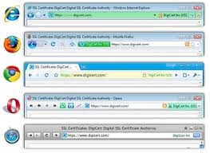
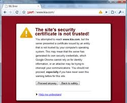
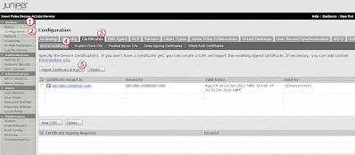
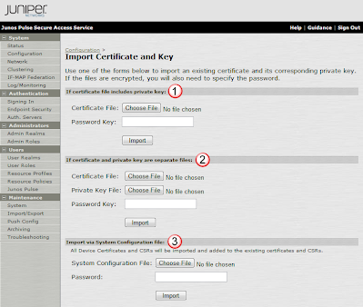
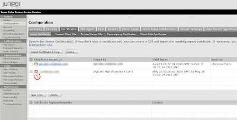
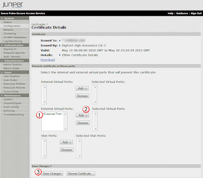
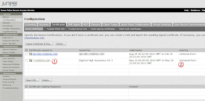

# Uploading a Signed Cert

## Overview:
To install a SSL certification on the MAG so that https users will get the nice green bar when they browse to it,

rather then the scary self-signed warning.

## Upload the Cert:
From the System(1) section, under Configuration(2), go to the Certificates(3) tab, and select Device Certificates(4).  Then select the Import Certificate & Key(5) button to add a new cert. 

The Import Cert page offers three main ways(1)(2)(3) to import the cert.  You need to figure out what is the correct method for the kind of cert that you have. Once you have uploaded the cert, select the Import button to upload the new cert.  

This will add the new cert (1) to the Device Certification page.    

## Select Cert for MAGs External Interface: 
To link the external interface on the MAG to the new cert, select the new cert(1) from above. This brings up the Certificate Details page.  Assuming that you have a default install (no vlans, or multiple ports), select the External Port(1) and press Add(2) to enable this cert to the primary interface.  Then press Save Changes(3) to enable this.  

The Device Certificates page will then show the new cert(1) bound to the external port(2). 

If you want to change the certs for different ports, first de-link the unwanted cert by selecting the cert and then removing it from an interface, and then repeat above to link another cert t that interface. 