# VPN Tunnels - Resource Policies

## Overview 
See [how to setup VPN Connect](how-to-setup-vpn-connect.md) to view a review of all the steps needed to get vpn connect working, and see how to [modify a USER ROLE](vpn-tunnels.md) to let a user role work with VPN tunnels.  

To create the different VPN Resource Profiles, under Users(1) select Resource Policies(2), and then select one of the four options(4) under VPN Tunneling(3).   

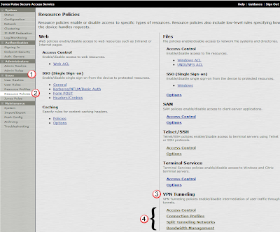

The following sections review the steps needed for each of the sub links under VPN Tunneling(3).

## Access Control:
Under the Access Control(1) tab, select the New Policy(2) button to create a new collection of IPs or networks that can be connected to.  Keep in mind that a single Access Control is like a single ACL on a firewall/router.  You can describe an entire network, a single server, or even a single service (like www) on a single server. 

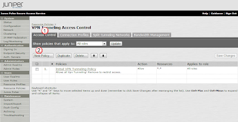

In the New Policy window, fill in the following:
1. Name: the name of the policy
2. Resources: the IP address of things that you want access to, or things you want to block access to.  ie: 10.50.0.0/16, or 10.50.10.50, or tcp://10.50.32.31:22, or udp://10.50.128.16:67-69   
3. Roles: what USER ROLES are associated to this rule. 
4. Action: Is this a allow statement, or deny
5. Save Changes: to save the new statement.

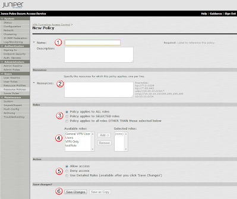

## Connection Profile
Under the Connection Profile(1) tab, select the New Profile(2) button to create a new profile to setup things like DHCP pools, DNS info, and type of tunnel. 

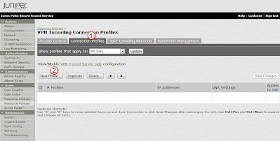

In the New Policy window, fill in the following:

1. Name: Name of the policy
2. IP Address Pool: the IP range that the internal DHCP server will use for new vpn clients. 
3. ESP: Use the IPSec protocol (not ssl) for tunneling.   
    1. Replay Protection: makes things more secure
    2. Compression: reduces the amount of traffic over the WAN
    3. Encryption: AES256/SHA1, most security.  Only need to double think this if the CPU on the Pulse is starting to overload.  
4. DNS: IVE is the DNS settings on the MAG, or you can specifically set them under Manual.  
5. DNS Search Order: If your doing split tunneling, this sets president as far as which DNS servers to try first. 
6. Roles: which USER ROLES are bound to this policy
7. Save Change: to write these changes. 

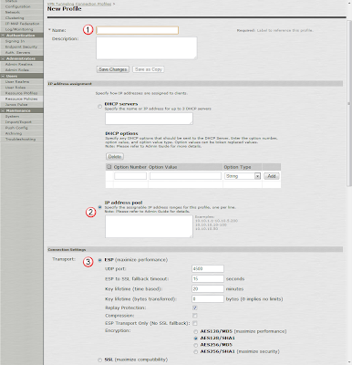

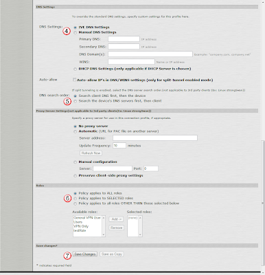

# Split Tunneling Networks
If split tunneling is enabled, this section allows you to enable routes that are sent down to the client.  Where the Access Control section allows or blocks access to specific services on specific servers, this section should be seen as a broader brush, that allows or denies whole CIDR routes. 

Under the Split Tunneling Networks(1) tab, select the New Policy(2) button to create a new policy. 

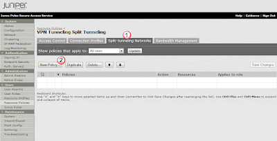

In the New Policy window, fill in the following:

1. Name: Name of the policy
2. Resource: The route that should be sent to the client
3. Roles: what USER ROLES should be associated to this policy
4. Action: should this send or block routes
5. Save Changes: to set the policy. 

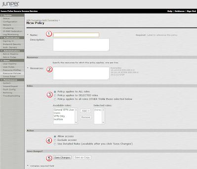

## Bandwidth Management
You can apply bandwidth throttling and provide minimum services to clients via these policies.  To manage the bandwidth that a client can use, under the Bandwidth Management(1) tab, select the New Policy(2) button.

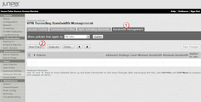

In the New Policy window, fill in the following:

1. Name: Name of the policy
2. Bandwidth Management Settings: how much pipe you want to give each user, or when do you want to start throttling them.  
3. Roles: what USER ROLES should be associated to this policy
4. Save Change: to write these changes.

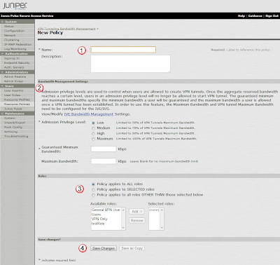

If you had not already, you will also need to define the bandwidth of the link to the MAG so that the VPN Bandwidth Management Profile can properly throttle clients at the right percentage.  To do this, under the System(1) section, and Network(2) subsection, select the Overview(3) tab, and scroll down to the Bandwidth Management(4) section.  

Here define what the Total Maximum Bandwidth for the link is, (the WAN link), and if you want to step it down a bit, the VPN Tunnels Maximum Bandwidth too. 

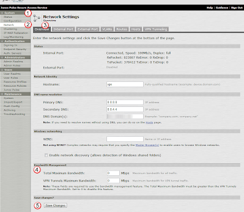

