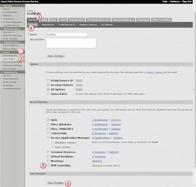
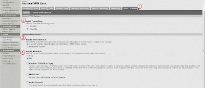

# VPN Tunnels

## Overview:
User roles out of the box will not allow VPN Tunneling.  You need to make a few changes to those roles for VPN tunneling to be an option for the users. 

See [how to setup VPN Connect](how-to-setup-vpn-connect.md) to view a review of all the steps needed to get vpn connect working, and see how to create all the [VPN Tunneling Resource profile to manage all the different features specific to enabling vpn tunnels](vpn-tunnels---resource-policies.md). 

## Enable VPN Tunnels on a USER Role:
Under Users(1) and User Roles(2), select the General(3) tab, and the Overview(4) sub-tab.  Then select the VPN Tunneling(5) checkbox, and Save Changes(6). 

## Modify VPN options for the USER ROLE. 
in the User Role, under the VPN Tunneling(1) tab, enter in the following:

2. Split Tunneling: "Disable" sends ALL traffic through the tunnel.  Its more secure, but prevents you from connecting to your local printers, and puts more bandwidth on the VPN server.  
3. Route Precedence: "Tunnel routes" means that all the routes provided by the VPN will win over the local route statements. 
4. Route Monitor: "Yes" makes sure that the user does not modify the routes on their side (like enable split tunneling).  More secure, but less flexible to the power users. 

