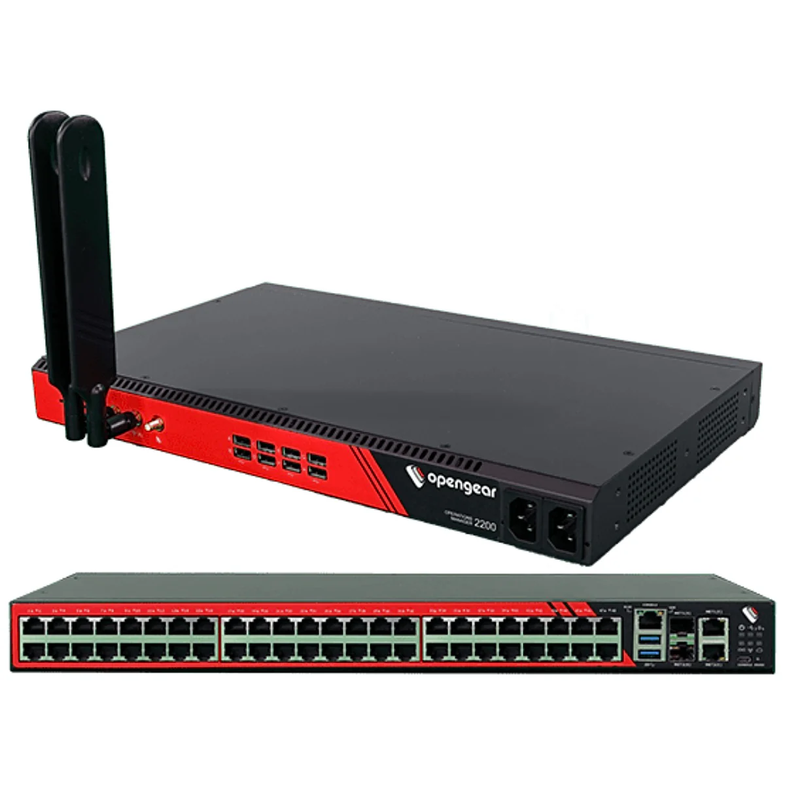

# Opengear

## Overview:
Console servers and other OOB Mgmt devices. 

## Configs: 
- [First time connect](first-time-connect.md): how to get in the box when you first get it.
- [Firmware Upgrade](firmware-upgrade.md): Updating the boxes OS
- [Change Root Password](change-root-password.md): no Defaults!!!
- [Breaking out of ssh](breaking-out-of-ssh.md): once your in, how you get out
- [Set network](set-network.md): get the nic on the right network
- [Setting up the Serial ports](setting-up-the-serial-ports.md): ssh directly to the ports.
- [Create Local User](create-local-user.md): add a local user to the box
- [Setting NTP](setting-ntp.md): get the clock synced.  
- [Syslog](syslog-opengear.md): Send to a remote collector, and just review the local logs

