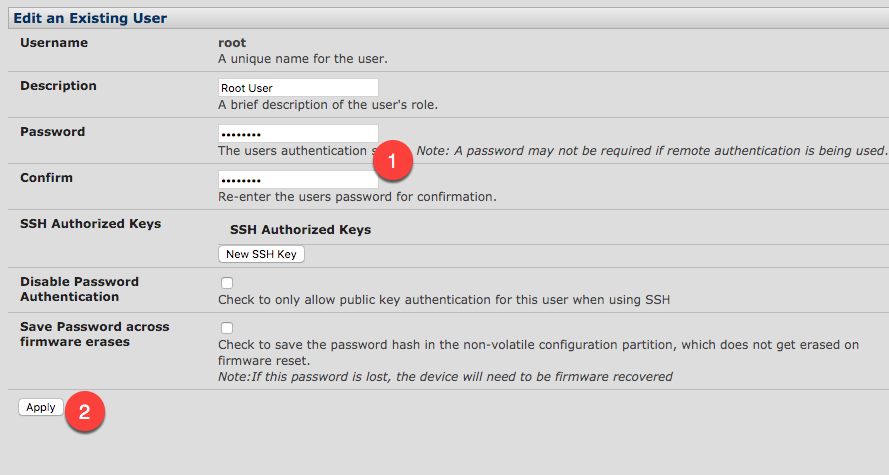

# Change Root Password

## From GUI
Under **Serial & Network** (1), select **Users & Groups** (2) and then under the "Users" section, under the root account, select **Edit** (3)

Change the **Password** (1) and **Apply** (2) the changes.  

