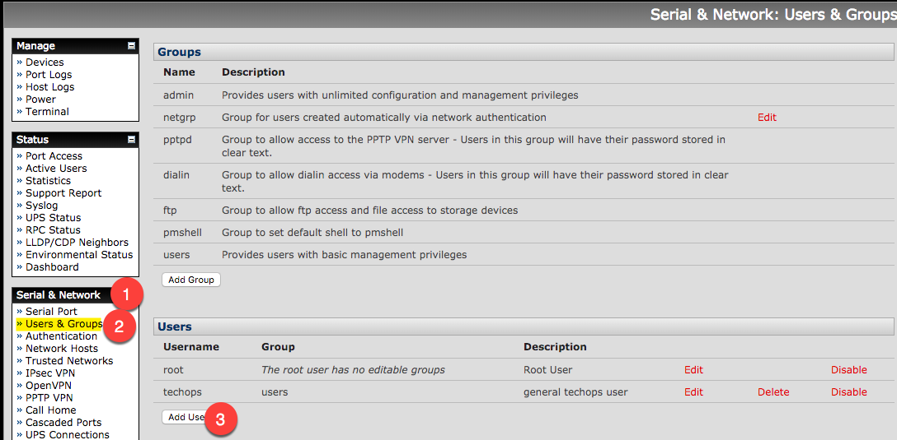
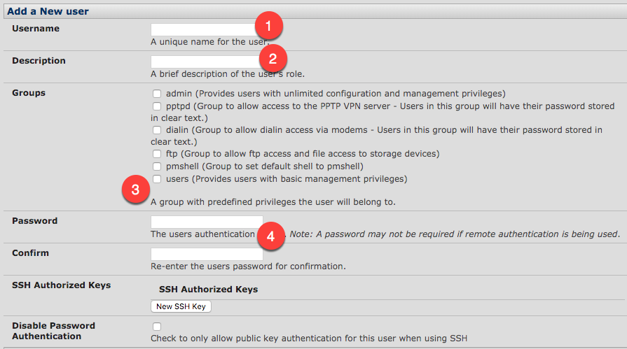
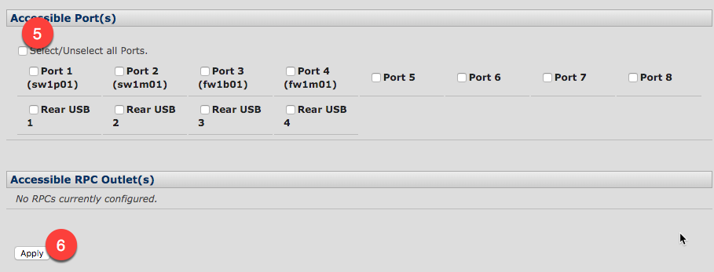

# Create Local User

## From the GUI
### Short Version: 
```
Serial & Network: Users & Groups : <add user> 
    username = techops
    description = general techops user
    groups = users
    password = justlikemyluggage
    accessible ports = <all>
    <apply> 
```
### More in detail: 

From Serial & Network (1), select Users & Groups (2) and then the Add Users (3) button



Add the username (1), user description like full name (2), select users group (3), enter a password for the user(4),



Then select all the ports (5) and apply (6) to save the change


