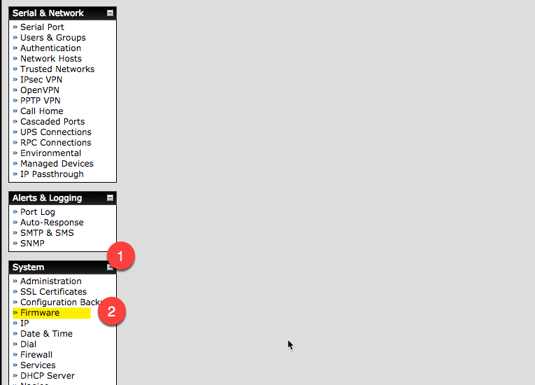
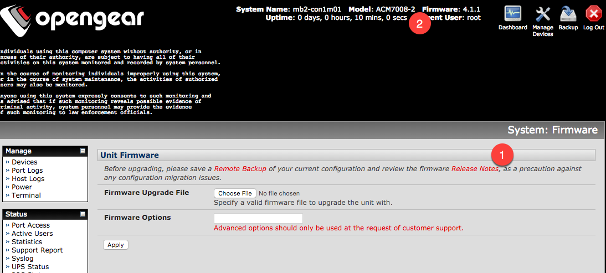
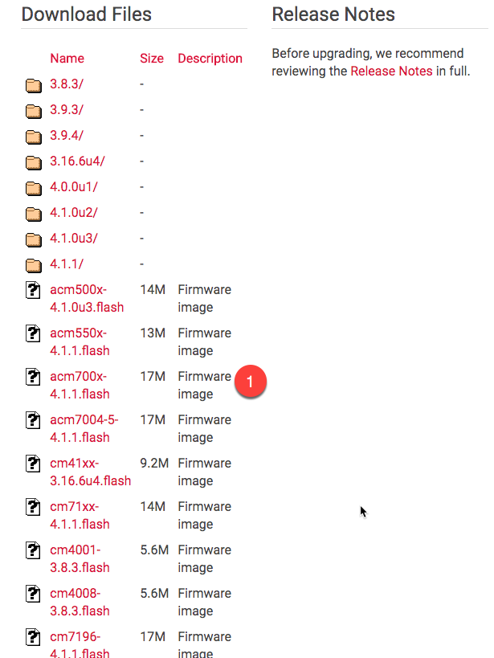
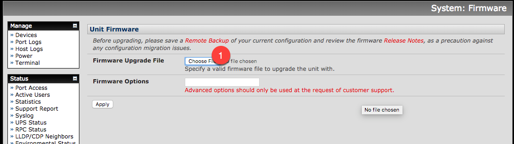
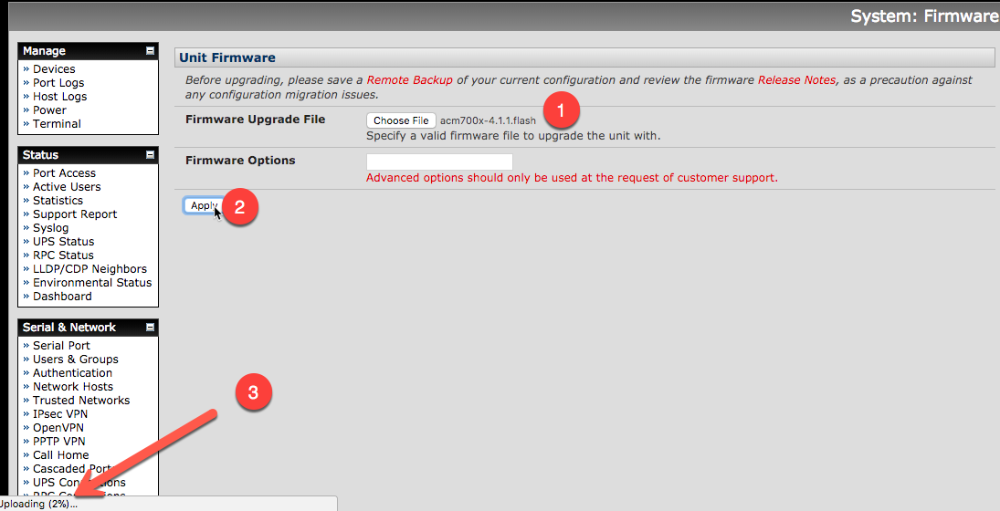
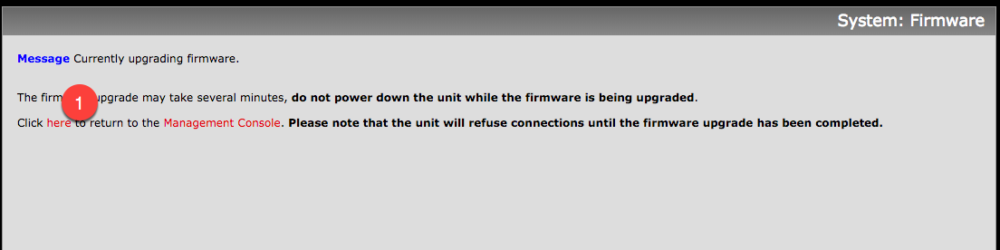
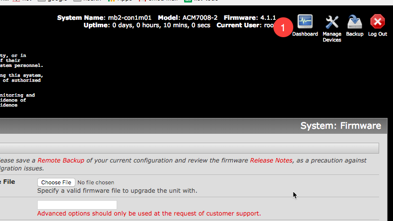

# Firmware Upgrade

## From the GUI
In the Main window, scroll down to System (1) and select Firmware (2)

From there confirm what the new release is by selecting Release Notes (1), or by going directly to the opengear release notes page .  Also confirm what model (2) opengear box you have, so that you can refer to it for which download to get.  

Open up another window, and download the appropriate image(1) from the Opengear current release page.  

Then go back to the opengear page, and under Firmware Upgrade File, press the Choose File (1) button

select the file you just downloaded, then confirm that it took (1), select Apply (2) to start the process, and you can watch the download in the lower left corner of the window (3).  

when the upgrade is happening, you will get this notification page.  When you think the upgrade is complete try re-loading the page, or select the here (1) button to reload.  

When the box reloads, go up to the top of the main page, and confirm that the new image(1) is installed. 

