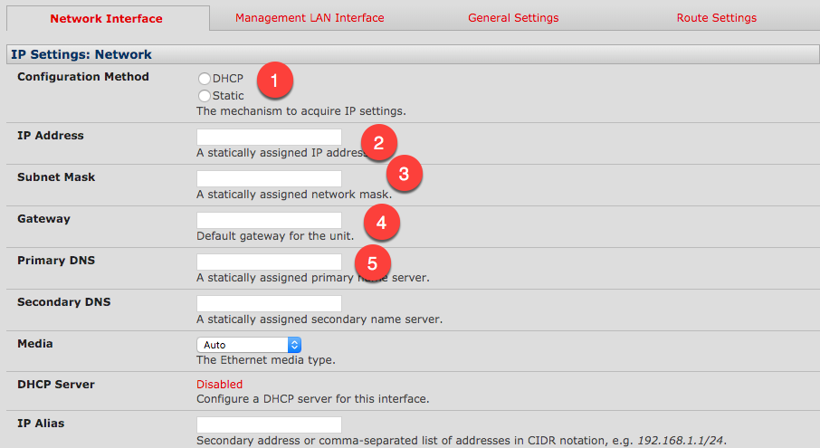

# Set network

## From the Gui

### Short version: 
```
System :: IP
    config method = static
    ip address = 10.36.34.40
    mask = 255.255.255.0
    gate = 10.36.34.1
    primary dns = 8.8.8.8
    <apply>
```

### In detail: 

In the main window, scroll down to **System**(1), and select **IP** (2)


Under "IP Settings: Network", set Configuration method to **Static** (1), enter in the static **IP** (2), and the **Mask** (3).  Provide the **Gateway** (4) and at least one **DNS** server (5),



And then scroll to the bottom of the page and save by pressing the **Apply** (6) button


Once this is complete, you might need to re-set your laptops local IP so that you can connect to the new IP.  