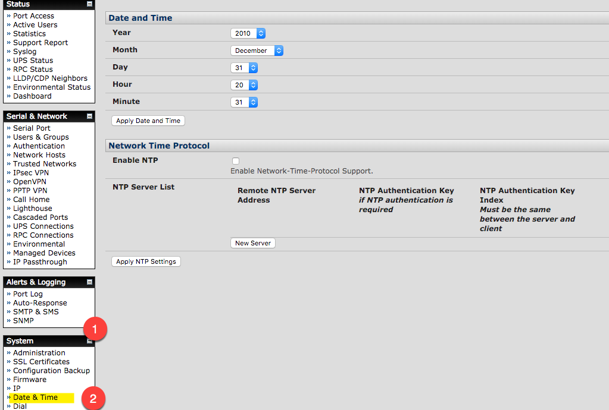

# Setting NTP
Get to the time page from System (1) and Date & Time (2)

Then set your local time to UTC by selecting Time Zone and selecting UTC (1), and Apply Time Zone (2) button

Then scroll down the page, and under the "Network Time Protocol" section, select Enable NTP (1), and press the New Server (2) button to add NTP sources.  

You might not be able to enter in a ntp pool DNS name, so instead, enter in the static IPs from NIST.  After entering each IP (1)(2), select the New Server (4) button to create a new field to enter in the next server.  When done, press the Apply NTP Settings (5) button.  

Note, depending on how out of sync your current time is, it might take a long while for your clock to sync up.  