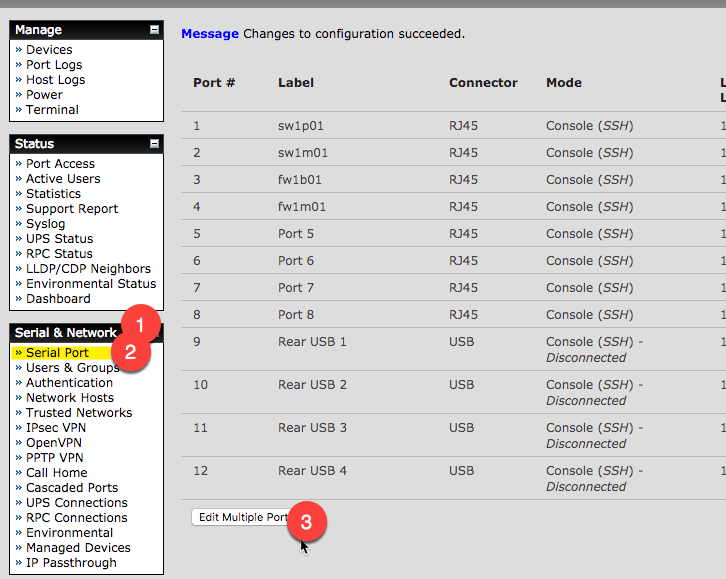
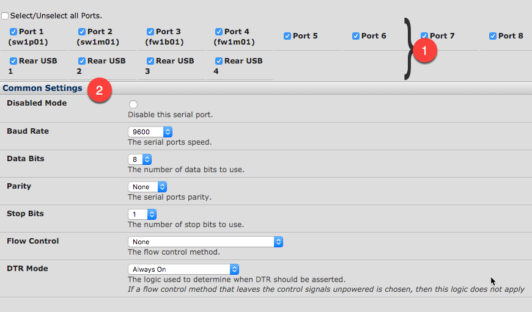
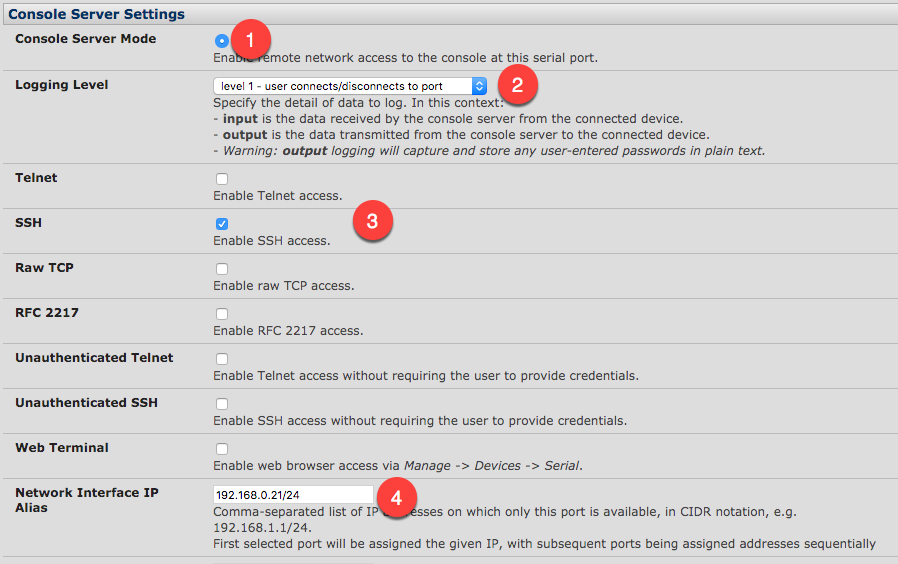
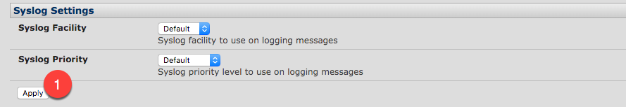
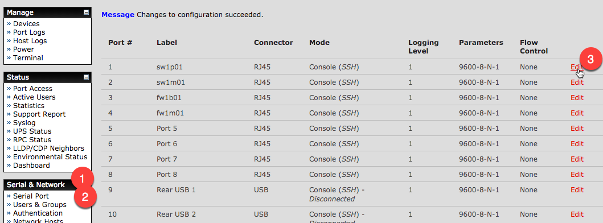
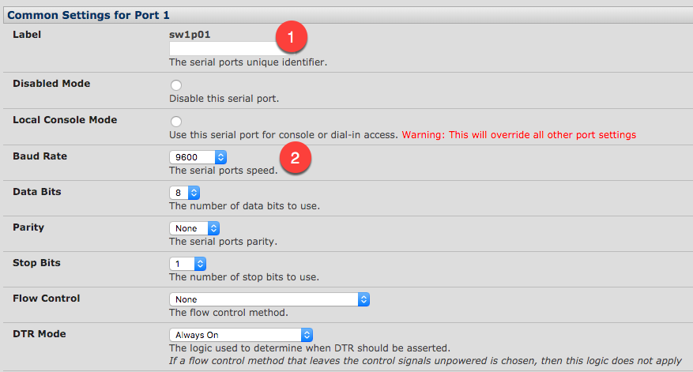

# Setting up the Serial ports

## From the GUI
do the following from the web page of the console server

### Setup all the ports to work
#### In Short: 
```
Serial & Network :: Serial Ports :: <Edit Multiple Ports>
    Select all ports
    baud rate = 9600
    data bits = 8
    parity = 1
    stop bit = 1
    Flow = none
    dtr mode = on
    Console Server Mode = <selected>
    Network Interface IP Alias = 10.36.34.21/24 
    <apply>
Serial & Network :: Serial Ports :: Port 1 :: <Edit>
    Common Settings: 
    label = sw1p01
    <apply>
```

#### With a bit more detail: 

Go to **Serial & Network** (1), then select **Serial Port** (2), and then select the **Edit Multiple Ports** (3) button



Confirm which ports you want this to affect(1).  Then set the standard baud rate and other console port settings (2).   Note that while this will change all of the ports to this setting, you can then go back and modify a single port to be different.



Under the "Console Server Settings" select **Console Server Mode** (1), select the correct **Logging Level** (2), enable **SSH** (3), and set the first IP address for the first port (4).  If you have an 8 port console server, and you enter in `1.1.1.1/24`, then the console ports will be port1 = `1.1.1.1`, port2=`1.1.1.2`, port3=`1.1.1.3`....  Also note that these IPs need to be on the same broadcast domain as the console servers IP.  (Right now they don't have the ability to internally route.)



If you need to change the syslog levels, go ahead, and then save the changes by selecting apply (1)



### Making individual port changes
Back in the main page under Serial & Network (1), then select Serial Port (2), and then select the Edit (3) button for the specific port you want to change. 



Change the name of the port (1), and console port settings (2)



And then scroll down and select apply (1)


## References
- [Communicating with serial port connected devices](https://opengear.zendesk.com/hc/en-us/articles/216373543-Communicating-with-serial-port-connected-devices): Opengear, Robert Waldie, 2017
- [Assigning unique IP addresses for each console port](https://opengear.zendesk.com/hc/en-us/articles/216373383-Assigning-unique-IP-addresses-for-each-console-port): Opengear, Robert Waldie, 2017