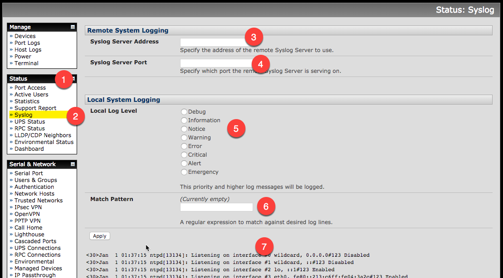

# Syslog-opengear

Connect to the Syslog page by going to **Status** (1), and selecting **Syslog** (2). 

## Adding a remote collector
Enter in the remote servers IP (3), and what port(4) to send the messages though.  

## Viewing Local Logs
you can filter the local logs based on log level (5) and/or by a regex expression (6), and view the logs below (7)