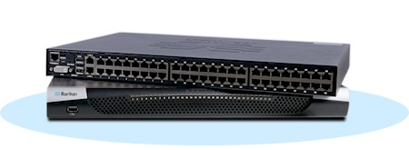

# Raritan

## Overview: 
Make great console servers

## system defaults: 

key | value
---|--- 
user  |   	 admin
password	 | raritan
console speed |	 115,200
default IP	 | 192.168.0.192

## Configuration: 
- [base config](base-config.md): getting the box up and running
- [config accounts](config-accounts.md): adding users and groups
- [config serial ports](config-serial-ports.md): configuring each serial port
- [idle timeout](idle-timeout.md): define how long until an unused terminal is torn down. 

