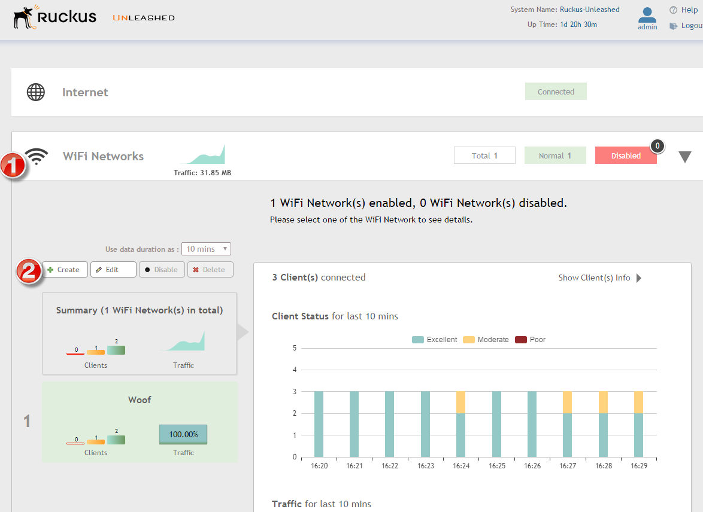
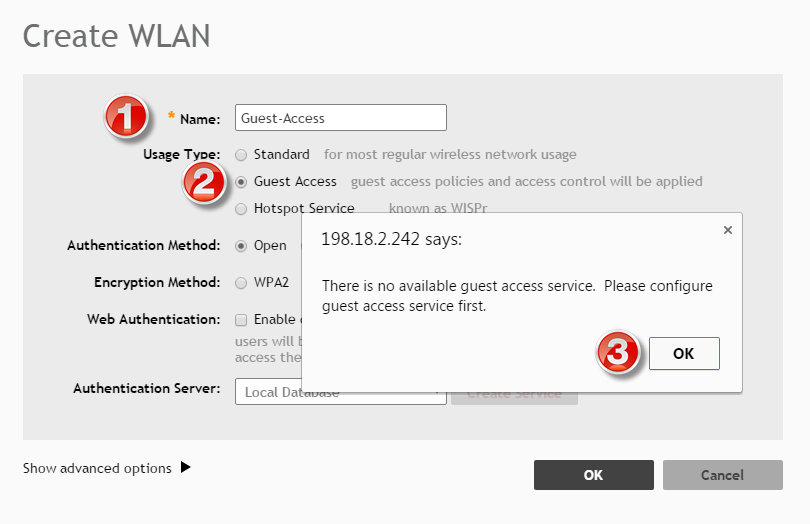
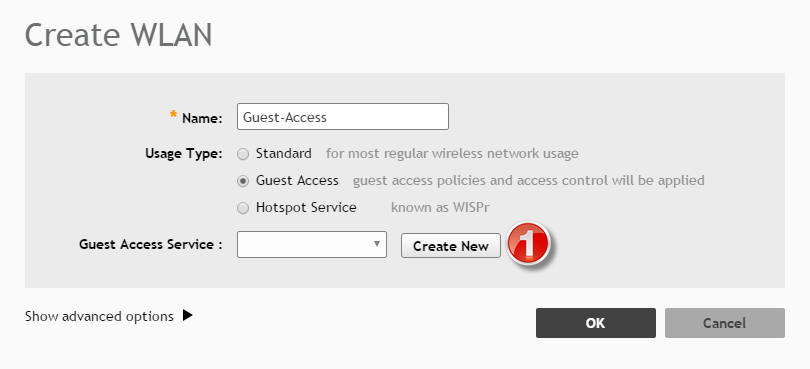
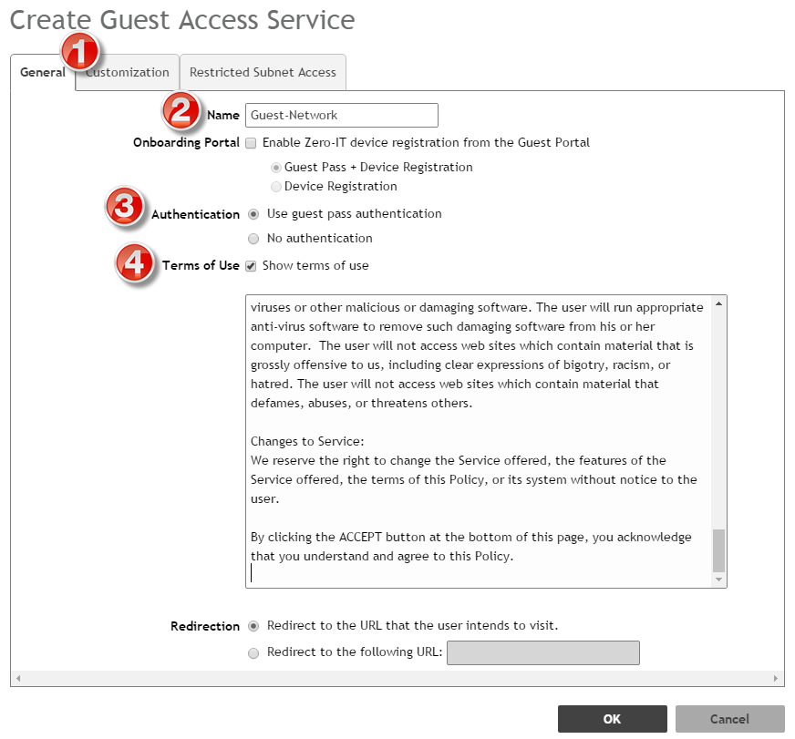
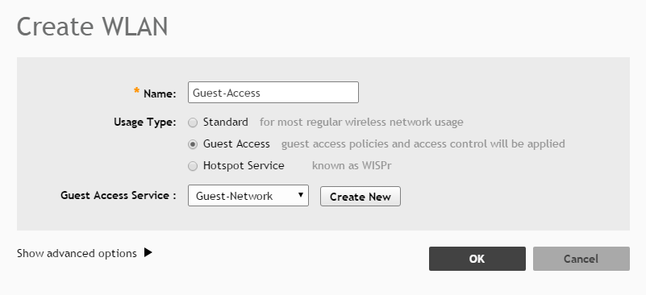

# Adding basic guest services

## Overview: 

## Create a generic guest service
Under **WiFi Networks**(1) select the **Create**(2) button to create a new network.  

In the Create WLAN window, for the **Name**(1) field, enter in the SSID you want for the wifi network.  Then under **Usage Type**, select the radio button for **Guest Access**(2).  Note that when you do this, you will get an alert saying that there is no guest service.  Press **OK**(3) to continue.  

The Create WLAN window will adjust, and then under **Guest Access Service**, select the **Create New**(1) button

The Create Guest Access Service window will appear.  Within the **General**(1) tab, under **Name**(2) enter in the name of the new service.  Keep Onboarding Portal blank, Then under **Authentication** (3) select No authentication, and then select **Terms of Use**(4) and enter in what you want for some silly verbiage.  

Example generic wifi terms and conditions: [Here's a few examples of TaC](example-generic-wifi-terms-and-conditions.md)

Then select **OK** to create the **WLAN**.  

## Changing VLANs for the Networks
If you have a guest and a normal vlan, you can dump all of this traffic on the same network and prevent guest traffic from getting places thought the ACLs located in Admin

