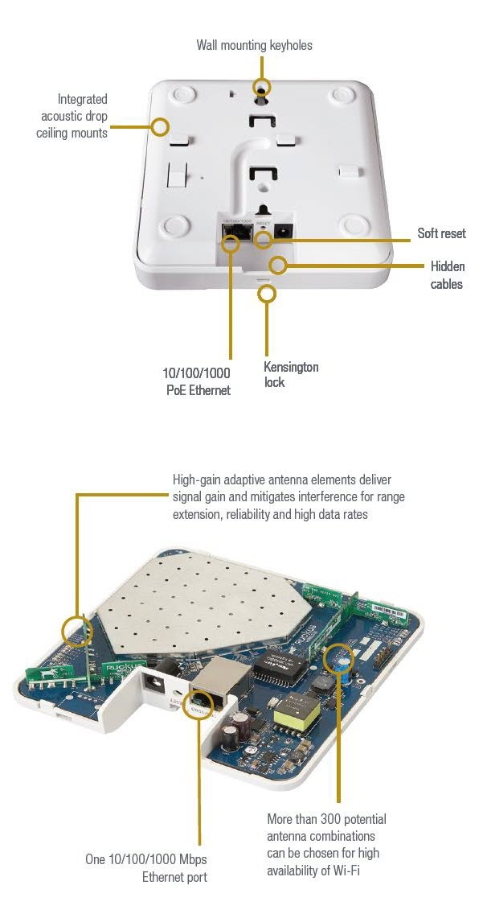
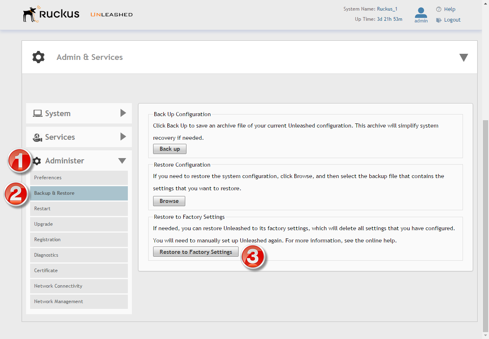
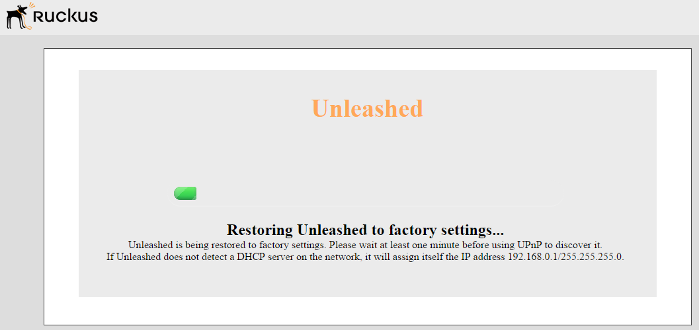

# Factory Reset / Virgin-ise the AP

## Overview: 
If you can not login to the AP (you forgot the user/password), the easiest solution is to manually factory reset the unit.  

## Manually Reset Unit: 
To manually factory reset the unit, flip the AP over, and find the **RESET** button/hole.  

While powered on, hold down on the reset button for more then 6 seconds.  When the reset is complete, the **PWR LED** will switch modes: 

### PWR LED modes: 
- solid RED = bootup process
- blinks GREEN = system in factory default state
- solid GREEN = configured AP

### Location of the RESET button: 
The reset button is on the bottom of the AP, next to the ethernet jack.  (it's labeled)  You need a pen or paperclip to depress the button.  

## Reset via the GUI: 
If you can login to the AP, and you still want to reset the unit, you can do that by going to the **Administrator** tab, and select **Backup & Restore**.  From there, select the **Restore to Factory Settings** button.  

While it's resetting itself, the AP will give you the following status page....

## References: 
- [Can I recover the admin password for a standalone access point?](https://support.ruckuswireless.com/answers/000002316): Ruckus KB #2316, Dec, 2015
- [Restore to Factory Settings](http://docs.ruckuswireless.com/unleashed/200.1.9.12/#c-RestoreToFactorySettings.html): Unleashed Online Help, v.200.1.9.12