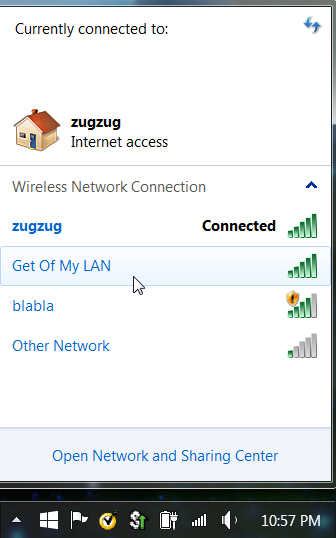
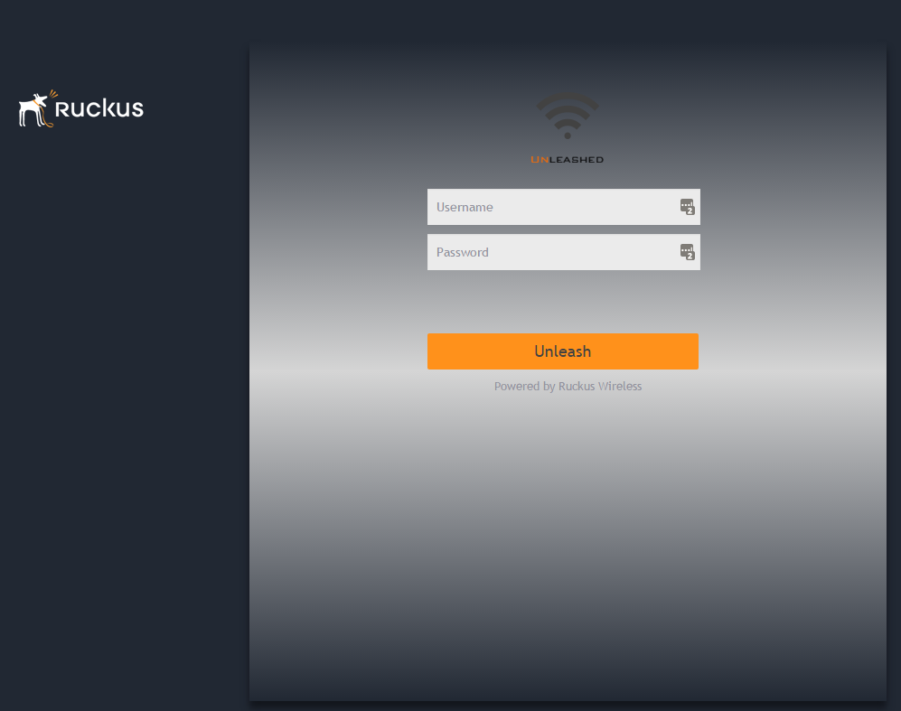
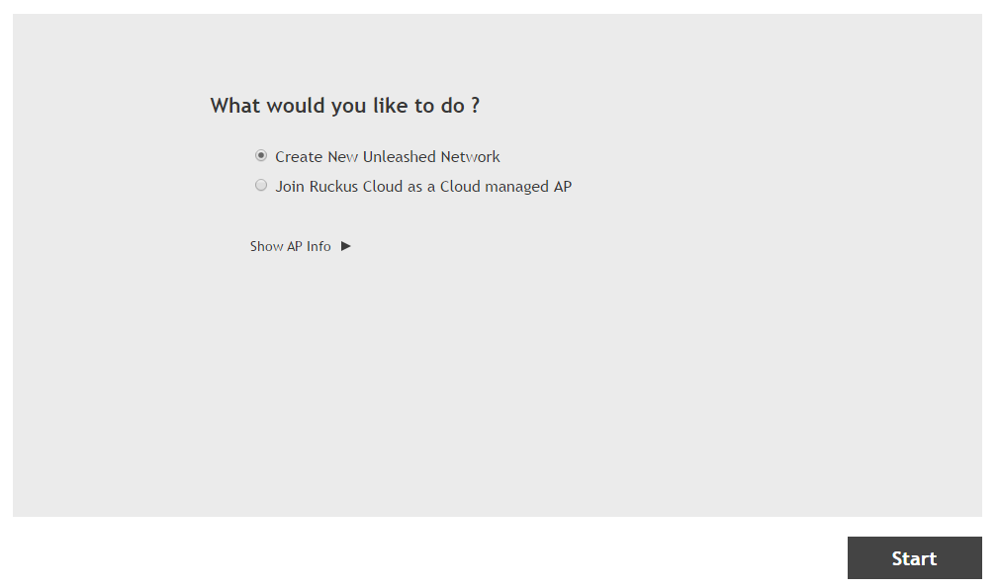
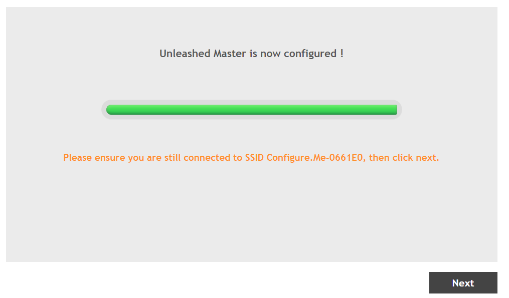
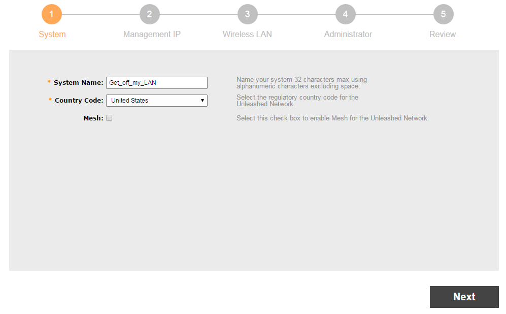
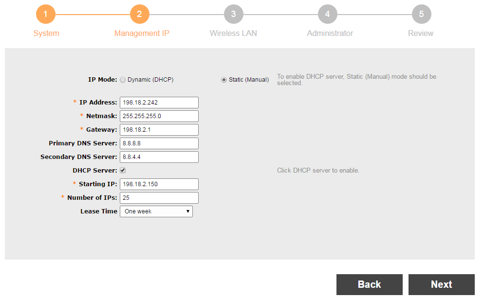
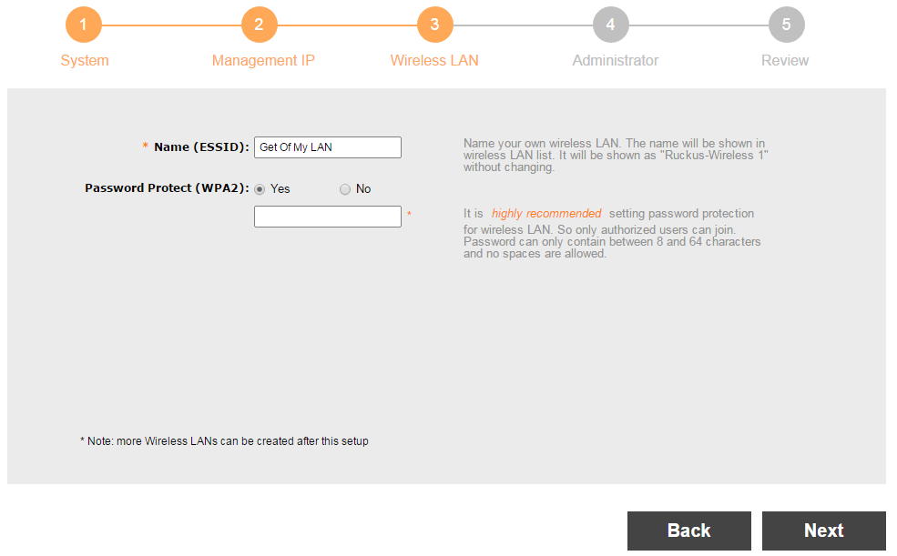
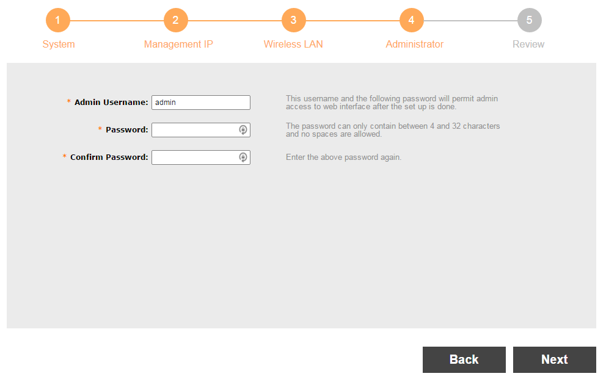
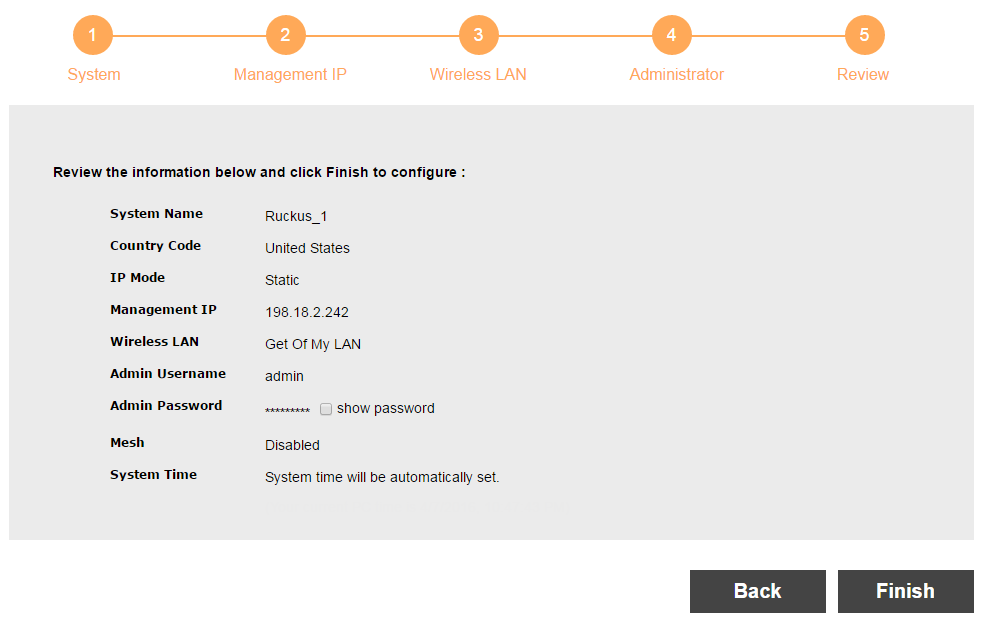
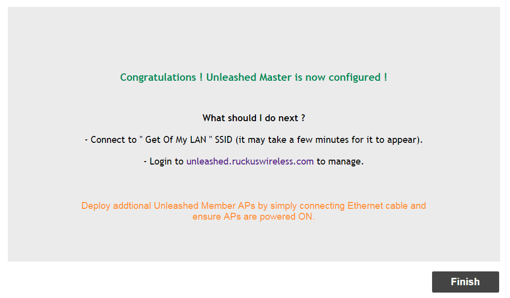

# First time connect to an Unleashed AP

- [First time connect to an Unleashed AP](#first-time-connect-to-an-unleashed-ap)
  - [Overview:](#overview)
  - [Connect:](#connect)
  - [Configure First AP](#configure-first-ap)
    - [Define the AP Name:](#define-the-ap-name)
    - [Setup the Mgmt IP (and DHCP settings):](#setup-the-mgmt-ip-and-dhcp-settings)
    - [Define the SSID:](#define-the-ssid)
    - [Define admin account:](#define-admin-account)
    - [Confirm and finish:](#confirm-and-finish)
  - [Reconnect to new AP:](#reconnect-to-new-ap)
    - [Reconnect to the new SSID](#reconnect-to-the-new-ssid)

## Overview: 
This goes over the process for how to connect to a Ruckus Unleashed AP, and what steps to follow to do a first time setup

## Connect: 
When you power on an Unleashed OS on a Ruckus AP, you will be shown a wifi SSID called Configure-Me-XXXXXX.  Select it and open up a browser.  

## Configure First AP
If your browser doesn't automatically connect, in your browser go to the url: `unleashed.ruckuswireless.com`

accept the unsigned cert of the web page, and you will get to the initial spash screen from the AP: 

Select **Create New Unleashed Network**, and then select **Start**.  

Once it's done, confirm you are still connected to the AP (`Configure-Me-XXXXXX`) and select Next. 

### Define the AP Name: 

### Setup the Mgmt IP (and DHCP settings): 

### Define the SSID: 

### Define admin account: 

### Confirm and finish: 

## Reconnect to new AP: 
Once the new settings have been made, you will need to reconnect to your new config.  

When the new settings are set, the Ruckus will show you the following page.  

### Reconnect to the new SSID

And select the mgmt link https://unleashed.ruckuswireless.com/ to manage the AP and bring up the following page. (note that the username/password was defined above in the define admin account section).  

