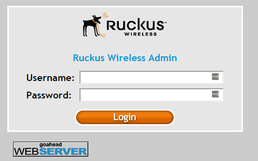
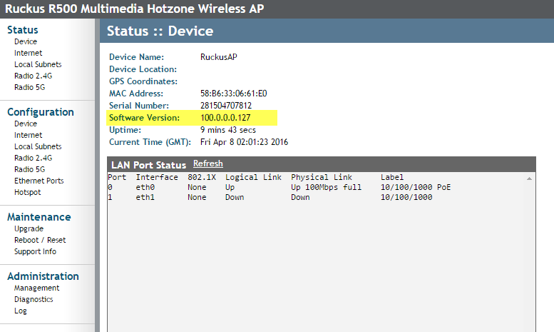
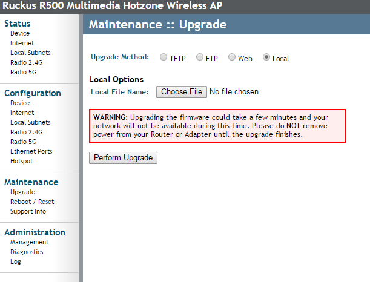
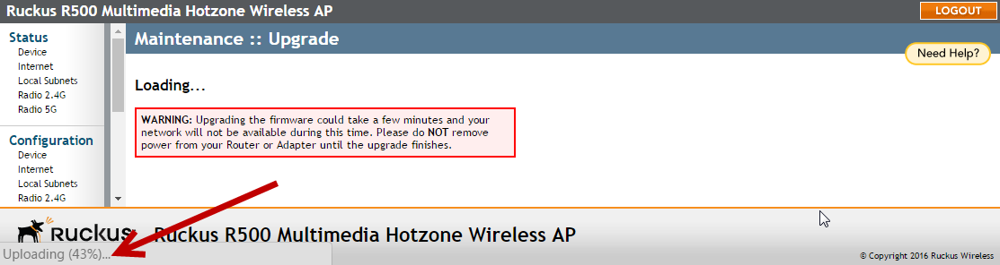

# Upgrade

## Overview: 
If you have a normal ruckus AP (not one with a Unleashed OS on it), you can upgrade the OS to a Unleashed version.  This is the process to do that. 

## Find the AP's IP
Once the AP is plugged into the network, you will need to track down whatever IP it got from DHCP.  An nmap on the same network should find it quickly enough as it will be able to see the MAC of the AP.  

```
> nmap -sP 198.18.2.0/24
Nmap scan report for 198.18.2.124
Host is up (0.010s latency).
MAC Address: 58:B6:33:06:61:E0 (Ruckus Wireless)
```

## Web In: 
From a web browser, http into the ruckus, and use the user/pass of super/sp-admin (the user/pass is also printed on the bottom side of the AP).



Once you log in, you will be able to see the current running software version under (the default) **Status::Device** : 



If you have already downloaded the newest OS version on the AP, you can upload it, via **Maintenance::Upgrade**, and by selecting the **Local** option, and then the **Choose File** button to select the new OS from your desktop.  Once you have selected the newest OS, select the **Perform Upgrade** button and wait till the update is completed.  



Note that at the bottom of the page, there is a counter that lets you know how far you have left to the download. 



When the download is complete, the AP will reboot, and your all set.


