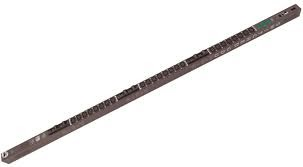
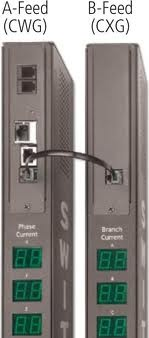

# Initial Setup

## Overview
Our power distribution equipment (aka power strips) is manufactured by Server Technology, and we are using their smart, switched CDU's.    We use the CW and CX-24V Sentry Switched CDU's which have a single NEMA L6-30 plug, and  24 IEC c13 outlets.



There are two different units, one is a master (CW) and includes a mini CPU allowing external ssh and SNMP polling, and the slave (CX) connects to the master through a custom console connection. 



The pricing and details for the systems are as follows: 

part number	| Description	| Aprox. Price
---|---|----
CW-24V2-L30M	| Switched CDU, 0U, 24 x IEC C13 Outlets, 3 x LED amp meters, 208V 30A input w/ L6-30P connector & cord, 10ft (3m), (2) Temperature/Humidity Sensor Capable, with retractable fuses	| $ 800
CX-24V2-L30M	| Switched CDU (Expansion Unit), 0U, 24 x IEC C13 Outlets, LED amp meter, 208V 30A input w/ L6-30P connector & cord, 10ft (3m), with retractable fuses	| $ 715

## Support: 
Servertech's equipment is supported based on the equipment's serial number.  There is no support contract for hardware replacements, but they have staff available for technical support, and that support is for the life of the product.  

- Support Phone Number: 775-284-200 x351
- MIB's for device: ftp://ftp.servertech.com/pub/SNMP/sentry3/

Power strip Config: 
```
# --- this is to configure the Servertech CDU-Switched power supplies ---
#
! connect to the console and log in
user : admn   (<--- NOTE: no "i")
pass : admn
! Change user/password: 
password
admn
mf098QErhjd
! Create ops/monitor account, let them view and turn stuff on
create user ops
odsgr3$n!
set user access ononly ops
set user envmon on ops
! Set the pre-login banner: 
set banner
**************************************************************
*                  AUTHORIZED ACCESS ONLY                    *
**************************************************************
*          This system is the property of CMED.          *
* Disconnect IMMEDIATELY if you are not an authorized user ! *
**************************************************************
! Ctrl-z 
! enable servces: 
set http enabled
set telnet disabled
set sntp primary 10.50.81.16
set sntp secondary 0.north-america.pool.ntp.org
set sntp gmtoffset 0 
set ssl enabled
set ssl access required
set ssh enabled
set ssh authmethod password enabled
set snmp enabled
set snmp getcomm Htt5cugaSq
set snmp trapdest1 10.50.81.20
set snmp trapdest2 10.50.81.21
set snmp syscontact techops@cmed.us
set syslog hostip1 10.50.81.20
set syslog hostip2 10.50.81.21
set email disabled
set dhcp disabled 
! set the non-specific IP info of the PDUs' 
set subnet 255.255.255.0
set gateway 10.50.32.1
set dns1 10.50.81.28
set dns2 8.8.8.8
# --- For each powerstrip, do the following ---
#
! --- for PCI Cabinet: -----
! set the IP's of the PDUs'
set ipaddress 10.50.32.32
! set location/support info: 
set location BOS1-21_PCI 
set snmp syslocation BOS1-21_PCI
set snmp sysname ps121a
restart
! --- for NON-PCI Cabinet: -----
! set the IP's of the PDUs'
set ipaddress 10.50.32.33
! set location/support info: 
set location BOS1-20_nonPCI 
set snmp syslocation BOS1-20_nonPCI
set snmp sysname ps120a
restart
```
