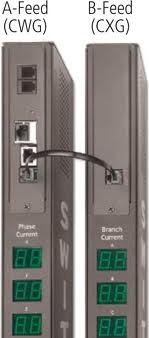

# SNMP Polling

- [SNMP Polling](#snmp-polling)
  - [Overview:](#overview)
  - [Input Power:](#input-power)
    - [Web:](#web)
    - [SNMP:](#snmp)
      - [Input Feed ID:](#input-feed-id)
      - [Input Feed Name:](#input-feed-name)
      - [Input Status](#input-status)
      - [Input Load (amp)](#input-load-amp)
      - [Input Voltage](#input-voltage)
      - [Input Power (watt):](#input-power-watt)
  - [System Stats:](#system-stats)
    - [Web:](#web-1)
    - [SNMP:](#snmp-1)
      - [Tower Model Numbers:](#tower-model-numbers)
      - [Tower Serial Numbers:](#tower-serial-numbers)
      - [OS Version:](#os-version)
  - [Output Power](#output-power)
    - [WEB:](#web-2)
    - [SNMP:](#snmp-2)
      - [Outlet ID:](#outlet-id)
      - [Outlet Name:](#outlet-name)
      - [Outlet Status:](#outlet-status)


## Overview:
These examples have "two towers", which mean, there are two power strips, one with a snmp pollable cpu "A", and another one "B" that is polled by "A" via a interconnect. 



Each Tower has three circuits A-C, so when viewing the feeds, you will see AA (tower A, ckt A).... AC (tower A, ckt C)... BA...BB....BC...

You can get data about the power strips via ssh, https, and snmp polling.  For simplicity sake, we will be showing the data via the web, and then showing how to get it from SNMP polling. 

Note that the ServerTech MIB info can be downloaded from here:
- ftp://ftp.servertech.com/pub/SNMP/sentry3/

## Input Power:

### Web:
From the Power Monitoring, Input Feeds section, we see the following data:


where: 
Note |  Name	        | Example Data      |  Description
-----|------------------| ------------------|------
 (1) | Input Feed ID    | AA	            | First letter lists the tower (the power strip) <A-B>, and the second letter lists each towers circuit <A-C>.
 (2) | Input Feed Name  | TowerA_InfeedA    | User definable name for each "feed" (tower/ckt combo).  Currently set to defaults, but can be modified as needed.
 (3) | Input Status     | On                |  If the ckt to a power strip is switched on or off. 
 (4) | Input Load       | 4.77 A            |  The total amp draw for the circuit.  (remember that there are 3 ckts per power strip.)
 (5) | Input Voltage    | 208.0 V           |  The input voltage on the power strip
 (6) | Input Power      | 992 W             | The watts in use by the ckt. 

### SNMP:

#### Input Feed ID:
Shows the different "towers" or different power strips that are monitored via this system.  In this case, there are two units connected with a cable: units' A and B.

OID:
- .1.3.6.1.4.1.1718.3.2.1.1.2
- .iso.org.dod.internet.private.enterprises.serverTech.sentry3.systemTables.towerTable.towerEntry.towerID

```
$ snmpwalk -v 2c -c HtRjcugaSq -On 10.50.32.32 .1.3.6.1.4.1.1718.3.2.1.1.2

.1.3.6.1.4.1.1718.3.2.1.1.2.1 = STRING: "A"
.1.3.6.1.4.1.1718.3.2.1.1.2.2 = STRING: "B"
```

#### Input Feed Name:
The names for the Towers and each of their three circuits. 

OID:
- .1.3.6.1.4.1.1718.3.2.2.1.3
- .iso.org.dod.internet.private.enterprises.serverTech.sentry3.systemTables.infeedTable.infeedEntry.infeedName

```
$ snmpwalk -v 2c -c HtRjcugaSq -On 10.50.32.32 .1.3.6.1.4.1.1718.3.2.2.1.3

.1.3.6.1.4.1.1718.3.2.2.1.3.1.1 = STRING: "TowerA_InfeedA"
.1.3.6.1.4.1.1718.3.2.2.1.3.1.2 = STRING: "TowerA_InfeedB"
.1.3.6.1.4.1.1718.3.2.2.1.3.1.3 = STRING: "TowerA_InfeedC"
.1.3.6.1.4.1.1718.3.2.2.1.3.2.1 = STRING: "TowerB_InfeedA"
.1.3.6.1.4.1.1718.3.2.2.1.3.2.2 = STRING: "TowerB_InfeedB"
.1.3.6.1.4.1.1718.3.2.2.1.3.2.3 = STRING: "TowerB_InfeedC"
```

#### Input Status 
Shows each circuit and if it is on or not.  Good thing to monitor and make sure that the status has not changed!!  (1= on, 0= off)

OID:
- .1.3.6.1.4.1.1718.3.2.2.1.5
- .iso.org.dod.internet.private.enterprises.serverTech.sentry3.systemTables.infeedTable.infeedEntry.infeedStatus

```
$ snmpwalk -v 2c -c HtRjcugaSq -On 10.50.32.32 .1.3.6.1.4.1.1718.3.2.2.1.5

.1.3.6.1.4.1.1718.3.2.2.1.5.1.1 = INTEGER: 1
.1.3.6.1.4.1.1718.3.2.2.1.5.1.2 = INTEGER: 1
.1.3.6.1.4.1.1718.3.2.2.1.5.1.3 = INTEGER: 1
.1.3.6.1.4.1.1718.3.2.2.1.5.2.1 = INTEGER: 1
.1.3.6.1.4.1.1718.3.2.2.1.5.2.2 = INTEGER: 1
.1.3.6.1.4.1.1718.3.2.2.1.5.2.3 = INTEGER: 1
```

#### Input Load (amp)
Amp draw for each input circuit. 

OID:
- .1.3.6.1.4.1.1718.3.2.2.1.7
- .iso.org.dod.internet.private.enterprises.serverTech.sentry3.systemTables.infeedTable.infeedEntry.infeedLoadValue

(note that a value of "479" is actually 4.79a)
```
$ snmpwalk -v 2c -c HtRjcugaSq -On 10.50.32.32 .1.3.6.1.4.1.1718.3.2.2.1.7

.1.3.6.1.4.1.1718.3.2.2.1.7.1.1 = INTEGER: 479
.1.3.6.1.4.1.1718.3.2.2.1.7.1.2 = INTEGER: 187
.1.3.6.1.4.1.1718.3.2.2.1.7.1.3 = INTEGER: 322
.1.3.6.1.4.1.1718.3.2.2.1.7.2.1 = INTEGER: 45
.1.3.6.1.4.1.1718.3.2.2.1.7.2.2 = INTEGER: 299
.1.3.6.1.4.1.1718.3.2.2.1.7.2.3 = INTEGER: 260
```

#### Input Voltage
Voltage supplied for each circuit.

OID:
- .1.3.6.1.4.1.1718.3.2.2.1.11
- .iso.org.dod.internet.private.enterprises.serverTech.sentry3.systemTables.infeedTable.infeedEntry.infeedVoltage

(where "2080" is 208.0v)
```
$ snmpwalk -v 2c -c HtRjcugaSq -On 10.50.32.32 .1.3.6.1.4.1.1718.3.2.2.1.11

.1.3.6.1.4.1.1718.3.2.2.1.11.1.1 = INTEGER: 2080
.1.3.6.1.4.1.1718.3.2.2.1.11.1.2 = INTEGER: 2080
.1.3.6.1.4.1.1718.3.2.2.1.11.1.3 = INTEGER: 2080
.1.3.6.1.4.1.1718.3.2.2.1.11.2.1 = INTEGER: 2080
.1.3.6.1.4.1.1718.3.2.2.1.11.2.2 = INTEGER: 2080
.1.3.6.1.4.1.1718.3.2.2.1.11.2.3 = INTEGER: 2080
```

#### Input Power (watt):
Watts in use per circuit

OID:
- .1.3.6.1.4.1.1718.3.2.2.1.12
- .iso.org.dod.internet.private.enterprises.serverTech.sentry3.systemTables.infeedTable.infeedEntry.infeedPower

(where 994 is 994w)
```
$ snmpwalk -v 2c -c HtRjcugaSq -On 10.50.32.32 .1.3.6.1.4.1.1718.3.2.2.1.12

.1.3.6.1.4.1.1718.3.2.2.1.12.1.1 = INTEGER: 994
.1.3.6.1.4.1.1718.3.2.2.1.12.1.2 = INTEGER: 387
.1.3.6.1.4.1.1718.3.2.2.1.12.1.3 = INTEGER: 661
.1.3.6.1.4.1.1718.3.2.2.1.12.2.1 = INTEGER: 94
.1.3.6.1.4.1.1718.3.2.2.1.12.2.2 = INTEGER: 620
.1.3.6.1.4.1.1718.3.2.2.1.12.2.3 = INTEGER: 518
```

## System Stats:

### Web:
Via the web, there is not really one great place to view all the stats. 

### SNMP:

#### Tower Model Numbers:
Lists what the part numbers are for the power strips (the towers).   Helpful to ensure that your MachineDB or CMDB has the right info, compare with this data.

OID:
- .1.3.6.1.4.1.1718.3.2.1.1.7
- .iso.org.dod.internet.private.enterprises.serverTech.sentry3.systemTables.towerTable.towerEntry.towerModelNumber

```
$ snmpwalk -v 2c -c HtRjcugaSq -On 10.50.32.32 .1.3.6.1.4.1.1718.3.2.1.1.7

.1.3.6.1.4.1.1718.3.2.1.1.7.1 = STRING: "CW-24V2-L30M"
.1.3.6.1.4.1.1718.3.2.1.1.7.2 = STRING: "CX-24V2-L30M"
```

#### Tower Serial Numbers:
The serial numbers for each of the towers (each of the power strips). 

OID:
- .1.3.6.1.4.1.1718.3.2.1.1.6
- .iso.org.dod.internet.private.enterprises.serverTech.sentry3.systemTables.towerTable.towerEntry.towerProductSN

```
$ snmpwalk -v 2c -c HtRjcugaSq -On 10.50.32.32 .1.3.6.1.4.1.1718.3.2.1.1.6

.1.3.6.1.4.1.1718.3.2.1.1.6.1 = STRING: "KBEF0001188"
.1.3.6.1.4.1.1718.3.2.1.1.6.2 = STRING: "KBJP0000913"
```

#### OS Version:
The firmware version running on the CWG (the tower with the cpu).

OID:
- .1.3.6.1.4.1.1718.3.1.1
- .iso.org.dod.internet.private.enterprises.serverTech.sentry3.systemGroup.systemVersion

```
$ snmpwalk -v 2c -c HtRjcugaSq -On 10.50.32.32 .1.3.6.1.4.1.1718.3.1.1

.1.3.6.1.4.1.1718.3.1.1.0 = STRING: "Sentry Switched CDU Version 6.0k (100707)"
```

## Output Power

### WEB:
From the Outlet Control and Individual sections, you can view all the outlets, and power cycle them as needed.

Because these units are "CW" and not "CWG" we can only control the power for the output legs, we can not monitor them.


 Note|  Name            | Example Data  | Description
 ----|------------------|---------------|------------------
 (1) | Outlet ID        | AA1           | Shows the TowerCktOutlet code for each outlet
 (2) | Outlet Name      | Server1-ckt1	| The custom name for the outlet.  Lets you remember what's plugged into it.
 (3) | Outlet Status    | On	        | Says if the outlet is on or off or in a reboot state
 (4) | Control Action   | Reboot        |  	You can turn a power outlet off, or "reboot" which shuts the power off momentary, and then brings it back on.


### SNMP:

#### Outlet ID:
Simple list of each tower/ckt/outlet

OID:
- .1.3.6.1.4.1.1718.3.2.3.1.2
- .iso.org.dod.internet.private.enterprises.serverTech.sentry3.systemTables.outletTable.outletEntry.outletID

```
$ snmpwalk -v 2c -c HtRjcugaSq -On 10.50.32.32 .1.3.6.1.4.1.1718.3.2.3.1.2

.1.3.6.1.4.1.1718.3.2.3.1.2.1.1.1 = STRING: "AA1"
.1.3.6.1.4.1.1718.3.2.3.1.2.1.1.2 = STRING: "AA2"
.1.3.6.1.4.1.1718.3.2.3.1.2.1.1.3 = STRING: "AA3"
.1.3.6.1.4.1.1718.3.2.3.1.2.1.1.4 = STRING: "AA4"
[...]
```

#### Outlet Name:
Personalized name for each outlet.  IE: the name of each server that it's plugged into.  (you could name an outlet "server1.plug1" or something like that).

OID: 
- .1.3.6.1.4.1.1718.3.2.3.1.3
- .iso.org.dod.internet.private.enterprises.serverTech.sentry3.systemTables.outletTable.outletEntry.outletName

```
$ snmpwalk -v 2c -c HtRjcugaSq -On 10.50.32.32 .1.3.6.1.4.1.1718.3.2.3.1.3

.1.3.6.1.4.1.1718.3.2.3.1.3.1.1.1 = STRING: "TowerA_InfeedA_Outlet1"
.1.3.6.1.4.1.1718.3.2.3.1.3.1.1.2 = STRING: "TowerA_InfeedA_Outlet2"
.1.3.6.1.4.1.1718.3.2.3.1.3.1.1.3 = STRING: "TowerA_InfeedA_Outlet3"
.1.3.6.1.4.1.1718.3.2.3.1.3.1.1.4 = STRING: "TowerA_InfeedA_Outlet4"
[...]
```

#### Outlet Status:
If the outlet is on or disabled, or if the fuse is popped.  The possible values are:

- off ( 0 ) : the outlet is disabled
- on ( 1 ) : The outlet is on
- offWait ( 2 ) :
- onWait ( 3 ) :
- offError ( 4 ) :
- onError ( 5 ) :
- noComm ( 6 ) : 
- reading ( 7 ) :
- offFuse ( 8 ) :
- onFuse ( 9 ) :

OID:
- .1.3.6.1.4.1.1718.3.2.3.1.5
- .iso.org.dod.internet.private.enterprises.serverTech.sentry3.systemTables.outletTable.outletEntry.outletStatus

```
$ snmpwalk -v 2c -c HtRjcugaSq -On 10.50.32.32 .1.3.6.1.4.1.1718.3.2.3.1.5

.1.3.6.1.4.1.1718.3.2.3.1.5.1.1.1 = INTEGER: 1
.1.3.6.1.4.1.1718.3.2.3.1.5.1.1.2 = INTEGER: 1
.1.3.6.1.4.1.1718.3.2.3.1.5.1.1.3 = INTEGER: 1
.1.3.6.1.4.1.1718.3.2.3.1.5.1.1.4 = INTEGER: 1
[...]
```

