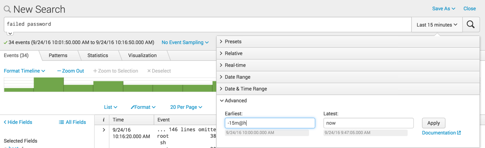
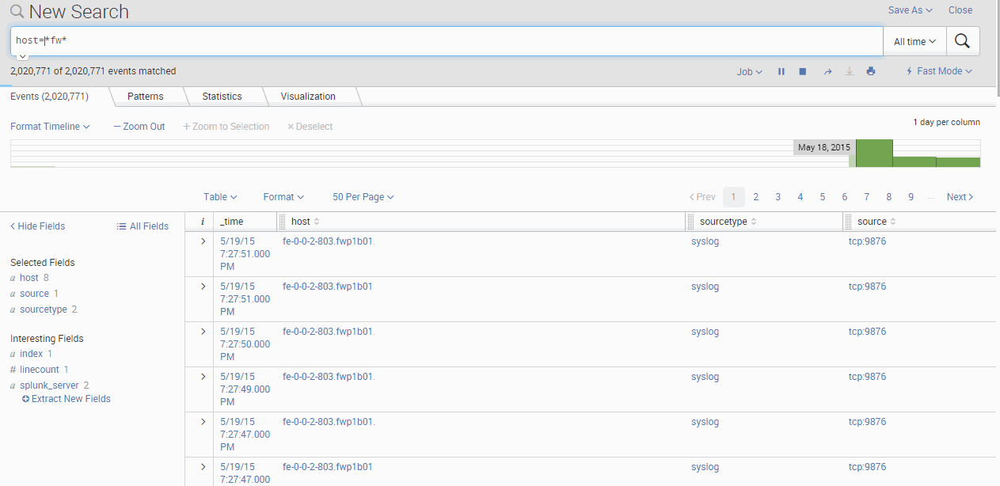
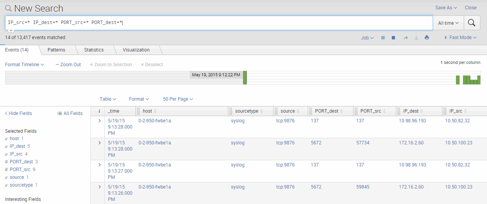

# Basic Search Review

- [Basic Search Review](#basic-search-review)
  - [Commands:](#commands)
    - [Keywords](#keywords)
    - [Booleans](#booleans)
    - [Phrases](#phrases)
    - [Field Searches:](#field-searches)
    - [Wildcards](#wildcards)
    - [Comparisons](#comparisons)
    - [Time Range:](#time-range)
  - [Look for data from hosts with a common name.](#look-for-data-from-hosts-with-a-common-name)
  - [Search logs that have only specific indexed fields](#search-logs-that-have-only-specific-indexed-fields)


## Commands: 

### Keywords 
search for `error password`

### Booleans
`OR`, `AND`, `NOT`. 

### Phrases
"web error". Find web error not web OR error

### Field Searches:
status=404, user=admin 

### Wildcards
status=40`*`  matches 40, 404, 401, etc.  "*" does not match spaces!

"`_`" space, colen, etc.  

### Comparisons
`=`,`!=`, `<`, `<=`, `>=`, `>`    

### Time Range: 

- s = seconds
- m = minutes
- h = hours
- d = days
- w =weeks
- mon = months
- y = year
- @ = snap to last total hour

 

- `earliest=-h`  look back one hour
- `earliest=-2d@d latest=@d`  looks back from two days ago, up to the beginning of time.  

## Look for data from hosts with a common name. 
I have all my firewalls have the "fw" somewhere in the hostname.  With this, I can simply run the following search
```
host=*fw*
```

and it will come up with all the data from all the firewalls being logged.  

 

## Search logs that have only specific indexed fields
In this example you want to work only with log files that have been properly indexed.  You can either use default fields, or extract your own fields (see previous how-to).  

In this example, I want to only see logs that contain the four variables that I have previously setup that show the traffics source and destination IP and Port.  

To do this, simply enter in the following on the search bar: 
```
IP_src=* IP_dest=* PORT_src=* PORT_dest=*
```

(not that in this example, I set the view to be "table" rather then "list")

 

Once this is done, you can then sort data based on the variables that required.  