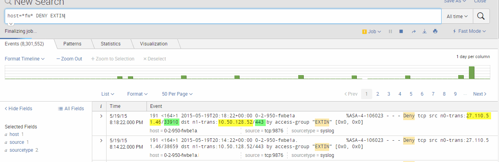
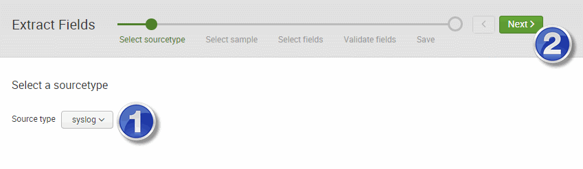
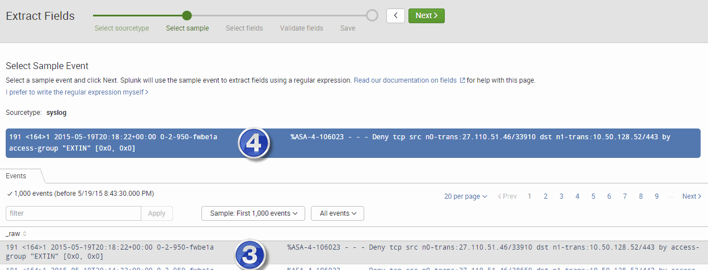
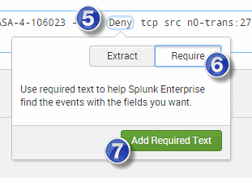
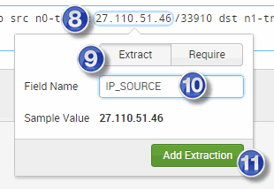
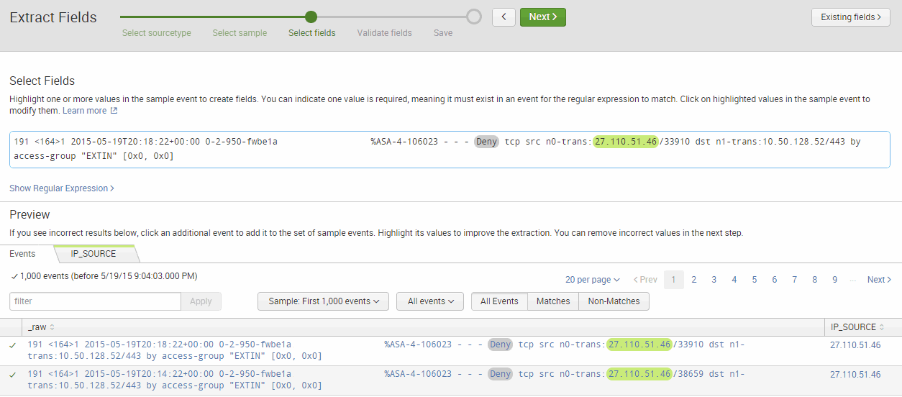

# Extract New Fields

- [Extract New Fields](#extract-new-fields)
  - [Overview:](#overview)
  - [Find Logs:](#find-logs)
  - [Extract Fields:](#extract-fields)


## Overview: 
When you do a search for new data, you might find that the splunk box does not automatically understand the data that you sent it.  With this lack of understanding, you can still find data by searching, but you can not use this data for graphs or analysis.  You can teach splunk how to find specific data and what to call it, and when you do this, you can then work with that data.  

## Find Logs:
In this example we have run the following search which looks for all firewall logs (via host=fw), and then looks for anything with the phrase "DENY" and EXTIN (which in my case is the name of the acl).
```
host=*fw* DENY EXTIN
```

If you look at the resulting data, I have a lot of data, but splunk does not understand what are the source/destination IPs and ports.  

 

To fix this I need to go in the lower left column, and select "**Extract New Fields**" 

## Extract Fields: 
Once you select the Extract New Fields link, specify the source type, in our case, its syslog(1)  and then select next(2)

 

Then select a row that is a good example with the data you want to search for(3) and it will then appear above in the window (4), and then select next. 

 

In the select fields window, select sections of the message that you want to require of all messages that should be looked at.  In other words, we're going to be looking for specific things in the logs, and assigning variable names to them.  But you can first pre-filter this data, so that it only does the variable assignments on log messages that contain the following.   

 

Then select sections of the log message that you want to assign variable names to .  In this example, I selected the source IP "27.110.51.46", and I gave it the variable name IP_SOURCE.  

 

Once the selections are complete, confirm the fields are in all the log files and select next.  Then select finish to enable this and start indexing all the fields.  

 

