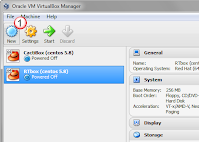
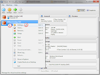
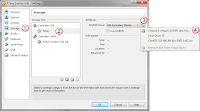
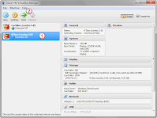

# Creating a new Image

From the VirtualBox window, select the New(1) button, and follow the instructions for getting the "box" built. 



under the settings of the vm, 



Under Storage(1), under the IDE controler, select the empty cd(2), and then select the disk icon(3) and select Choose a virtual CD/DVD disk file(4).  Then find the iso disk for the system.  



Then select the VM you just build(1) and start(2) it.  



## Boot image: 
I use centos "minimal.iso" but then have network problems.  (see:note)  fix that by doing the following: 
```bash
vi /etc/sysconfig/network-sripts/ifconfig-eth0
```

and made the change
```
    ONBOOT=yes
```

Then
```bash
/etc/init.d/network restart
ifconfig -a
```
