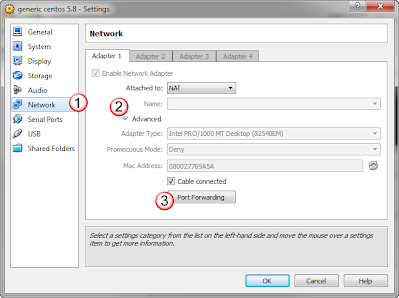

# sshing into your vm

## Overview:
If you simply need to ssh into a VM thats' running in VirtualBox, it might be simpler to just ssh into it rather then connecting directly through the console.  There are only a few steps to set this up and this document goes though them. 

This would also be the same process if you wanted to connect to a webserver that was running on a VM, or if there were any other daemons you wanted to connect to. 

## Setting Up Port Forwarding with a NAT interface:
From the virtual box manager, select the vm you want to modify(1) and then select settings (2).

In the settings window, from the left hand column select Network (1), under Adaptor1 tab select the Advanced triangle (2) to view details on this adaptor, and then select the Port Forwarding button (3). 

Then in the port forwarding rules window, add a new rule with the "+" icon (1), then name the rule (2), and define what port on your PC, or "Host Port" it should use.   And finally, define what port on the VM (4), or "guest port" it should go to.

Once that is all saved, in putty enter the hostname as localhost (1) and for the port use the above "host port" in the port field (2), and select open. 

you're all set!  Simply log in just as you would from the VB console!

