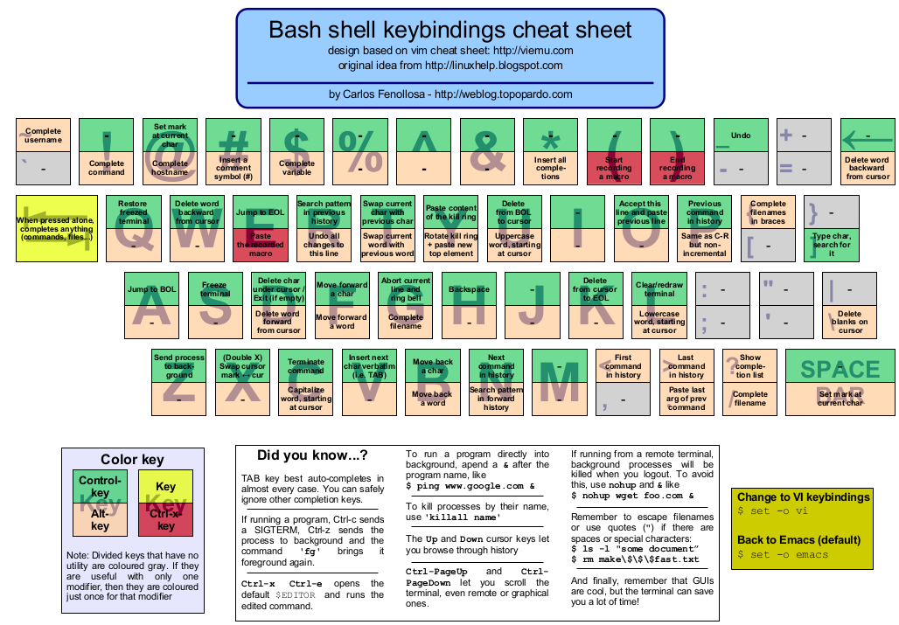

# Key Shortcuts

## Overall Map: 

## Important Items: 

| Key Combo | Description | 
|--|--|
 `CTRL`+`A` `fn` + `←` | Go to the beginning of a line	 
 `ALT`+`B` `esc` , `b` | Go back a word	 
 `CTRL`+`F` `esc` , `f` | Move forward a word	 
 `CTRL`+`E` `fn` + `→` | Move to the end of line
 `CTRL`+`U` | Delete all characters before the cursor	 
 `CTRL`+`K` | Delete all characters after the cursor.
 `CTRL`+`W` | Delete the word before the cursor.

