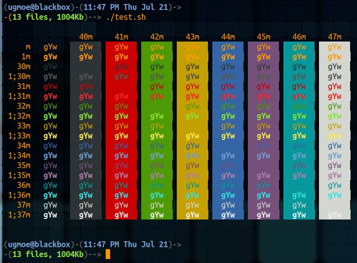

# Shell color coding: 
As far as the prompt, and how to color code it, the following is a key for the colors and how to enter it. 

## Reference:
- [How to Customize the Command Prompt](http://code.tutsplus.com/tutorials/how-to-customize-the-command-prompt--net-20586): June 2011 