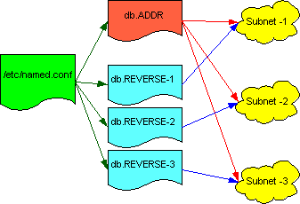

# Nutshell Primer of Bind 8


## Overview of Bind 8
There are two different types of syntax, we are basing all our examples on Bind version 8. (The other is version 4, which we won't discuss.)

In a basic layout, we have three sets of files, the `/etc/named.conf` file, the `db.ADDR` file and the `db.REVERSE` file. The main file, `/etc/named.conf`, is the master file that points to where the other files are, what they are called, and what they contain. The other two files are specific about the hosts in the domain.

The `db.ADDR` file lists all the hosts in the domain, and their IP's. This "forward lookup" file, is used for converting domain names to ips, and holds a list of all the hosts in the domain, no matter how many subnets they span across. On the other hand, the `db.REVERSE` file, or "reverse look up" file, is specific to each subnet. It contains the IPs and then their host names, but if there are three subnets for a domain, since it is specific to each subnet, there needs to be three separate `db.REVERSE` files. This file is used when the IP is known, but the hostname is not.



- `/etc/named.conf` file: This is the main configuration file for BIND. It is always named: `/etc/named`.conf which makes it pretty easy to find. This file points to all the other database files and specify what domains it is master to, and who it is a slave to.
- `db.ADDR` file: This is the standard name lookup file, sometime called a forward lookup table. This table defines names to ip addresses. We use one file for all the different subnets that are under the same domain name grouping (like `*.chuck.com`).
- `db.REVERSE` file: This is a collection of files, in this example we have three. There needs to be a separate file for each class "C" subnet, and also a file for the servers loopback address (127.0.0.0)

## The /etc/named.conf File
The most important file is the `/etc/named.conf`

the /etc/named.conf file

```bind
// BIND configuration file

options {
		directory "/usr/local/named';
		// Place additional options here.
};

zone "chuck.com" in {
		type master;
		file "db.chuck";
};

zone "1.6.10.in-addr.arpa" in {
		type master;
		file "db.10.6.1";
};

zone "50.6.10.in-addr.arpa" in {
		type master;
		file "db.10.6.50";
};

zone "0.0.127.in-addr.arpa" in {
		type master;
		file "db.127.0.0";
};

zone "." in {
		type hint;
		file "db.cashe";
};

zone "smcint.com" in {
		type slave;
		file "db.smcint";
		masters { 192.168.235.30; };
};

zone "235.168.192.in-addr.arpa" in {
		type slave;
		file "db.192.168.235";
		masters { 192.168.235.30; };
};
```

## Simple Example of db.ADDR
For mapping hostnames to addresses. This file would be called: `db.chuck`

the db.ADDR file
```bind
@ IN  SOA  NS1.chuck.com. mowgli.mail.chuck.com. (       
		1   	; Serial
		10800	; Refresh after 3 hours
		3600	; Retry after 1 hour
		604800	; Expire after 1 week
		86400 )	; Minimum TTL of 1 day
;
; Name servers (The name '@' is implied)
;
    		IN	NS	NS1.chuck.com
    		IN	NS	NS2.chuck.com

;
; Addresses for the canonical names
;
localhost	IN	A	127.0.0.1
red 		IN	A	10.6.1.10
green		IN	A	10.6.1.11
brown		IN	A	10.6.1.12
blue		IN	A	10.6.1.13
purple		IN	A	10.6.1.14
		
magenta		IN	A	10.6.50.10
azure		IN	A	10.6.50.11
mahogany   	IN	A	10.6.50.12
chartreuse	IN	A	10.6.50.13

;
; Aliases
;
quake		IN	CNAME	red
music		IN	CNAME	brown
backup		IN	CNAME	azure
```

## Simple Example of db.REVERSE
In our example, "chuck.com" maintains two subnets plus its loopback, which is where we get three files for this example.

In this example we have three db.reverse files:
- db.10.6.1
- db.10.6.50
- db.127.0.0

This is the contents of the file named db.10.6.1

the db.10.6.1 file
```txt
01  ! -- 

;
; Origin added to names not ending in 
; dot: 1.6.10.in-addr.arpa
;
@ IN  SOA  NS1.chuck.com. mowgli.mail.chuck.com. (       
		1   	; Serial
		10800	; Refresh after 3 hours
		3600	; Retry after 1 hour
		604800	; Expire after 1 week
		86400 )	; Minimum TTL of 1 day
;
; Name servers (The name '@' is implied)
;
    		IN	NS	NS1.chuck.com
    		IN	NS	NS2.chuck.com

;
; Addresses point to canonical name
;
10  		IN	PTR	red.chuck.com.
11  		IN	PTR	green.chuck.com.
12  		IN	PTR	brown.chuck.com.
13  		IN	PTR	blue.chuck.com.
14  		IN	PTR	purple.chuck.com.
```

This is the contents of the file named: db.10.6.50

the db.10.6.50 file
```txt
01  ! -- 
;
; Origin added to names not ending in 
; dot: 50.6.10.in-addr.arpa
;
@ IN  SOA  NS1.chuck.com. mowgli.mail.chuck.com. (       
		1   	; Serial
		10800	; Refresh after 3 hours
		3600	; Retry after 1 hour
		604800	; Expire after 1 week
		86400 )	; Minimum TTL of 1 day
;
; Name servers (The name '@' is implied)
;
    		IN	NS	NS1.chuck.com
    		IN	NS	NS2.chuck.com

;
; Addresses point to canonical name
;
10  		IN	PTR	magenta
11  		IN	PTR	azure
12  		IN	PTR	mahogony
13  		IN	PTR	chartreuse
```
The contents of the file db.127.0.0

the db.127.0.0.0 file
```txt
01  ! -- 
@ IN  SOA  NS1 mowgli.mail (       
		1   	; Serial
		10800	; Refresh after 3 hours
		3600	; Retry after 1 hour
		604800	; Expire after 1 week
		86400 )	; Minimum TTL of 1 day

    		IN	NS	NS1
    		IN	NS	NS2
```

## More Advanced Features

## Definitions
- `SOA Record`: Start Of Authority. Indicates authority for this zone. Or, "The SOA record indicates that this name server is the best source of information for the data within this zone. An SOA record is required in each db.DOMAIN and db.ADDR file. There can be one, and only one, SOA record in a db file."1
- `IN`: The IN stands for internet. This is one class of data. Other classes exist, but none of them are currently in widespread use. The class field is optional, if the class is omitted, the class IN is assumed.
- `NS Record`: Lists a name server for this zone
- `A`: Name-to-Address mapping
- `PTR`: Address-to-Name mapping. This is used in the db.reverse files when specifying a ip to name listing. Addresses should only point to a single name: the canonical name. You can create two PTR record records for a single host, but most systems are not prepared to see more that one name for an address. 3
- `CNAME`: Canonical name (for aliases). Note: "The name server handles CNAME records in a different manner than aliases are handled in the host table. When a name server looks up a name and finds a CNAME record, it replaces the name with the canonical name and looks up the new name."2
- `@`: If the domain name is the same as the origin, the name can be specified as "@". This means that instead of having to list the names in the file red.chuck.com., you can instead name it red and the rest is implied. Note that if the name ends with a "." then the shortening will not work.
- `type slave`: Within a /etc/named.conf file. The type slave specify's what zone it's slave over, and what's the ip of the master server of that domain. There should be both forward and reverse lookups for slave zones (db.addr and db.reverse files).
- `Serial SOA value`: This applies to all data within a zone. When a slave name server contacts a master server for zone data, it first asks for the serial number on that data. If the slave's serial number is lower than the master server's, the slave zone data are out of date. In this case, the slave pulls a new copy of the of the zone. If you modify the the db files on the primary master, you must increment the serial number or the slave will not upload the changes. A good format for the serial number is YYYYMMDDNN, where NN is a counter for a specific day. (ie: 2000112601) Also note that with bind 8 on both the master and slave servers, the primary master will notify the slave that a zone has been changed within 15 minutes of loading a new copy of that zone.
- `Refresh SOA value`: The refresh interval tells the slave how often to check that its data are up to date.
- `Retry SOA value`: If the slave fails to reach the master name server(s) after the refresh period (the hosts could be down), then it starts to trying to connect after every every retry period.
- `Expire SOA value`: If the slave fails to contact the master server(s) for expire seconds, the slave expires its data. Expiring the data means that the slave stops giving out answers about the data because the data are too old to be useful.
- `TTL SOA value`: TTL stands for time to live. This value applies to all the resource records in the db file.
- `MX Record`: specify a mail exchanger for a domain name: a host will either process or forward mail for the domain name. The number following the MX label is the mail exchanger preference value. The preference of a possible mail server is higher if the number is lower. (thus 0 would be considered the highest preference. -you can also have mail sent to two servers with the same preference - they load balance.) For an example, gwu would have a MX listing as such:
```
gwu.edu. IN MX 0 gwis2.circ.gwu.edu.
gwu.edu. IN MX 10 felix.seas.gwu.edu.
gwu.edu. IN MX 20 mail.law.gwu.edu.
```
This would send all mail to "gwu.edu" to gwis2, but if it went down, seas could accept their mail, and if they both went down, then the mail could go to the law school.
