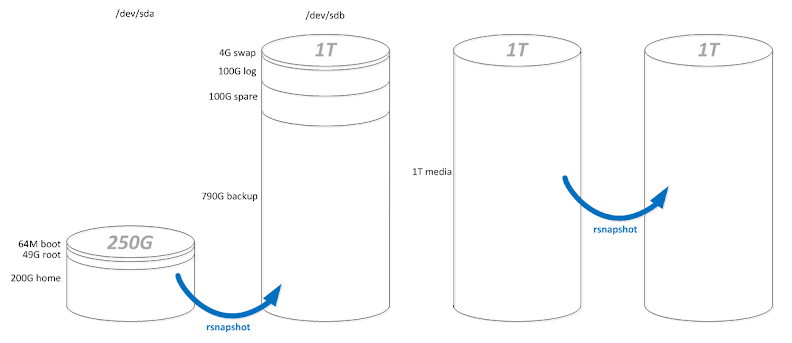

# Gentoo Filer2

## Overview:

## Get the box connectable:
From the terminal, do the following:
```
net-setup
    select: eth0
    select: My network is wired
    select: Use DHCP to auto-detect my network settings
passwd
/etc/init.d/sshd start
ifconfig
```

Now you can ssh into the box from another workstation, and don't have to stare at a terminal for a couple of hours.  

From the console, ssh into the box and continue:

## Set up the drives:
I have three 1T drives, and one 250G drive.  I'm laying out them in the following method



And to do this I would do the following at the console:
```
fdisk /dev/sda
    p
    n, p, 1, [enter], +64M          #boot
    n, p, 2, [enter], +49G          #root
    n, p, 3, [enter], [enter]       #home
    a, 1                            #set boot to bootable 
    w                               #write changes 
fdisk /dev/sdb
    p
    n, p, 1, [enter], +4G           #swap
    n, p, 2, [enter], +100G         #log
    n, p, 3, [enter], +100G         #spare
    n, p, 4, [enter], [enter]       #backup  
    t, 1, 82                        #set swap to swap
    w                               #write changes
```

## Set the Stage:

use ext2 for the /boot partition
```
mke2fs /dev/sda1           #boot
```

use ext3 on the main partitions
```
mke2fs -j /dev/sda2        #root
mke2fs -j /dev/sda3        #home

mke2fs -j /dev/sdb2        #log
mke2fs -j /dev/sdb3        #spare
mke2fs -j /dev/sdb4        #backup
```

Create and activate the swap
```
mkswap /dev/sdb1 && swapon /dev/sdb1
```

Mount the filesystems:
```
mount /dev/sda2 /mnt/gentoo           #root

mkdir /mnt/gentoo/boot
mount /dev/sda1 /mnt/gentoo/boot      #boot

cd /mnt/gentoo
```

The following is copied (and ~slightly~ modified) from the gentoo quick install guide.  See the full guide here and consider the following a complete quote from the original.  (all credit is obviously granted to the Gentoo guys.)
http://www.gentoo.org/doc/en/gentoo-x86-quickinstall.xml

Code Listing 2.11: Set the date and UTC time
```
(Check the clock)
livecd gentoo # date
Mon Mar  6 00:14:13 UTC 2006

(Set the current date and time if required)
livecd gentoo # date 030600162006 (Format is MMDDhhmmYYYY)
Mon Mar  6 00:16:00 UTC 2006
```

Download from one of the mirrors, and then unpack it.
wget http://mirror.datapipe.net/gentoo/releases/x86/current-stage3/stage3-i686-20120410.tar.bz2
time tar xjpf stage3*

Download the latest portage snapshot and unpack it
```
cd /mnt/gentoo/usr
wget http://mirror.datapipe.net/gentoo/releases/snapshots/current/portage-latest.tar.bz2
time tar xjf portage-lat*
```

Chroot:
```
cd /
mount -t proc proc /mnt/gentoo/proc
mount --rbind /dev /mnt/gentoo/dev
cp -L /etc/resolv.conf /mnt/gentoo/etc/
chroot /mnt/gentoo /bin/bash
env-update && source /etc/profile
```

Set Timezone:
```
cp /usr/share/zoneinfo/EST /etc/localtime
```

Set hostname:
```
cd /etc
echo "127.0.0.1 oak.cmed.us oak localhost" > hosts
sed -i -e 's/HOSTNAME.*/HOSTNAME="oak"/' conf.d/hostname
```

hostname oak
```
hostname -f
```

Kernel config:
```
time emerge gentoo-sources
cd /usr/src/linux
make menuconfig
```

The changes to the proc should include:
```
    Processor type and features  ---> 
       Processor family (Pentium-Pro)  --->
          (X) Core 2/newer Xeon
    File systems  --->
       <*> Second extended fs support                               
          [*]   Ext2 extended attributes  
          [*]     Ext2 POSIX Access Control Lists
          [*]     Ext2 Security Labels 
          [*]   Ext2 execute in place support
       [*] Additional quota sanity checks
       [*] Network File Systems (NEW)  --->
          <M>   CIFS support (advanced network filesystem, SMBFS successor
            [*]     CIFS extended attributes
```

compile kernel
```
time make -j2
make modules_install
cp arch/i386/boot/bzImage /boot/kernel
```

Configure the system:
```
Configure /etc/fstab
cd /etc
emerge vim
vim fstab

/dev/sda1   /boot     ext2    noauto,noatime     1 2
/dev/sda2   /         ext3    noatime            0 1
/dev/sda3   /home     ext3    noatime            0 1

/dev/sdb1   none      swap    sw                 0 0
/dev/sdb2   /var/log  ext3    noatime            0 1
/dev/sdb3   /spare    ext3    noatime            0 1
/dev/sdb4   /backup   ext3    noatime            0 1

/dev/cdrom  /mnt/cdrom   auto    noauto,ro       0 0
/dev/fd0    /mnt/floppy  auto    noauto          0 0
```

Config network:
```
cd init.d
ln -s net.lo net.eth0
cd ../conf.d
echo 'config_eth0="198.18.2.34 netmask 255.255.255.0 brd 198.18.2.255"' >> net
echo 'routes_eth0="default via 198.18.2.1"' >> net
echo 'hostname="oak"' > hostname
rc-update add net.eth0 default

rc-update add sshd default
```

change the root password
```
passwd
```

install services:
```
time emerge syslog-ng vixie-cron
rc-update add syslog-ng default
rc-update add vixie-cron default
```

Install bootloader:
```
time emerge grub
vim /boot/grub/grub.conf

default 0
timeout 10
title Gentoo
root (hd0,0)
kernel /boot/kernel root=/dev/sda2
```

configure grub
```
grub
    root (hd0,0)
    setup (hd0)
    quit
```

reboot (and see what you screwed up)
```
exit
umount -l /mnt/gentoo/dev{/shm,/pts,}
umount -l /mnt/gentoo{/proc,/boot,}
reboot
```

