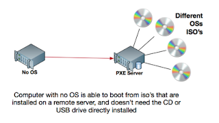
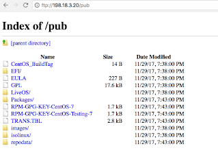
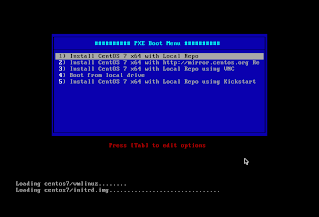

# PXE/Jumpstart server
- [PXE/Jumpstart server](#pxejumpstart-server)
  - [Overview](#overview)
  - [Setting up the PXE Server (pixie server)](#setting-up-the-pxe-server-pixie-server)
    - [Setup DNSMASQ Server (dhcp)](#setup-dnsmasq-server-dhcp)
    - [Setup SYSLINUX Bootloaders](#setup-syslinux-bootloaders)
    - [Setup TFTP-Server](#setup-tftp-server)
    - [Setup FTP Server](#setup-ftp-server)
    - [Setup PXE Server](#setup-pxe-server)
      - [Setup pxelinux setup](#setup-pxelinux-setup)
      - [Add Boot Images to PXE Server](#add-boot-images-to-pxe-server)
      - [Copy ISO data do the FTP Directory](#copy-iso-data-do-the-ftp-directory)
    - [Start and enable the Deamons](#start-and-enable-the-deamons)
    - [Open Firewall and Test FTP](#open-firewall-and-test-ftp)
    - [PXE Server Cleanup](#pxe-server-cleanup)
      - [Debug:](#debug)
      - [Unmount ISO](#unmount-iso)
    - [Automated Installations using Kickstart](#automated-installations-using-kickstart)
      - [Copy Kickstart File](#copy-kickstart-file)
      - [Add a new label to the PXE Server](#add-a-new-label-to-the-pxe-server)
  - [Results](#results)
  - [References:](#references)

## Overview

Host requirements: 
You will need to make sure that your host has at least 25G of disk space, as it will need to mount and copy the contents of 9G ISOs.

## Setting up the PXE Server (pixie server)
[Preboot eXecution Environment](https://en.wikipedia.org/wiki/Preboot_Execution_Environment) lets a computer boot from an image on another computer through the network.  Basically, you don't need to download linux (or whatever) onto a usb or cd to install it.  Instead you put it on another local computer, and tell the local computer to boot from the network.  



### Setup DNSMASQ Server (dhcp)
install
```bash
yum install dnsmasq
```

backup then edit its config file
```bash
[root@mon01 ~]# cp /etc/dnsmasq.conf /etc/dnsmasq.conf.backup
[root@mon01 ~]# vim /etc/dnsmasq.conf
```

Delete everything and just paste in the following.  but change the network settings as needed (see comments below)
```
interface=eth0,lo

#bind-interfaces
domain=cmed.us

# DHCP range-leases
dhcp-range= eth0,198.18.3.200,198.18.3.240,255.255.255.0,1h

# PXE
dhcp-boot=pxelinux.0,pxeserver,198.18.3.20

# Gateway
dhcp-option=3,198.18.3.1

# DNS
dhcp-option=6,8.8.8.8, 8.8.4.4
server=8.8.8.8

# Broadcast Address
dhcp-option=28,198.18.3.255

# NTP Server
dhcp-option=42,199.223.248.99

pxe-prompt="Press F8 for menu.", 60
pxe-service=x86PC, "Install CentOS 7 from network server 198.18.3.20", pxelinux
enable-tftp
tftp-root=/var/lib/tftpboot
```

You will want to make the following changes
- `eth0` should be replaced with your ethernet interface (maybe eth0?) you can confirm with the "`ip addr`" command
- `198.18.3.200,198.18.3.240` is the DHCP Scope that you will be giving IP addresses out on
- `255.255.255.0` is the netmask (and "1h" is the lease time)
- `198.18.3.20` is the IP for THIS server (the pxe server)
- `198.18.3.1` is the default gateway
- `192.168.1.1, 8.8.8.8` are the DNS servers
- `198.18.3.255` is the broadcast IP (x.y.z.255 on a normal class C network)
- `199.223.248.99` is the address of the ntp server

See also the [DNSMASQ](http://www.thekelleys.org.uk/dnsmasq/docs/dnsmasq-man.html) manual


### Setup SYSLINUX Bootloaders
install the PXE bootloader package
```bash
yum install syslinux
```

The boot loader files should now be installed in the `/usr/share/syslinux` directory.  You can confirm
```bash
[root@mon01 ~]# ls /usr/share/syslinux
altmbr.bin     disk.c32      gpxelinux.0     isohdpfx_f.bin      mboot.c32    poweroff.com    syslinux.com
altmbr_c.bin   dmitest.c32   gpxelinuxk.0    isohdppx.bin        mbr.bin      pwd.c32         syslinux.exe
altmbr_f.bin   dosutil       hdt.c32         isohdppx_c.bin      mbr_c.bin    pxechain.com    ver.com
cat.c32        elf.c32       host.c32        isohdppx_f.bin      mbr_f.bin    pxelinux.0      vesainfo.c32
chain.c32      ethersel.c32  ifcpu64.c32     isolinux.bin        memdisk      reboot.c32      vesamenu.c32
cmd.c32        gfxboot.c32   ifcpu.c32       isolinux-debug.bin  memdump.com  rosh.c32        vpdtest.c32
config.c32     gptmbr.bin    ifplop.c32      kbdmap.c32          meminfo.c32  sanboot.c32     whichsys.c32
cpuid.c32      gptmbr_c.bin  int18.com       linux.c32           menu.c32     sdi.c32         zzjson.c32
cpuidtest.c32  gptmbr_f.bin  isohdpfx.bin    ls.c32              pcitest.c32  sysdump.c32
diag           gpxecmd.c32   isohdpfx_c.bin  lua.c32             pmload.c32   syslinux64.exe
[root@mon01 ~]#
```

### Setup TFTP-Server
install the tftp server
```bash
yum install tftp-server
```

and copy all the bootloader files above to the tftpboot directory
```bash
cp -r /usr/share/syslinux/* /var/lib/tftpboot
```

### Setup FTP Server
This is used for the PXE server to get iso data for the booting kernel.  Install the vsftpd ftp service
```bash
yum install vsftpd
```

in the PXE Server setup, you will add content to the ftp directory in /var/ftp/pub/ .  

### Setup PXE Server

#### Setup pxelinux setup
This allows you to boot hosts with a bunch of different options

Create the pxelinux default file
```bash
[root@mon01 ~]# mkdir /var/lib/tftpboot/pxelinux.cfg
[root@mon01 ~]# vim /var/lib/tftpboot/pxelinux.cfg/default
```

and add the following, which will give you 4 options at boot.  
1. boots from the pxe server, and loads from ftp server (on pxe server)
2. boots from the pxe server, and loads from internet centos mirror site
3. boots from the pxe server, and loads from ftp server (on pxe server), but also loads vnc to support gui install
4. boots from local drive. 

```
default menu.c32
prompt 0
timeout 300

MENU TITLE ########## PXE Boot Menu ##########

LABEL 1
  MENU LABEL ^1) CentOS 7 x64 with Local Repo
  KERNEL centos7/vmlinuz
  APPEND initrd=centos7/initrd.img repo=ftp://198.18.3.20/pub/ devfs=nomount

LABEL 2
  MENU LABEL ^2) Install CentOS 7 x64 with http://mirror.centos.org Repo
  KERNEL centos7/vmlinuz
  APPEND initrd=centos7/initrd.img method=http://mirror.centos.org/centos/7/os/x86_64/ devfs=nomount ip=dhcp

LABEL 3
  MENU LABEL ^3) Install CentOS 7 x64 with Local Repo using VNC
  KERNEL centos7/vmlinuz
  APPEND  initrd=centos7/initrd.img method=ftp://198.18.3.20/pub devfs=nomount inst.vnc inst.vncpassword=password

LABEL 4
  MENU LABEL ^4) Boot from local drive
```

- `centos7/vmlinuz` is the (relative) path to the kernel, the full path would be /var/lib/tftpboot/centos7/vmlinux since that's where this file is. 
- `198.18.3.20` is the local server's IP.  The installer repositories will be reached there via the /pub directory
- `inst.vnc` boots with vnc support
- `password` is the vnc password.  you should strive for something a bit better ;-)
- `dhcp` boot server with ip from DHCP

See [Syslinux Menu System](https://wiki.syslinux.org/wiki/index.php?title=Menu) for notes on the variables and how to use them. 

(Could you put in more directories, and allow installs from different versions/distributions?  if so, show this)

#### Add Boot Images to PXE Server
Download the full iso.  We will need this to create the local installer repos in the ftp directory.
```bash
[root@mon01 ~]# curl -C - -O 'http://mirror.cogentco.com/pub/linux/centos/7/isos/x86_64/CentOS-7-x86_64-Everything-1708.iso'
  % Total    % Received % Xferd  Average Speed   Time    Time     Time  Current
                                 Dload  Upload   Total   Spent    Left  Speed
  2 8292M    2  194M    0     0  6834k      0  0:20:42  0:00:29  0:20:13 6851k
```

then mount the iso
```bash
[root@mon01 ~]# mount -o loop CentOS-7-x86_64-Everything-1708.iso /mnt
mount: /dev/loop0 is write-protected, mounting read-only
[root@mon01 ~]#
```

Create the centos7 directory and copy the bootable kernel and initrd images 
```bash
mkdir /var/lib/tftpboot/centos7
cp /mnt/images/pxeboot/vmlinuz  /var/lib/tftpboot/centos7
cp /mnt/images/pxeboot/initrd.img  /var/lib/tftpboot/centos7
```

#### Copy ISO data do the FTP Directory
Copy all the mounted content tot he vsftpd server path (/var/ftp/pub) .  The copy command will probably take a while.
```bash
cp -v -r /mnt/*  /var/ftp/pub/ 
chmod -R 755 /var/ftp/pub
```

### Start and enable the Deamons
Start the services, verify their status, and enable them system wide
```bash
[root@mon01 ~]# systemctl start dnsmasq
[root@mon01 ~]# systemctl status dnsmasq
● dnsmasq.service - DNS caching server.
   Loaded: loaded (/usr/lib/systemd/system/dnsmasq.service; disabled; vendor preset: disabled)
   Active: active (running) since Thu 2017-11-30 00:44:39 GMT; 4s ago
 Main PID: 23011 (dnsmasq)
   CGroup: /system.slice/dnsmasq.service
           └─23011 /usr/sbin/dnsmasq -k

Nov 30 00:44:39 mon01.cmed.us dnsmasq[23011]: started, version 2.76 cachesize 150
Nov 30 00:44:39 mon01.cmed.us dnsmasq[23011]: compile time options: IPv6 GNU-getopt DBus no-i1...ify
Nov 30 00:44:39 mon01.cmed.us dnsmasq-dhcp[23011]: DHCP, IP range 198.18.3.200 -- 198.18.3.240,...1h
Nov 30 00:44:39 mon01.cmed.us dnsmasq-tftp[23011]: TFTP root is /var/lib/tftpboot
Nov 30 00:44:39 mon01.cmed.us dnsmasq[23011]: using nameserver 8.8.8.8#53
Nov 30 00:44:39 mon01.cmed.us dnsmasq[23011]: reading /etc/resolv.conf
Nov 30 00:44:39 mon01.cmed.us dnsmasq[23011]: using nameserver 8.8.8.8#53
Nov 30 00:44:39 mon01.cmed.us dnsmasq[23011]: using nameserver 8.8.8.8#53
Nov 30 00:44:39 mon01.cmed.us dnsmasq[23011]: using nameserver 8.8.4.4#53
Nov 30 00:44:39 mon01.cmed.us dnsmasq[23011]: read /etc/hosts - 2 addresses
Hint: Some lines were ellipsized, use -l to show in full.
[root@mon01 ~]#
[root@mon01 ~]# systemctl start vsftpd
[root@mon01 ~]# systemctl status vsftpd
● vsftpd.service - Vsftpd ftp daemon
   Loaded: loaded (/usr/lib/systemd/system/vsftpd.service; disabled; vendor preset: disabled)
   Active: active (running) since Thu 2017-11-30 00:44:58 GMT; 4s ago
  Process: 23019 ExecStart=/usr/sbin/vsftpd /etc/vsftpd/vsftpd.conf (code=exited, status=0/SUCCESS)
 Main PID: 23020 (vsftpd)
   CGroup: /system.slice/vsftpd.service
           └─23020 /usr/sbin/vsftpd /etc/vsftpd/vsftpd.conf

Nov 30 00:44:58 mon01.cmed.us systemd[1]: Starting Vsftpd ftp daemon...
Nov 30 00:44:58 mon01.cmed.us systemd[1]: Started Vsftpd ftp daemon.
[root@mon01 ~]#
[root@mon01 ~]#
[root@mon01 ~]# systemctl enable dnsmasq
Created symlink from /etc/systemd/system/multi-user.target.wants/dnsmasq.service to /usr/lib/systemd/system/dnsmasq.service.
[root@mon01 ~]# systemctl enable vsftpd
Created symlink from /etc/systemd/system/multi-user.target.wants/vsftpd.service to /usr/lib/systemd/system/vsftpd.service.
[root@mon01 ~]#
```

### Open Firewall and Test FTP
Confirm what ports the services are running on with netstat
```bash
root@mon01 ~]# netstat -tulpn
Active Internet connections (only servers)
Proto Recv-Q Send-Q Local Address           Foreign Address         State       PID/Program name
tcp        0      0 0.0.0.0:53              0.0.0.0:*               LISTEN      23011/dnsmasq
tcp        0      0 0.0.0.0:22              0.0.0.0:*               LISTEN      2025/sshd
tcp        0      0 127.0.0.1:25            0.0.0.0:*               LISTEN      1212/master
tcp6       0      0 :::21                   :::*                    LISTEN      23020/vsftpd
tcp6       0      0 :::53                   :::*                    LISTEN      23011/dnsmasq
tcp6       0      0 :::22                   :::*                    LISTEN      2025/sshd
tcp6       0      0 ::1:25                  :::*                    LISTEN      1212/master
udp        0      0 0.0.0.0:4011            0.0.0.0:*                           23011/dnsmasq
udp        0      0 0.0.0.0:53              0.0.0.0:*                           23011/dnsmasq
udp        0      0 0.0.0.0:67              0.0.0.0:*                           23011/dnsmasq
udp        0      0 0.0.0.0:69              0.0.0.0:*                           23011/dnsmasq
udp        0      0 127.0.0.1:323           0.0.0.0:*                           626/chronyd
udp6       0      0 :::53                   :::*                                23011/dnsmasq
udp6       0      0 :::69                   :::*                                23011/dnsmasq
udp6       0      0 ::1:323                 :::*                                626/chronyd
[root@mon01 ~]#
```

Confirm that firewalld is running
```bash
[root@mon01 ~]# firewall-cmd --state
running
[root@mon01 ~]#
```

and then add the needed rules to allow services for FTP, DNS, DHCP, TFTP, and ProxyDHCP
```
firewall-cmd --add-service=ftp --permanent    ## Port 21(tcp) for FTP
firewall-cmd --add-service=dns --permanent    ## Port 53(udp) for DNS
firewall-cmd --add-service=dhcp --permanent   ## Port 67(udp) for DHCP
firewall-cmd --add-port=69/udp --permanent    ## Port 69(udp) for TFTP
firewall-cmd --add-port=4011/udp --permanent  ## Port 4011(udp) for ProxyDHCP
```

then reload firewalld to apply the new rules
```bash
[root@mon01 ~]# firewall-cmd --reload   ## Apply rules
success
[root@mon01 ~]#
```

Then from your laptop, test the ftp service from your browser



or from command line
```bash
$ curl ftp://198.18.3.20/pub/
-rwxr-xr-x    1 0        0              14 Nov 30 00:38 CentOS_BuildTag
drwxr-xr-x    3 0        0              35 Nov 30 00:38 EFI
-rwxr-xr-x    1 0        0             227 Nov 30 00:38 EULA
-rwxr-xr-x    1 0        0           18009 Nov 30 00:38 GPL
drwxr-xr-x    2 0        0              43 Nov 30 00:38 LiveOS
drwxr-xr-x    2 0        0          532480 Nov 30 00:43 Packages
-rwxr-xr-x    1 0        0            1690 Nov 30 00:43 RPM-GPG-KEY-CentOS-7
-rwxr-xr-x    1 0        0            1690 Nov 30 00:43 RPM-GPG-KEY-CentOS-Testing-7
-rwxr-xr-x    1 0        0            2883 Nov 30 00:43 TRANS.TBL
drwxr-xr-x    3 0        0              57 Nov 30 00:38 images
drwxr-xr-x    2 0        0             198 Nov 30 00:38 isolinux
drwxr-xr-x    2 0        0            4096 Nov 30 00:43 repodata
```

### PXE Server Cleanup

#### Debug: 

if you need to see debug the PXE server for misconfigurations, 
```bash
[root@mon01 ~]# tailf /var/log/messages
Nov 30 00:45:13 mon01 systemd: Reloading.
Nov 30 00:57:54 mon01 firewalld[645]: WARNING: ALREADY_ENABLED: ftp
Nov 30 00:59:23 mon01 firewalld[645]: WARNING: ICMP type 'beyond-scope' is not supported by the kernel for ipv6.
Nov 30 00:59:23 mon01 firewalld[645]: WARNING: beyond-scope: INVALID_ICMPTYPE: No supported ICMP type., ignoring for run-time.
Nov 30 00:59:23 mon01 firewalld[645]: WARNING: ICMP type 'failed-policy' is not supported by the kernel for ipv6.
Nov 30 00:59:23 mon01 firewalld[645]: WARNING: failed-policy: INVALID_ICMPTYPE: No supported ICMP type., ignoring for run-time.
Nov 30 00:59:23 mon01 firewalld[645]: WARNING: ICMP type 'reject-route' is not supported by the kernel for ipv6.
Nov 30 00:59:23 mon01 firewalld[645]: WARNING: reject-route: INVALID_ICMPTYPE: No supported ICMP type., ignoring for run-time.
Nov 30 01:01:01 mon01 systemd: Started Session 4 of user root.
Nov 30 01:01:01 mon01 systemd: Starting Session 4 of user root.
```

#### Unmount ISO 
unmount the iso that was mounted earlier 
```bash
umount /mnt
```

### Automated Installations using Kickstart
The kickstart file allows many computers to automatically be setup in all the same ways.  The easiest way to do this is to manually install one server, and then copy the local file `/root/anaconda-ks.cfg` to the PXE server and in the pxemenu config file to set the line `inst.ks=protocol://path/to/kickstart.fileto`.  

#### Copy Kickstart File
From the PXE server's /root directory, copy the anaconda-ks.cfg file to the ftp directory
```bash
cp anaconda-ks.cfg  /var/ftp/pub/
chmod 755 /var/ftp/pub/anaconda-ks.cfg
```

edit the kickstart file
```bash
vim /var/ftp/pub/anaconda-ks.cfg
```

At the minimum, first tell it to boot from the ftp server rather then CDROM, and second have it get an IP address via dhcp.  
```
# Use CDROM installation media
# cdrom
# Use network installation
url --url="ftp://198.18.3.20/pub/"

# Network information
# network  --bootproto=static --device=eth0 --gateway=198.18.3.1 --ip=198.18.3.20 --nameserver=8.8.4.4,8.8.8.8 --netmask=255.255.255.0 --ipv6=auto --activate
network  --bootproto=dhcp --device=eth0 --ipv6=auto --activate
```

For more notes, see the [RHEL 7 Kickstart Documentation](https://access.redhat.com/documentation/en-us/red_hat_enterprise_linux/7/html/installation_guide/sect-kickstart-syntax)
an [example kickstart config can be found here](kickstart1.md).  

Next verify the kickstart file with pykickstart. 

First install pykickstart
```bash
yum install pykickstart
```

Then run it to test the file
```bash
[root@mon01 ~]# ksvalidator /var/ftp/pub/anaconda-ks.cfg
[root@mon01 ~]#
```

Finally, confirm that the kickstart file is accessible via ftp from your laptop
```bash
$ curl ftp://198.18.3.20/pub/
-rwxr-xr-x    1 0        0              14 Nov 30 00:38 CentOS_BuildTag
drwxr-xr-x    3 0        0              35 Nov 30 00:38 EFI
-rwxr-xr-x    1 0        0             227 Nov 30 00:38 EULA
-rwxr-xr-x    1 0        0           18009 Nov 30 00:38 GPL
drwxr-xr-x    2 0        0              43 Nov 30 00:38 LiveOS
drwxr-xr-x    2 0        0          532480 Nov 30 00:43 Packages
-rwxr-xr-x    1 0        0            1690 Nov 30 00:43 RPM-GPG-KEY-CentOS-7
-rwxr-xr-x    1 0        0            1690 Nov 30 00:43 RPM-GPG-KEY-CentOS-Testing-7
-rwxr-xr-x    1 0        0            2883 Nov 30 00:43 TRANS.TBL
-rwxr-xr-x    1 0        0            1531 Nov 30 03:10 anaconda-ks.cfg
drwxr-xr-x    3 0        0              57 Nov 30 00:38 images
drwxr-xr-x    2 0        0             198 Nov 30 00:38 isolinux
drwxr-xr-x    2 0        0            4096 Nov 30 00:43 repodata
```

#### Add a new label to the PXE Server
Modify the pxelinux config file
```bash
vim /var/lib/tftpboot/pxelinux.cfg/default
```

With the following changes
```bash
default menu.c32
prompt 0
timeout 300

MENU TITLE ########## PXE Boot Menu ##########

LABEL 1
  MENU LABEL ^1) CentOS 7 x64 with Local Repo
  KERNEL centos7/vmlinuz
  APPEND initrd=centos7/initrd.img repo=ftp://198.18.3.20/pub/ devfs=nomount

LABEL 2
  MENU LABEL ^2) Install CentOS 7 x64 with http://mirror.centos.org Repo
  KERNEL centos7/vmlinuz
  APPEND initrd=centos7/initrd.img method=http://mirror.centos.org/centos/7/os/x86_64/ devfs=nomount ip=dhcp

LABEL 3
  MENU LABEL ^3) Install CentOS 7 x64 with Local Repo using VNC
  KERNEL centos7/vmlinuz
  APPEND  initrd=centos7/initrd.img method=ftp://198.18.3.20/pub devfs=nomount inst.vnc inst.vncpassword=password

LABEL 4
  MENU LABEL ^4) Boot from local drive

LABEL 5
  MENU LABEL ^5) Install CentOS 7 x64 with Local Repo using Kickstart
  MENU DEFAULT
  KERNEL centos7/vmlinuz
  APPEND initrd=centos7/initrd.img inst.ks=ftp://198.18.3.20/pub/anaconda-ks.cfg devfs=nomount
```

- remove `ONTIMEOUT local` global statement
- add the LABEL 5 lines
- add the `MENU DEFAULT` statement to use this label after the timeout is complete.


## Results
If you boot a host from the network, you would be presented with the following page on the console of the booting server. 


 
 with pxe lable 1, you would get the fo

## References: 
- [Setting up a ‘PXE Network Boot Server’ for Multiple Linux Distribution Installations in RHEL/CentOS 7](https://www.tecmint.com/install-pxe-network-boot-server-in-centos-7/): Techmint, Matei Cezar, Oct 2014
- [Automated Installations of Multiple RHEL/CentOS 7 Distributions using PXE Server and Kickstart Files](https://www.tecmint.com/multiple-centos-installations-using-kickstart/): Techmint, Matei Cezar, Oct 2014
- [DNSMASQ Man Page](http://www.thekelleys.org.uk/dnsmasq/docs/dnsmasq-man.html): 
- [Install PXE Server On CentOS 7](https://www.unixmen.com/install-pxe-server-centos-7/): m.el Khamlichi, Unixmen, 
- [HOWTO: Configure a CentOS 6.0 Network Install Server](https://wiki.centos.org/HowTos/NetworkInstallServer): Oct 2015
- [Configuring a DHCP Server](https://www.centos.org/docs/5/html/Deployment_Guide-en-US/s1-dhcp-configuring-server.html): Redhat, CentOS 5
- [How To Set Up a Firewall Using FirewallD on CentOS 7](https://www.digitalocean.com/community/tutorials/how-to-set-up-a-firewall-using-firewalld-on-centos-7): Justin Ellingwood, June 2015
- [RHEL 7 Kickstart Documentation](https://access.redhat.com/documentation/en-us/red_hat_enterprise_linux/7/html/installation_guide/sect-kickstart-syntax): Redhat, System 7 
- [SYSLINUX Wiki](http://www.syslinux.org/wiki/index.php?title=SYSLINUX): Everything you need to know about the the network boot loader that we connect to via tftp

