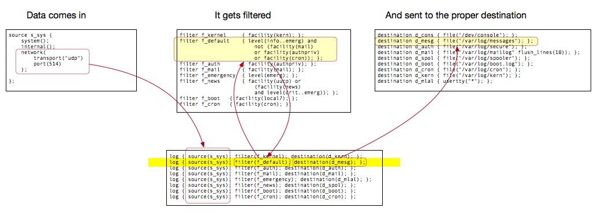

# Syslog NG

- [Syslog NG](#syslog-ng)
  - [Install on Centos 7:](#install-on-centos-7)
  - [Understanding the syslog config](#understanding-the-syslog-config)
    - [Sources Section](#sources-section)
    - [Filter Section](#filter-section)
    - [Destination Section](#destination-section)
    - [Log Section (the glue)](#log-section-the-glue)
    - [Review:](#review)
    - [IPTables/Firewalld](#iptablesfirewalld)
      - [Firewalld](#firewalld)
  - [Cron](#cron)
  - [References:](#references)

## Install on Centos 7: 
Syslog-ng is not in the normal yum path, so you need to first setup/point to the epel-release
```bash
yum -y install epel-release
yum -y repolist
yum -y update
reboot
```

Then install syslog-ng
```
yum install syslog-ng
```

Turn on Syslog-ng
```
systemctl enable syslog-ng
systemctl start syslog-ng
```

and if your running centos 7, remove the default logging service
```
yum erase rsyslog
```

## Understanding the syslog config
There is one config file that manages everything.  In Centos7, its located here: 
```bash
vim /etc/syslog-ng/syslog-ng.conf
```

There are four sections of the file that are important to note.  

### Sources Section
This describes the different methods for accepting data.  It also applies variables to those inputs.  For example, in the following all internal and system logs will be assigned to "s_sys", and anything accepted via udp port 514 will be assigned to "s_net_udp".  
``` 
source s_sys {
    system();
    internal();
};

source s_net_udp {
    network(
        transport("udp")
        port(514)
    );

};
```

### Filter Section
Here we can filter out traffic that we don't want (or do want).  
```
filter f_kernel     { facility(kern); };
filter f_default    { level(info..emerg) and
                        not (facility(mail)
                        or facility(authpriv)
                        or facility(cron)); };
filter f_auth       { facility(authpriv); };
filter f_mail       { facility(mail); };
filter f_emergency  { level(emerg); };
filter f_news       { facility(uucp) or
                        (facility(news)
                        and level(crit..emerg)); };
filter f_boot   { facility(local7); };
filter f_cron   { facility(cron); };
```

### Destination Section 
Where the data should go, or in other words, what files everything should be tossed to.  (Note that syslog-ng has all sorts of other methods for putting data other than just writing them to files.)
```
destination d_cons { file("/dev/console"); };
destination d_mesg { file("/var/log/messages"); };
destination d_auth { file("/var/log/secure"); };
destination d_mail { file("/var/log/maillog" flush_lines(10)); };
destination d_spol { file("/var/log/spooler"); };
destination d_boot { file("/var/log/boot.log"); };
destination d_cron { file("/var/log/cron"); };
destination d_kern { file("/var/log/kern"); };
destination d_mlal { usertty("*"); };

destination d_sorted { file("/var/log/syslog/${HOST}/${YEAR}_${MONTH}_${DAY}.log" create-dirs(yes)); };
```

### Log Section (the glue)
Link sources to a filter, and then spit the output to a destination.   If we look at the bottom line, we're taking traffic from UDP:514, and running the "f_default" filter on it, and then taking that output, and sending it to the "d_sorted" destination, which creates directories by hostname, and then date of the log.  
```
log { source(s_sys); filter(f_kernel); destination(d_kern); };
log { source(s_sys); filter(f_default); destination(d_mesg); };
log { source(s_sys); filter(f_auth); destination(d_auth); };
log { source(s_sys); filter(f_mail); destination(d_mail); };
log { source(s_sys); filter(f_emergency); destination(d_mlal); };
log { source(s_sys); filter(f_news); destination(d_spol); };
log { source(s_sys); filter(f_boot); destination(d_boot); };
log { source(s_sys); filter(f_cron); destination(d_cron); };

log { source(s_net_udp); filter(f_default); destination(d_sorted); };
```

### Review: 
In review, graphically, it looks like the following.  



### IPTables/Firewalld
External traffic needs to get to the syslog server from the outside.  It might be blocked by the servers ACLs.  To open up the service, use the following statements. 

#### Firewalld
Confirm what interfaces are on what zones
```bash
[root]# firewall-cmd --get-active-zones
public
  interfaces: ens160
```

Add syslog to the public zone
```bash
[root]# firewall-cmd --zone=public --permanent --add-service=syslog
success
```


## Cron
If you need to delete older files from your server, you can do this with the find tool and run it daily in cron.  
From root, edit cron
```cron
# crontab -e


# Root Cron Jobs:
# where:
# 0 1 * * *  USERNAME /path/to/command arg1 arg2
# means @ 1:00am everyday, as "USERNAME", run the "command" with the following arguments
#
# /----------- Minute (0 - 59)
# | /--------- Hour (0 - 23)
# | | /------- Day of month (1 - 31)
# | | | /----- Month (1 - 12)
# | | | | /--- Day of week (0 - 7) (Sunday=0 or 7)
# | | | | |

  0 2 * * * find /var/log/syslog -name *.log -mtime +7 -delete 2>&1 | /usr/bin/logger -t delete_syslog_files_older_then_7_days
```

## References: 
- [Building Reliable Syslog infrastructure on Centos 7 for Splunk](http://www.rfaircloth.com/2016/01/17/building-reliable-syslog-infrastructure-on-centos-7/): 
- [Getting Started with Syslog-ng](http://www.monitis.com/blog/getting-started-with-syslog-ng/),  [How to Filter Logs with Syslog-ng](http://www.monitis.com/blog/how-to-filter-logs-with-syslog-ng/): Ralph Eck, 2011
- [The syslog-ng Open Source Edition 3.9 Administrator Guide: Balabit](https://www.balabit.com/documents/syslog-ng-ose-latest-guides/en/syslog-ng-ose-guide-admin/html/), 2017
- [Troubleshooting and debugging syslog-ng: Zoltán Pallagi](https://pzolee.blogs.balabit.com/2009/12/troubleshooting-and-debugging-syslog-ng/), Dec 2009
- [HowTo: Add Jobs To cron Under Linux or UNIX?](https://www.cyberciti.biz/faq/how-do-i-add-jobs-to-cron-under-linux-or-unix-oses/): nixCraft, April 2006
- [Better logging for cronjobs? Send cron output to syslog?](http://serverfault.com/questions/137468/better-logging-for-cronjobs-send-cron-output-to-syslog): Serverfault, Oct, 2012
- [Delete files older than X days in Linux](https://ma.ttias.be/delete-files-older-x-days-linux/): Mattias Geniar, Jan 2016
- [How To Set Up a Firewall Using FirewallD on CentOS 7](https://www.digitalocean.com/community/tutorials/how-to-set-up-a-firewall-using-firewalld-on-centos-7): Justin Ellingwood, June 2015

