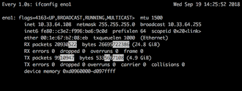

# watch

```bash
watch ifconfig eno1
```
provides the updating screen : 
```bash
Every 2.0s: ifconfig eno1 
Wed Sep 19 14:24:10 2018

eno1: flags=4163<UP,BROADCAST,RUNNING,MULTICAST>  mtu 1500
        inet 10.33.64.108  netmask 255.255.255.0  broadcast 10.33.64.255
        inet6 fe80::c3e2:f996:ba6:9c0d  prefixlen 64  scopeid 0x20<link>
        ether 00:1e:67:b2:08:eb  txqueuelen 1000  (Ethernet)
        RX packets 20930020  bytes 26695667046 (24.8 GiB)
        RX errors 0  dropped 0  overruns 0  frame 0
        TX packets 9909333  bytes 5333490325 (4.9 GiB)
        TX errors 0  dropped 0 overruns 0  carrier 0  collisions 0
        device memory 0xd0960000-d097ffff
```

If you want to see the same thing, but outline the digits that are being updated, you can modify the command to the following: 
```bash
watch -n 1 -d ifconfig eno1
```

the output is the same, but with the outlining: 

