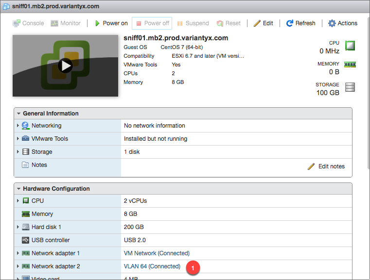

# getting a VM to sniff traffic

## Setting a host port to be in promiscuous mode
In VMWare, when the host is shutdown, select the sniffing interface of the host (1)

 

Note that the current security policy is to NOT be in promiscuous mode (2).  To change this, select Edit (3). 

 

Under Security (4), go to Promiscuous mode and select Accept (5).  Then press Save (6) to keep the changes. 

 

## Reference: 
- [Monitoring network traffic from within a virtual machine on a VMware vSphere ESX/ESXi server (1038847)](https://kb.vmware.com/s/article/1038847): VMWare KB, May 2011
- [Configuring promiscuous mode on a virtual switch or portgroup (1004099)](https://kb.vmware.com/s/article/1004099?ui-force-components-controllers-hostConfig.HostConfig.getConfigData=1&r=3&other.KM_Utility.getArticleDetails=1&other.KM_Utility.getArticleMetadata=1&other.KM_Utility.getAllTranslatedLanguages=1&ui-comm-runtime-components-aura-components-siteforce-qb.Quarterback.validateRoute=1): VMWare KB, Oct 2014