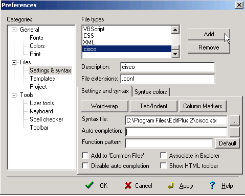

# EditPlus
Great windows text editor. 

[Their official site](http://www.editplus.com/)

Context Highlighting:

1. copy a context file (ie: cisco.stx) into the editplus directory (ie: `c:\Program Files\EditPlus 2\`)
2. under the tools-> preferences pulldown, select "settings and syntax" and "add".  then add a description, the file extension to apply this to, and what syntax file to use, and select "ok"

