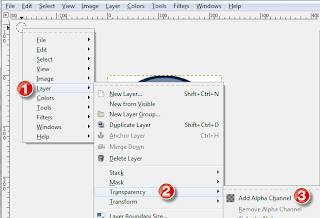
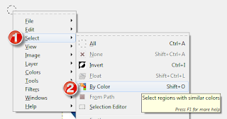
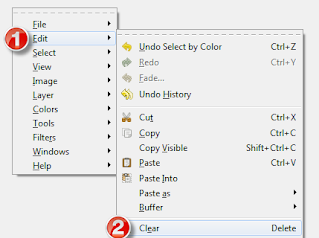
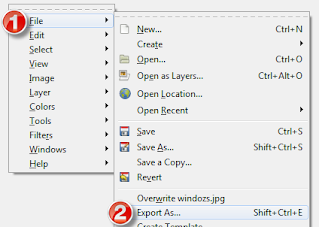

# Gimp

## Set Transparent Color: 
When the image is opened, right click in the window and select Layer(1), Transparency(2), and then Add Alpha Channel(3).

Then again right click somewhere within the window and select Select(1) and then By Color(2), and then click on the color you want to be transparent within the image.  If you want to add more colors, hold down on the shift button and click again.  

Again right click somewhere within the window and select Edit(1) and then Clear(2).  

To save this change you can't just hit save, you need to go to File(1) and Export As...(2) 

then select where you want the file saved, and change the extension to .gif or .png and hit the next two Export buttons.  

