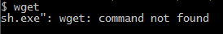
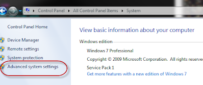
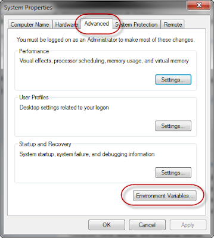
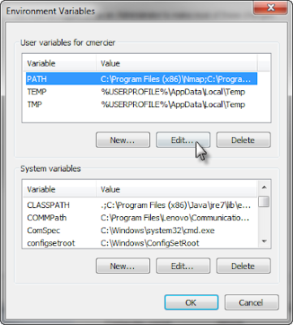
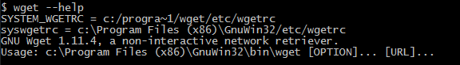

# adding programs to your PATH

Sometimes you need to add a app to your path:



To do this (in Win7), go to the START button, select CONTROL PANEL, and select the SYSTEM icon.

Select the Advanced system settings button



and then under the Advanced tab, select Environment Variables...



Under User variables for <username>, select PATH, and select Edit..



At the end of the Variable value: field, add the new entry to the path.  (make sure you separate it with the previous statement with a semicolon.  )
```
;C:\Program Files (x86)\GnuWin32\bin
```

Open up a new shell and confirm it works:




