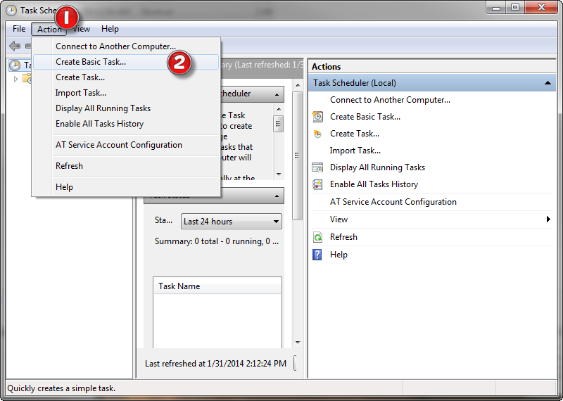

# Windows CRON

Create a cron job ([scheduled task](http://windows.microsoft.com/en-us/windows/schedule-task#1TC=windows-7)) in windows to run a script every day or "X" amount of time. 

Do this by running `Start` :: `Control Panel` :: `Administrative Tools` :: `Task Scheduler`.  

Then under the Action Menu (1), select Create Basic Task(2). 

Provide a name for the cron, how often (and when) it should happen, and then under Acton, browse and find the bat file you just created.  Once you select the finish button, your all set. 
