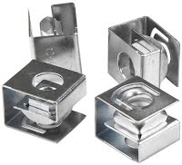
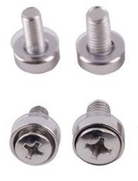
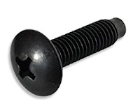

# Cage Nuts and Screws

- [Cage Nuts and Screws](#cage-nuts-and-screws)
  - [Cage nuts:](#cage-nuts)
  - [Metric:](#metric)
    - [M5](#m5)
    - [M6](#m6)
  - [Imperial:](#imperial)
    - [UNF 10-32](#unf-10-32)
    - [UNF 12-24](#unf-12-24)
  - [References:](#references)

## Cage nuts: 
They obviously match the diameter and threading of the screws, and look like the following

|  Cage Nuts | Clip Nuts |
|--|--|
|  |  | 

## Metric: 

| M5 vs. M6 screw |
|--|
|  |

### M5
Thinner screw for lighter loads (5mm outside diameter, .8mm pitch)
The longer ones are generally 20mm, and shorter is 16mm.  This will be denoted as M5x16 or M5(16) vs. M5x20 or M5(20). 

### M6
Thicker screw for heavier loads (6mm outside diameter, .8mm pitch)

## Imperial: 
We still use them in the states, but it's probably the best plan to stop getting these, and only focus on the metric screws.  

### UNF 10-32
Standard imperial screw, .19" outside diameter, and 0.031250" pitch

| 10-32 screw |
|--|
|  |

(10-32 screw.  looks the same as the others, unless you're trying to thread it into a metric nut.)

### UNF 12-24
Less used, thicker imperial screw.  Outside diameter is 0.2160", and the pitch is 0.041667".  

## References: 
- [ISO metric screw thread](https://en.wikipedia.org/wiki/ISO_metric_screw_thread): Wikipedia 
- [Unified Thread Standard](https://en.wikipedia.org/wiki/Unified_Thread_Standard): Wikipedia
- [Cage Nut](https://en.wikipedia.org/wiki/Cage_nut): Wikipedia

