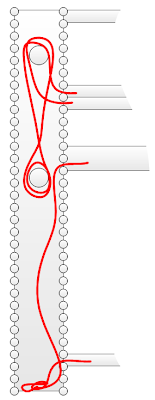
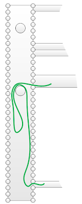
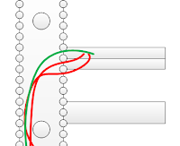

# Properly using Vertical Cable Management

When you wire cables into vertical cable managers, you want to make sure that you keep everything clean, loose, and within their rack unit.  

## Don't tangle/wrap
Don't let long cables lay on the floor, and don't tie them up between wiring spools.  

## Lay once
Instead, use the spools to drape the cables over them.  Pull the cable up from the lower device, and lay the cable over the spool.  Make sure that the cables are loose and not tight.  Also make sure that they are not tangled with other cables and not wrapped around other spools.  

## Stay in Lane
Keep the cabling for a device with it's "U".  Have the cables go directly horizontally out through the vertical cable managers fingers.  Make sure that the cables don't cross over or mix up with cables from the devices above or below.  

