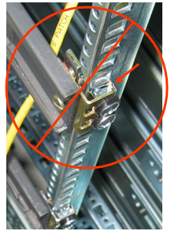
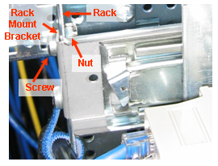
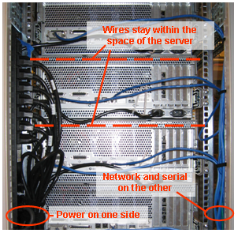
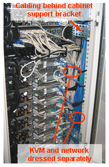
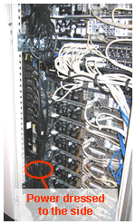

# Racking Servers

## Rack Mounting
At first, cage-nuts might be a bit confusing. Note that the screw and nut go on either side of the rack and rack rail. (Yes, someone actually did make this mistake, and they weren't really happy with me when I made them re-rack all the servers after I caught the mistake.)  See below:

 
 

## Wiring the Servers
There are two main rules for wiring cabinets, keep the wiring within the height of the server, and if possible, wire the power and everything else on separate sides. The theory behind separating the power, is that AC power induces an electromagnetic field around it, and this field might create unnecessary noise on the other cables if they are too close. 

 

Again, it is really important to keep the wires out of the way of the other servers above and below. Use plastic wire ties or Velcro straps to tie back your cabling to the sides of the cabinets. You need space behind the servers for a bunch or reasons, ranging from airflow, to accessing the servers for maintenance.

WIN boxes have those nasty KVM (Keyboard, Video, and Mouse) cables to deal with. (don't you just pity Windoz administrators)? Since those cables are so bulky, tie them up separately from the network and console cables. Try and keep the cables behind the cabinet supports if possible. If the cabinet has built-in wire managers, then your in luck, if not, tie them off as far to the side as possible.

Power cables can get really unruly. They are really thick and each server can have a bunch of them. Best way to tie these up is to plug the cables into the servers and power strips (keeping the cables straight and keeping them untangled), and then when you are done, wrap them up together. Don't skimp on the tie downs with the power. You want to make them secure enough that a tugging on one power cable will not power cycle a neighboring server. 

 
 
 
