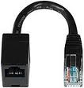
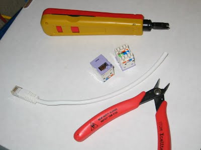
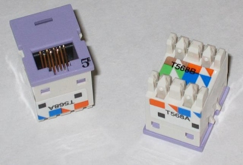
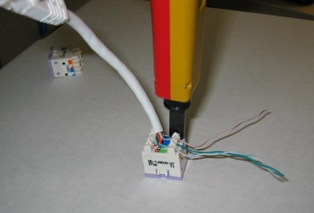

# Making A RJ45M-RJ45F Dongle

## Overview:
Many times when working with console cables (or anything else), you need to create a "special cable" to connect two hosts together for some special reason. As far as console cables are concerned (the main focus of writing this doc), everyone and their brother uses a different pin-out, and to connect laptops or console servers to different devices, normally means dragging with you a bag full of different console cables.

The idea of dongles is two fold. First, they are just a lot easier to make then cables with rj45m heads on each side. Punching down 110's can be done in a sec, and is correct every time, but cramming wires up in an ice cube is slow, and tends to fail. Secondly, you can make a bunch of dongles quickly, and then leave them on all the equipment that needs it. That way you only need to carry/make one cable that works with everything (ie create your own "standard").

This doc is meant to show how easy it is, and what you need to make a dongle.

## Parts List:
To do this, you will probably need to get a couple of things. Here is a list of things that you will need to get. You wi

- one Punch-down Tool with a 110 blade
- one nice Wire Cutter
- a bunch of patch cables (Approx 1' - 3')
- a bunch of RJ45f-110 adapters

The links to the specific parts are only there as examples. (They probably won't be valid for very long anyway.) If you get something else that works for you, or from someone else, great!

The diagram below is everything you will need to make a dongle. Note that the picture includes two RJ45f-110 adapters (to show what both sides look like) but you will only need one for a single adapter). 

In case you have never seen one, here is a blow up of the adapters. The purple side is the RJ45f side, and the other side is the 110 side. 

## Making the Adapters
First cut the patch cable to the desired lengths. You should cut the cable with an extra ~3 inches of length and then strip upward.

To strip the outer sheath off the bottom of the patch cable, cut upward and then around, rather then taking a knife around the cable. You don't want to nick the cables, so by cutting upward, you reduce the chance of this.

Separate the pairs only if necessary, and place them in the proper spots in the 110 slots. See my console wiring page for hints at different wiring for different kinds of console adapters.

Use the punch down tool to insert the cable into the 110 block. It will also automatically cut off the extra cable.

That's it! Your done! Congrats!