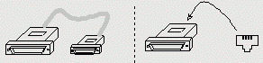
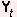
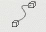
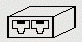

# Standard RS232 Pinouts

- [Standard RS232 Pinouts](#standard-rs232-pinouts)
  - [Serial RS-232 (console) Connections:](#serial-rs-232-console-connections)
    - [RJ45 to DB25 or DB9 Adapters:](#rj45-to-db25-or-db9-adapters)
    - [RJ45(m) to RJ45(m-f) Cables (or Dongles)](#rj45m-to-rj45m-f-cables-or-dongles)
    - [RJ45(f) to RJ45(f) Adapters](#rj45f-to-rj45f-adapters)
    - [Vendor Specific Serial Connectors](#vendor-specific-serial-connectors)
  - [Ethernet (cat5) Connections:](#ethernet-cat5-connections)
    - [RJ45(m) to RJ45(m-f) Cables (or Dongles)](#rj45m-to-rj45m-f-cables-or-dongles-1)
  - [RJ45(f) to RJ45(f) Adapters](#rj45f-to-rj45f-adapters-1)

## Serial RS-232 (console) Connections: 

### RJ45 to DB25 or DB9 Adapters: 

| Adaptor | Pin out |
|--|--|
 Straight | [DBn (db9 & db25) to RJ45](img/DBn_db9-db25_toRJ45.gif)
 Cross-Over | [DBn to DBn](img/x-DBntoDBn.gif)   [DBn to RJ45](img/x-DBntoRJ45.gif)
 Rollover| [DBn to DBn](img/G-DBntoDBn.gif)   [DBn to RJ45](img/G-DBntoRJ45.gif)
 Yost-DTE | [DBn to RJ45](img/Yt-DBntoRJ45.gif)
 Yost-DCE | [DBn to RJ45](img/Yc-DBntoRJ45.gif)

### RJ45(m) to RJ45(m-f) Cables (or Dongles)

| Adaptor | Pin out |
|--|--|
 Straight | [RJ45(m) - RJ45(m)](img/con-II-RJ45m-RJ45m.gif)
 Cross-Over | [RJ45(m) - RJ45(m)](img/con-X-RJ45m-RJ45m.gif)
 Rollover | [RJ45(m) - RJ45(m)](img/con-G-RJ45m-RJ45m.gif)  [RJ45(m) - RJ45(f) (Panduit Mini-Com Tx)](con-g-rj45m-rj45f-panduit-mini-com-tx.md)

### RJ45(f) to RJ45(f) Adapters

| Adaptor | Pin out |
|--|--|
 Straight | [RJ45(f) - RJ45(f) (110-110)](img/con-II-RJ45f-RJ45f_110-110.gif)
 Cross-Over | [RJ45(f) - RJ45(f) (110-110)](img/con-X-RJ45f-RJ45f_110-110.gif)
 Rollover | [RJ45(f) - RJ45(f) (110-110)](img/con-G-RJ45f-RJ45f_110-110.gif)

### Vendor Specific Serial Connectors
- [Examples for using Console Adapters](img/examp000.gif)

## Ethernet (cat5) Connections: 

### RJ45(m) to RJ45(m-f) Cables (or Dongles)

| Adaptor | Pin out |
|--|--|
 Straight | [RJ45(m) - RJ45(m)](img/eth-II-RJ45m-RJ45m.gif)
 Cross-Over | [RJ45(m) - RJ45(m)](img/eth-X-RJ45m-RJ45m.gif)

## RJ45(f) to RJ45(f) Adapters

| Adaptor | Pin out |
|--|--|
 Straight | [568B Cable (110-110)](img/eth-II-568BCable110-110.gif)
 Cross-Over | [568B Cable (110-110)](img/eth-X-568BCable110-110.gif)