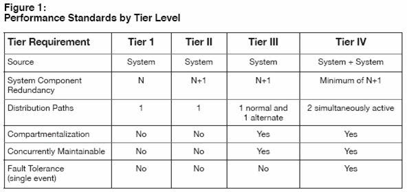
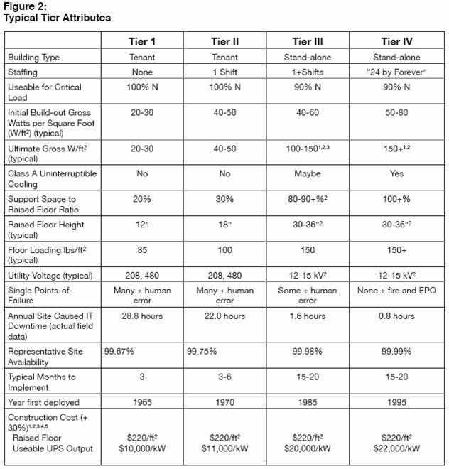
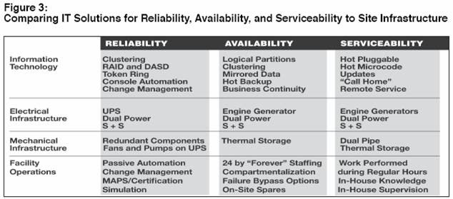

# Datacenter Tiers

## Overview:
There is a 4 Tier structure that was defined by the institute back in the early 90’s.  It is the only “standard” widely used to describe the design and availability of a data center.   Its standards are known to be abused as a way of attempting to describe a facility, but the only valid levels are Tier1 through Tier4, with Tier1 being the least reliable environment, and Tier4 being highly available.  

The official standard can be found from the attached pdf.

## Summary:
A summary to the tiering structures can be stated as such.

A Tier1 environment would not be able to stay running during a maintenance event (AC, Power, Networking work), where as a Tier4 is highly redundant, and any single component can be shutdown with out affecting the overall running status of that environment.

The following charts are copied from the standard, and help give the basic idea of the different tiering structures.

## A1. References:

### A1.1 Links
- [The Uptime Institute](http://uptimeinstitute.com/)
- [Tire Classification Defined Site Infrastructure Performance](http://atd.uptimeinstitute.com/PDFs/TierStandards.pdf)

### A1.2 Uptime Institute warns against tier standard misuse
By Matt Stansberry, Site Editor

27 Apr 2006 | SearchDataCenter.com

ORLANDO, Fla. -- Data center executives and Uptime Institute Inc. directors say the IT community is misappropriating Uptime's tier classification system for data center performance. Institute president Ken Brill attempted to set the record straight this week at the Uptime's Symposium on high-density computing.

The Institute created a four-tier rating system that applied the IT concepts of high availability and concurrent maintainability to the underlying data center infrastructure. Tier-1 data centers are the most basic while a Tier-4 is fundamentally immune to planned and unplanned downtime.

But when the research firm developed its classifications over 10 years ago, its directors had no idea the tier system would become a standard used far beyond its circle of influence.

"It's evolved -- it was never intended to be what it is," Brill said. "We did it in response to a customer who wanted to explain to his management why he was spending the money he was spending. It answered a fundamental need and has become a default standard. I'm pleased that it happened, but we didn't set out to do that."

But as the Uptime tier standard spread, terms like "near Tier-3 data center" and "Tier-3 plus" started cropping up at conferences and in boardrooms. So the Institute revised its standards to better explain that those classifications don't actually exist.

"You either are or you aren't -- the definitions are very simple," Brill said. "Are you concurrently maintainable? There's not a 'maybe' answer to that."

Concurrent maintenance is a big part of the Tier-3 and Tier-4 classifications. In server hardware terms, it means you can replace power supplies or upload software without turning it off. The Institute's definition extends that idea to infrastructure -- you need to be able to shut down any component of your power distribution or cooling systems and have a redundant system working -- uninterrupted by the maintenance.

"The fact that you may never need to do it isn't part of the definition," Brill said.

Paul Schumann, vice president and manager of distributed systems for TD Banknorth in Lewiston, Maine, took that message to heart. He agreed that there is a big risk in misusing the standard.

"There's a risk when people try to interpret where they are," Schumann said. "It's an absolute system and people get a false self-confidence saying 'I'm a near Tier-3.' You're a Tier-2. The risk is that you have infrastructure somewhere in your data center that you're not paying attention to that one day will pop up and bite you."

Schumann is wrapping up a two-year renovation of his data center, a mainframe shop with 460 distributed servers. He has upgraded power, cooling and UPS to redundant levels, all on a production data center without taking systems down.

The goal for TD Banknorth is to have a Tier-3 data center, but Schumann is wary to call it that yet. "Our organization has pride in our improvements -- and rightly so -- but we're talking about being near Tier-3. I've got to go back once our project is done this summer and find out what's keeping us from being a full Tier-3. I know where some of those points are, but if all of a sudden I lose part of the center because some piece hasn't been addressed, we're in for an ugly surprise."

Schumann is planning to audit his project soon, and until that's done, he's not going to call it Tier-3.

"[The Institute] is making it very clear that you're only as good as your weakest link. I think that's a place where people can get confused and get their executives confused," Schumann said. "It's nicer to say near Tier-3 than say Tier-2. But who are you fooling?"