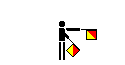

# ICAO Alphabet Codes

## Alphabet Codes

This is officially termed the [ICAO (International Civil Aviation Organization)](http://www.icao.org/) code. The ICAO is a United Nations department. Initially used by the US military, the code has since gained pervasive adoption by the airlines and is used throughout all civil aviation.
```
    A=Alpha
    B=Bravo
    C=Charlie
    D=Delta
    E=Echo
    F=Foxtrot
    G=Golf
    H=Hotel
    I=India
    J=Juliet
    K=Kilo
    L=Lima
    M=Mike
    N=November
    O=Oscar
    P=Papa
    Q=Quebec
    R=Romeo
    S=Sierra
    T=Tango
    U=Uniform
    V=Victor
    W=Whiskey
    X=X-ray
    Y=Yankee
    Z=Zulu
```

## Maritime Signal Flags


## Semaphore Flag Signals
 
<table>
<tbody> 
<tr>
    <td>A and 1<br></td>
    <td>B and 2<br></td>
    <td>C and 3<br></td>
    <td>D and 4<br></td>
    <td>E and 5<br></td>
</tr>
<tr>
    <td>F and 6<br></td>
    <td>G and 7<br></td>
    <td>H and 8<br></td>
    <td>I and 9	<br></td>
    <td>J and Alphabetic<br></td>
</tr>
<tr>
    <td>K and 0 (zero)<br></td>
    <td>L<br></td>
    <td>M<br></td>
    <td>N<br></td>
    <td>O<br></td>
</tr>
<tr>
    <td>P<br></td>
    <td>Q<br></td>
    <td>R<br></td>
    <td>S<br></td>
    <td>T<br></td>
</tr>
<tr>
    <td>U<br></td>
    <td>V<br></td>
    <td>W<br></td>
    <td>X<br></td>
    <td>Y<br></td>
</tr>
<tr>
    <td>Z<br></td>
    <td>&nbsp;</td>
    <td>Error<br></td>
    <td>Numerical<br></td>
    <td>Annul<br></td>
</tr>
</tbody> 
</table>
	 
 
