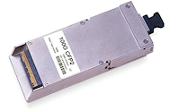
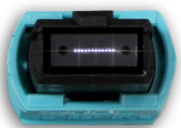

# Physical Network Types: 
- [Physical Network Types:](#physical-network-types)
  - [10 Meg Ethernet](#10-meg-ethernet)
    - [10 Base 2 (thinknet)](#10-base-2-thinknet)
    - [10 Base 5 (Thicknet)](#10-base-5-thicknet)
    - [AUI](#aui)
  - [100 Meg Ethernet](#100-meg-ethernet)
  - [200 Meg Ethernet](#200-meg-ethernet)
    - [FDDI](#fddi)
  - [1G Ethernet](#1g-ethernet)
    - [SFP interfaces](#sfp-interfaces)
  - [40G Ethernet](#40g-ethernet)
  - [100G Ethernet](#100g-ethernet)
    - [CFP:](#cfp)
    - [CFP2:](#cfp2)
    - [CXP:](#cxp)
    - [CPAK (Cisco proprietary):](#cpak-cisco-proprietary)
    - [MXP (Arista proprietary):](#mxp-arista-proprietary)
    - [QSFP28:](#qsfp28)

## 10 Meg Ethernet
https://en.wikipedia.org/wiki/Ethernet

### 10 Base 2 (thinknet)
Otherwise known as "cheapnet".  Computers were chained together to create a LAN.  Usually there would be one device like a bridge, router or thicknet adaptor that would then link the LAN segment to a larger network.

| Connector "T"| Terminator | Linked together with coax | 
|--|--|--|
 | |   

### 10 Base 5 (Thicknet) 
Generally these links were used to run network between floors of buildings, but was used to run between longer distances.  

| vampire tap | Tap and AUI Adaptor | 
|--|--|
 | 
 
### AUI 

| AUI to 10BT Adaptor | AUI Bridge | AUI Cable | 
|--|--|--|
 | | 
 

 	 
## 100 Meg Ethernet
 
## 200 Meg Ethernet

### FDDI

|FDDI Cables|
|--|
| |

 	 
## 1G Ethernet

### SFP interfaces

|RJ-45 to SFP Adaptor|
|--|
| |

## 40G Ethernet

## 100G Ethernet
https://en.wikipedia.org/wiki/100_Gigabit_Ethernet

### CFP:  
The original 100GbE form factor, very large in size.  Legacy at this point. 

|CFP Adaptor|
|--|
| |

### CFP2:  
The first attempt to shrink a CFP optic to a more manageable size.  Still used for long-haul or DWDM 100GbE optics.

|CFP2 Adaptor|
|--|
| |

### CXP:  
an early multimode or direct attach copper form factor.  Still used occasionally in current production equipment.

|CXP Adaptor|
|--|
| |

### CPAK (Cisco proprietary):  
With the CFP2 form factor still too large, Cisco came out with their proprietary CPAK form factor to provide a smaller optic option.  Still used by Cisco in their router lines and Nexus 7000/7700 linecards. 

|CPAK Adaptor|
|--|
| |

### MXP (Arista proprietary):  
Arista, in a similar position to Cisco, went with a proprietary fixed optic technology vs. a pluggable.  MXP ports are 10/40/100GbE compatible. MXP ports can actually light up all 24 strands in the MPO cable, allowing for operation in 12x10GbE, 3x40GbE, or 1x100GbE mode.  Arista still offers MXP port switches, but all new models use QSFP28 optics instead. 

| MXP Adaptor|
|--|
| |

### QSFP28:  
The QSFP28 optic is the most recent form factor for 100GbE.  Unlike the other form factors above which use 10x 10Gbps lanes, the QSFP28 uses 4x 25Gbps lanes, which makes for a much less complex (and hence smaller) optic.  The QSFP28 is the same design as the original QSFP, just with faster lanes, so availability and cost reduction have come at a rapid pace with this form factor.  Additionally, because of this similarity, QSFP28 ports on switches support 40 and 100GbE modes for easy backwards compatibility.
 
| QSFP28 Adaptor|
|--|
| |

