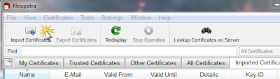
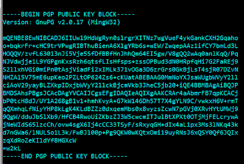

# Adding public keys to your key chain

## Overview:

## Importing a Key File:
It's really simple to import a public key file.  First, save the file someplace you will be able to find it, and then from within Kleopatra, select the Import Certificates button and then find the public key file. 

When finding the keyfile, you might need to select Any Files (*) to be able to see all files, rather then only the files with the standard extensions. 

## Importing a Key:
Sometimes you simply have a signature in an email or something that is the public key. 

Simply save this as a text file somewhere your can find on your computer, and then import it the same way you would import a key file above. 

