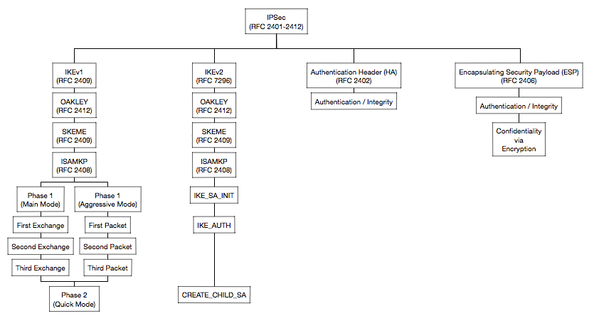

# IPSec

## Overview of the RFC's

## References
A couple of links to refer to: 
- [FAQ-What are the differences between IKEv1 and IKEv2](http://support.huawei.com/enterprise/en/knowledge/KB1000081273): Huawei, June 2015
- [What are differences between IKEv1 and IKEv2? (IKEv1 vs. IKEv2)](https://rockhoppervpn.sourceforge.net/techdoc_ikev1vsikev2.html) : (A reference table) Rockhopper VPN, 2011
- [IPSec Site-to-Site VPNs w/Static Virtual Tunnel Interfaces (SVTI)](https://www.youtube.com/watch?v=08WZ9GBptjY): IKEv1 & IKEv2 : Video, Travis Bonfigli, Aug 2015
- [Crypto map based IPsec VPN fundamentals - negotiation and configuration](https://community.cisco.com/t5/security-knowledge-base/crypto-map-based-ipsec-vpn-fundamentals-negotiation-and/ta-p/3153502): Cisco, July 2017