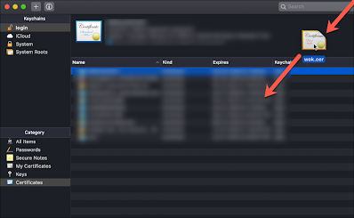

# NET::ERR_CERT_INVALID

**Table of Contents**
- [NET::ERR\_CERT\_INVALID](#neterr_cert_invalid)
  - [Overview:](#overview)
  - [Download the Website Cert](#download-the-website-cert)
  - [Add cert to keychain](#add-cert-to-keychain)
  - [Re login with your browser](#re-login-with-your-browser)


## Overview: 


If your web client (chrome, firefox, etc) blocks your access to a webserver that you own and maintain, and gives you the error

```
NET::ERR_CERT_INVALID
```

You can get around this, and still have access to the webpage with the following steps.  

## Download the Website Cert
When you are at the webpage, and you get the error


Go to the top of the browser, and inspect the certificate.  


Then (on a mac), click on the icon of the certificate (3), and drag it (4) to the desktop.  This will save that websites cert for you to authenticate later. 


## Add cert to keychain
Open up you keychain app and drag the cert into the Certificates window. 



The certificate will show up in the keychain, and then select it.


Then in the cert window, select each of the settings and "trust" them.  


## Re login with your browser

Once the cert has been added to the keychain, go back to the webpage and reload. 

You should end up with a webpage that gives you a link to proceed to that page.  

