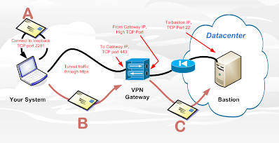
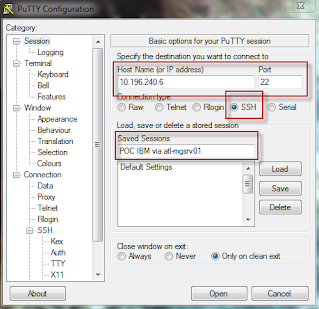
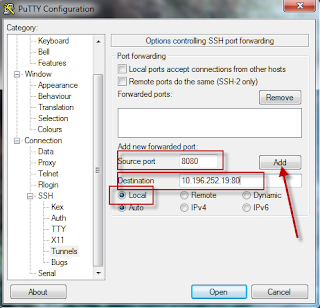

# SSL Tunnel

## Overview: 

SSL allows you to be able to tunnel from your device to the remote one.  This is a feature that is enabled by default, but can be disabled at the server if required.

Lets say you are only able to ssh between your host and a remote bastion in a DC.  But you need to have web access to a server that is local to that bastion.  The following explains how you an easily do just that.



## Via Putty

Modify the putty configuration window in the following way to get ssh tunneling to work.

### Session Tab
Enter your normal ssh connection to the bastion host.
Enter in the IP address of the bastion, the ssh port, click on the ssh radio button, and enter in a name to call this.



### Connections Tab
Under the SSH section of the connections tab, select Tunnels, and then enter the local port (8080), and the destination with port.  Make sure you select the "local" radio button, and select ADD to enter this rule.  (you can enter as many as you like this way.)



The logic behind setting this rule up is this.  The "Source Port" is the local port you would point your web browser to, as shown as "A" in the top diagram. The "Destination" is the system and it's port that you are trying to connect to, "C" in the digram at the top of the page.

### Save
When your done, don't forgot to go back to the Session window and select the Save button, or you will lose your change!


In this example I'm tunneling web traffic, so I can test this tunnel by opening up a web browser and pointing to

```
http://localhost:8080
```