# Ethernet Analyzed

- [Ethernet Analyzed](#ethernet-analyzed)
  - [The Ethernet Frame](#the-ethernet-frame)
  - [Preamble](#preamble)
    - [DIX](#dix)
    - [802.3](#8023)
  - [Destination and Source Fields](#destination-and-source-fields)
    - [Little Endian](#little-endian)
  - [Type / Length Fields](#type--length-fields)
    - [DIX](#dix-1)
    - [802.3](#8023-1)
  - [VLAN TAG Field](#vlan-tag-field)
    - [TPID - Tag Protocol Identifier](#tpid---tag-protocol-identifier)
    - [TCI - Tag Control Information](#tci---tag-control-information)
  - [Data Field](#data-field)
    - [DIX](#dix-2)
    - [802.3](#8023-2)
    - [LLC Sublayer](#llc-sublayer)
    - [802.2 Protocol](#8022-protocol)
    - [802.2 SNAP Protocol](#8022-snap-protocol)
  - [FCS Field](#fcs-field)
  - [End of Frame Detection](#end-of-frame-detection)
  - [Outline of transmission on Half Duplex Media](#outline-of-transmission-on-half-duplex-media)
  - [References](#references)

## The Ethernet Frame
The ethernet frame is the lowest level container that data is encapsulated within when being sent between hosts. This page discusses the information that is used in this encapsulation as well at the two different kinds of ethernet frames; DIX (Digital, Intel, and Xerox aka: Ethernet_II) and IEEE 802.3.

There have been two sets of Ethernet standards in place over the years. The first was the original Ethernet protocol, as developed by Digital Equipment Corporation (DEC), Intel, and Xerox, and which came to be known as DIX Ethernet. The DIX Ethernet standard was first published in 1980 and defined a network running at 10 Mbps using RG8 coaxial cable in a bus topology. This standard is known as thick Ethernet, Thicknet, or 10Base5. The DIX Ethernet II standard, published in 1982, added a second physical layer option to the protocol using RG58 coaxial cable. This standard is called thin Ethernet, Thinnet, Cheapernet, or 10Base2.

Around the same time that these standards were published, an international standards-making body called the Institute of Electrical and Electronic Engineers (IEEE) set about creating an international standard defining this type of network, which would not be held in private hands as was the DIX Ethernet standard. In 1980, the IEEE assembled what they called a working group with the designation IEEE 802.3, which began the development of an Ethernet-like network standard. They couldn't call their network Ethernet because Xerox had trademarked the name, but in 1985, they published a document called the "IEEE 802.3 Carrier Sense Multiple Access with Collision Detection (CSMA/CD) Access Method and Physical Layer Specifications." This document included specifications of the same two coaxial cable options as DIX Ethernet and, after further development, added a specification of the unshielded twisted pair (UTP) cable option known as 10BaseT. Additional documents published by the IEEE 802.3 group in later years include IEEE 802.3u in 1995, which includes the 100 Mbps Fast Ethernet specifications, and IEEE 802.3z and IEEE 802.3ab, which are the 1,000 Mbps Gigabit Ethernet standards.

The IEEE 802.3 standard differs only slightly from the DIX Ethernet standard. The IEEE standard contains additional physical layer options, as already noted, and some differences in the frame format. Despite the continued use of the name Ethernet in the marketplace, however, the protocol that networks use today is actually IEEE 802.3, because this version provides the additional physical layer options and the Fast Ethernet and Gigabit Ethernet standards. Development of the DIX Ethernet standards ceased after Ethernet II, and when people use the term Ethernet today, it is understood that they actually mean IEEE 802.3. The only element of the DIX Ethernet standard still in common use is the Ethernet II frame format, which contains the Ethertype field that is used to identify the network layer protocol that generates the data in each packet.

The following is a diagram showing the basic layout of a general ethernet frame.

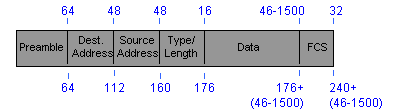

## Preamble
The preamble allows 10Mbps Ethernet interfaces to synchronize themselves. On 10Mbps Ethernet, when the packets arrive, some of the beginning bits are lost. The preamble exists in order to allow the beginning of the frame to lose a few bits due to startup delays.

The preamble part of a packet does exists within Fast Ethernet and Gigabit Ethernet, but it is not used. Those systems use more complex mechanisms for encoding the signals that avoid any signal startup losses.

The actual data for both the DIX and 802.3 preamble are the exact same. The difference is in the naming. DIX defines the entire piece as the preamble, and 802.3 defines the first part as the preamble, and the second part as the sfd.

### DIX
In the DIX standard, the preamble consists of eight 8-bit bytes, made up of alternating ones and zeros, except for the last two bits, which have the pattern "11".

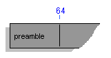

Below is a table showing each bit in the preamble. Each line is a separate byte.

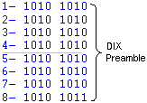

Note that DIX defines the entire set as the preamble.

### 802.3
For IEEE's standard, the data is the exact same, but they define the "preamble" as just the first seven bytes and they define the last byte as the "Start Of Field".

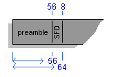

Below is a table showing each bit in the preamble and the SFD. Each line is a separate byte.

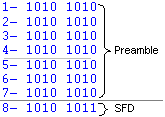

Note that 802.3 defines the repeating "10" as the preamble, and calls the last byte "1010 1011" as the "Start of Field" frame.


## Destination and Source Fields
Both fields are 48 bit's (six bytes) in length. In order to decide if a datagram is destined for the host, each packet received must be processed at least to the destination field.

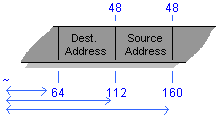

Each of these fields are only comprised of the two mac addresses. There is no header or footer information included in the fields.

For each MAC, the first two bits (the two most significant bits) have special meaning.

- (x) The first bit is the "Physical or Multicast Address bit". If it is set to "1", then the address is a multicast address, and if it is "0", then the following address is a physical, or unicast, address.
- (y) For the 802.3 frame only, the second bit is called the "Logical or Global bit". This defines whether the address is a IEEE certified address, or an administorly defined address. A "0" sets the address as a globally administered address, and a "1" is a locally administered address. A globally defined mac (bit=1) is one that has a OUI that IEEE reserves for specific vendors. If a MAC is named by an administrator, or an application (like a multicast MAC), then it would be considered a "locally administrator ed address" LAA. To find what organization has been granted a specific MAC (for figuring out what host has a specific MAC) see IEEE's webpage: IEEE OUI and Company_id Assignments.

The following is an example of the MAC: (**ignoring endianness**)

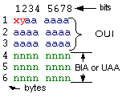

- The Physical or Multicast Bit is the "x" bit.
- The Logical or Global bit is the "y" bit.
- The OUI (Organizationally Unique Identifier) are the "x, y and a" bits. (The first three bytes)
- The BIA (Burned In Address) or UAA (Universally Administrated Address) is the unique address that is defined by the manufacture of the nic
- an application (like a multicast MAC), then it would be considered a "locally administrator ed address" LAA. To find what organization has been granted a specific MAC (for figuring out what host has a specific MAC) see IEEE's webpage: IEEE OUI and Company_id Assignments.

The following is an example of the MAC:

- The Physical or Multicast Bit is the "x" bit.
- The Logical or Global bit is the "y" bit.
- The OUI (Organizationally Unique Identifier) are the "x, y and a" bits. (The first three bytes)
- The BIA (Burned In Address) or UAA (Universally Administratered Address) is the unique address that is defined by the manufacture of the nic

### Little Endian
Note that the MAC address is transported in little endian order. Thus the bits are not transported in the order they are viewed above, left to right, top to bottom. Instead, the lower order bit is sent first for each byte, thus the above MAC is sent right to left, and top to bottom.

For an example, if we were to transport a MAC via little-endian ordering the following MAC would be sent as follows:
```
MAC in Hex:    6F.A1.8F:23.AB.F0
(multi/local)  xy
MAC in Bin:    0110 1111 . 1010 0001 . 1000 1111 : 0010 0011 . 1010 1011 . 1111 0000
                  6F     |    A1     |    8F     |    23     |    AB     |    F0
little endian: 1111 0110 . 1000 0101 . 1111.0001 : 1100 0100 . 1101 0101 . 0000 1111
(multi/local)         yx
```

See how the bits in the byte get reversed, but the bytes are sent in order? Also note where the multicast and local bits are. x=0 (not unicast), and y=1 (locally assigned MAC).

Also note that Multicast MACs always start with the address: 01.00.5e.aa.nn.nn.nn.nn


## Type / Length Fields

### DIX

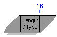

Type of high level protocol that is in the DATA field. Note that it only holds the type information. The length info needs to be kept in the DATA field, managed by higher level software.

If the following data was an IP packet, then the value in this field would be `0000 1000 0000 0000` (16 bit).

### 802.3

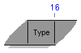

If the value in the frame is less then `0x05DC` (`0000 0000 0000 0000` - `0000 0101 1101 1100`) then the value defines the length of the datagram. The number indicates the number of LLC data octets that follow in the data frame. (0 to 1500)

If the value in the frame is 0x0600 or more (0000 0110 0000 0000 - 1111 1111 1111 1111), then the field defines the type of the data in the data field (as per the DIX standard). (1536 to 65,535).

## VLAN TAG Field
IEEE 802.1Q, not part of the standard 801.3 frame. But compatible will all switching equipment.

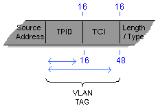

- adds 48 bits (4 bytes) to the overall MAX size of an ethernet frame (MTU). From 1518 - 1522 bytes. This has been standardized in the 802.3ac Standard.
- since this is only done between switching gear, the larger frame does not break anything. (it might, though, if the frame was sent to a host's nic.)

### TPID - Tag Protocol Identifier
- Identifies the frame as a tagged frame
- On Ethernet, tagged frames use the value of 0c8100 (1000 0001 0000 0000)

### TCI - Tag Control Information

- Bits 1-3: carry priority info (qos), biased on the IEEE 802.1p standard
- Bits 4-16: VID - Vlan Identifier, uniquely identifies the vlan to which the frame belongs.

## Data Field
Grabbing the data from the data field and figuring out what LLC protocol is used (802.2 etc..) is called "demultiplexing". Sometimes it figures out the LLC protocol from the type/length field, other times it just examines the data field and figures it out.

### DIX
46-1500 bytes

The higher level protocols are responsible for either filling the data field with bogus data, if the data is less then 46 bytes, or splitting the data if it is more then 1500 bytes.

### 802.3
LLC Standard normally rides inside the data field

802.2 is the LLC standard. It is used to identify the type of protocol data being stored (needed if the type/length field is being used for length info), also used for control info.


### LLC Sublayer
The ethernet "type" field only covers types that were defined till up to the 80's. After that time all the different defined types were claimed. The LLC's use is to open up the number of types and to allow type definition standard (appletalk, smb, etc.) that works on more then just the ethernet frame (tokenring, fddi, etc).

### 802.2 Protocol

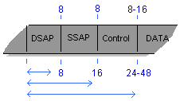

- DSAP = Destination Service Access Point. Defines the high level protocol that the data frame is intended for. (just like the ethernet "type" field)
- SSAP = Source Service Access Point. Used when demultiplexing the data frame. Identifies the type of high level protocol data.
- Any hight level protocols defined after the 80's (smb, appletalk, etc.), probably use the 802.2 LLC to define their type.

### 802.2 SNAP Protocol

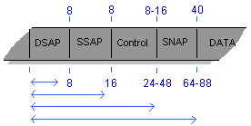

- SNAP = Sub-Network Access Protocol. The added SNAP filed is basically a duplicate of the ethernet "type" field. It allows a data from an ethernet packet to be transmitted to FDDI or Tolkenring, or anything else that doesn't include a type field.
- All types (pre and post 80's) are defined in the SNAP field. It is used mostly for full Layer 2 interoperability.

## FCS Field

- FCS = Frame Check Sequence. AKA: CRC (Cyclic Redundancy Check), which is also the type of mathematical equation used to create the FCS.
- Checks that integrity of the various bits in the frame fields. (NOT including the preamble, but including the dest, source, type/length, & data fields.

## End of Frame Detection
- for 10meg eth. the presence on the line is known as "carrier"
- when a signal stops being sent, there might be some echo's on the line that can be mistaken for carrier, or more data. This mistaken data is known as dribble bits. The standard allows for up to 7 mistaken dribble bits with no confusion.

## Outline of transmission on Half Duplex Media
1. Want to send data, listen on line for carrier.
    1. If carrier found, wait. "deferring"
    2. If clear, wait an amount of time at least that of the IFG (interface gap).
        1. IFG = 96 "bit times"
        2. 10meg = 9.6 ms
        3. 100meg = 960 ns
        4. 1000meg = 96 ns
2. Send Frame (only one)
    1. If someone talks over send out 32 bits of "jam" (finish sending preamble if necessary).
        1. Then wait a random amount of time and repeat. (called backoff)
    2. Once 512 bits are transmitted (not including preamble) it's called having "acquired the channel".
        1. There should not be any collisions after the sender has acquired the channel.
        2. The time to acquire the channel is called the "slot time". After the slot time has been reached, the collision counter is cleared (which is used to generate backoff time).
        3. Slot Time is the "maximum roundtrip signal propagation time on an ethernet segment".
        4. If there are too many repeaters, cables are too long, or there are too many hosts, this can make the real slot time longer then the standard. That's why the specs state max lengths etc.

## References
- [Ethernet: The Definitive Guide](https://www.oreilly.com/library/view/ethernet-the-definitive/1565926609/) © Feb 2000 First Edition, O'Reilly & Associates, Inc.
- [Charles Spurgeon's Ethernet](http://www.ethermanage.com/) Web Site.
- [Cisco CCNA Exam #640-507 Certification Guide](https://www.ciscopress.com/store/) © 2000 Lacidar Unlimited, Inc., Cisco Press
- [Cisco's Ethernet Technologies](http://www.cisco.com/univercd/cc/td/doc/cisintwk/ito_doc/ethernet.htm) Web Site.