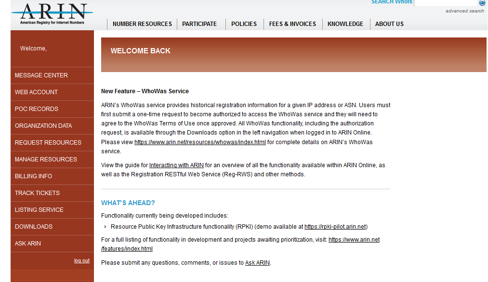
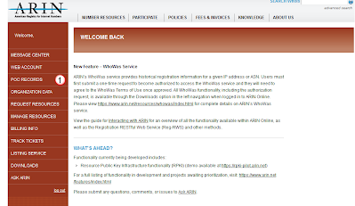

#

## Overview:
The POC is your "ID Card" for ARIN.  It defines who you are and binds you to organizations that you work with. 

## Create an web Account:
From the ARIN website https://www.arin.net/
in the left tab, select the "new user?" link (1). 

Fill out all the personal information including your email address.  Since this is your personal account, it's best to use your personal email address rather then your companies.  If you move to a different job, you will want your personal information to stay linked to you and not the company. 

Once you get your account and then log into the site, you will get a page similar to this one. 

## Create a POC
Under the left column, select the POC Records button (1) to create a POC. 

## References:
- [ARIN: Point Of Contact (POCs)](https://www.arin.net/resources/request/poc.html)  