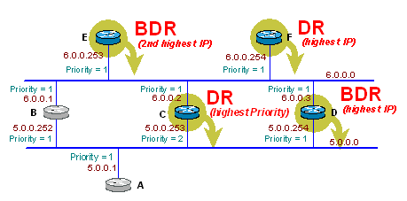
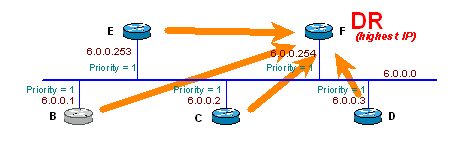
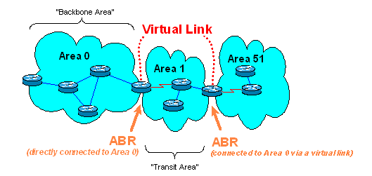
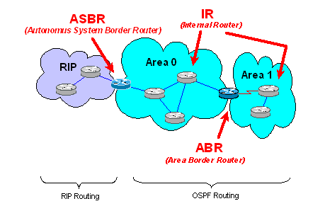
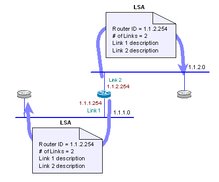
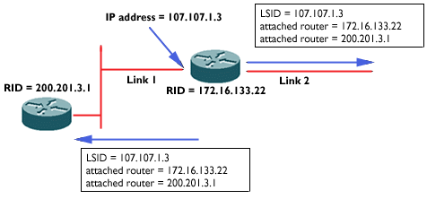
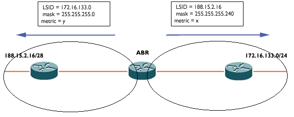
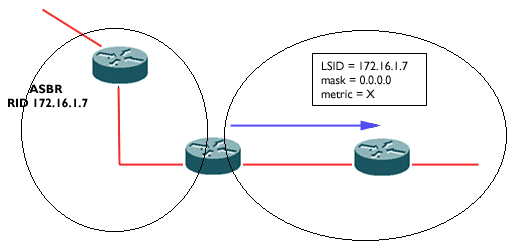
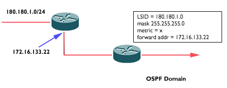

# Understanding OSPF

## Overview
The Open Shortest Path First (OSPF) routing protocol is based on link-state technology, as opposed to distance-vector protocols such as Interior Gateway Routing Protocol (IGRP) and Routing Information Protocol (RIP). OSPF offers several advantages over distance-vector protocols. It has faster convergence, supports larger internetworks, and is less susceptible to bad routing information. Some of the features of OSPF follow:

- Hierarchical routing
- Classless behavior, allowing support of variable-length VLSMs) and discontinuous networks
- The use of multicast addresses in order to reduce the effect of non-OSPF routing devices
- Authentication for secure routing

## Link State Protocol
OSPF is a routing protocol that calls for the sending of link-state advertisements (LSAs) to all other routers within the same hierarchical area. An area is a group of contiguous networks and attached hosts. OSPF LSAs include information on attached interfaces, metrics used, and other variables. As OSPF routers accumulate information, the routers use the SPF algorithm to calculate the shortest path to each node. This is different from the way distance-vector protocols work. Distance-vector protocols send all or a portion of their routing tables in routing-update messages to their neighbors. Configuring and troubleshooting OSPF networks is more complex than with its distance-vector counterparts.

## OSPF Operations
The following is an overview on how OSPF operates:

- Routers running OSPF will send OSPF hello packets to all OSPF-enabled interfaces.
- Routers sharing a common data link will become OSPF neighbors if their hello packets contain certain information that is mutually agreed upon.
- OSPF neighboring routers may form an OSPF adjacency if it is determined that there are certain commonalties between the routers exchanging hellos and the network over which the hellos are exchanged. Not all neighboring routers will form adjacencies.
- Routers will send (flood) LSAs over all adjacencies.
- All routers will build identical databases the LSAs.
- Shortest-path trees are calculated from the newly assembled routing tables.

## Neighbor Adjacencies

### Hellos
OSPF neighbors are identified by their router IDs. A router ID is an IP address by which the router is uniquely identified within the OSPF domain. A Cisco router selects its router ID as the highest IP address on any loopback interfaces configured on the router. If no loopback interfaces are configured on the router, the router chooses the highest IP address of any of its physical interfaces.

Routers that share a common segment may become neighbors on that segment. Neighbors are discovered via the OSPF Hello protocol and are recorded in a neighbor table.

The Hello protocol:

- Provides a way to discover OSPF neighbors
- Acts as a keepalive between neighbors
- Ensures bi-directional communication between neighbors
- Is used for designated router (DR) and backup designated router (BDR) election on certain types of networks

Hello packets are sent out all OSPF-enabled interfaces. They are sent out periodically with a special multicast address as the destination. Routers will become neighbors when they see themselves (their own router ID) in their neighbor's hello packets and they agree upon certain parameters included in the hello packets. Neighbor negotiation will take place on the primary IP address only, not over secondary addresses. If secondary addresses are configured on the interface, they are restricted to be in the same OSPF area as the primary address.

Two routers will become neighbors if the following parameters are agreed upon:

- Area ID: The two routers sharing a common network segment must have their interfaces configured to be in the same area.
- Authentication OSPF allows for configuration of a password for a specified area. Routers that want to become neighbors must exchange the same password over the common segment.
- Hello and Dead intervals -- The hello interval is the amount of time between hello packets that a router sends out on an OSPF-enabled interface. The dead interval is the amount of time, in seconds, that a router will wait for a hello packet from a neighbor before declaring the neighbor down. These interval times are included in the hello packet and must be agreed upon by neighbors.
- Stub area flag: Two neighboring routers must also agree on the stub area flag in the hello packets in order to become neighbors. (Stub areas will also be discussed later.)

All of the above parameters are included in hello packets. Also included in hello packets are the following:

- The router ID of the originating router
- The address and mask of the originating interface
- Router priority, which is used for DR election (discussed later)
- The DR and BDR
- Flag bits for option capabilities; one of these is the stub area flag mentioned above
- Router IDs of the originating router neighbors

### Network Types
After two-way communication between neighbors is established, OSPF routers move on to the next step, which is building adjacencies. Adjacent routers are routers that go beyond the hello protocol exchange and proceed into the database exchange process.

As previously mentioned, not all neighboring routers become adjacent. Whether or not an adjacency is formed depends on the type of network to which the neighboring routers are connected.

The types of networks that OSPF defines follow:

- Point-to-point networks
- Broadcast networks
- Non-Broadcast Multi-Access networks (NBMA)
- Point-to-multipoint networks

Point-to-point networks, such as serial lines, connect a single pair of routers. OSPF will always form an adjacency with the neighbor on the other side of a point-to-point interface. There is no concept of DR or BDR on point-to-point networks. The destination address of OSPF packets on these networks will always be sent to 224.0.0.5, otherwise known as the ALLSPFRouters multicast address.

Broadcast networks, such as Ethernet, Token Ring, and Fiber Distributed Data Interface (FDDI), are multi-access, meaning they are able to connect more than two devices; a packet sent by one router will be received by all connected routers. On broadcast networks, OSPF will elect a DR and a BDR. Hello packets on broadcast networks are sent to the destination address of 224.0.0.5. All packet originated by the DR and BDR are also sent to the this address. All other non-DR and non-BDR routers will send link-state updates to the address 224.0.0.6, also known as AllDRouters.

NBMA networks, such as Frame Relay, ATM, and X.25, can connect multiple devices, but they have no broadcast capability. (For more information on Frame Relay, please read the Frame Relay document.) A packet sent by a router will not be received by all the other routers attached to the network. Special care should be taken when configuring OSPF over NBMA networks. OSPF considers these media to be just like any other broadcast media such as Ethernet or Token Ring. As a result, extra configuration may be required for NBMA networks. OSPF routers elect a DR and BDR, and all OSPF packets are unicast.

Point-to-multipoint networks are NBMA networks in which the networks are treated as a collection of point-to-point links. Routers on these networks do not elect a DR and BDR because the network is seen as point-to-point links. OSPF packets are multicast on these networks.

### Designated Router and Backup Designated Router
The DR and BDR are elected on broadcast networks in order to prevent certain problems. First, if every router attached to a broadcast network formed an adjacency with every other router attached to the network, there would be n(n - 1)/2 adjacencies. Second, if a router flooded its LSAs to all of the router neighbors and all routers in turn flooded the LSA to their neighbors, there would be multiple copies of the same LSA on the same network.

The idea behind the DR is that every router attached to the network would form an adjacency with the DR. Only the DR would send LSA to the rest of the attached network. OSPF also elects a BDR in the event that the DR fails. This prevents routers from having to reelect a DR and reforming adjacencies with the new DR. Instead, the routers attached to the network form an adjacency with both the DR and BDR. If the DR goes down, the BDR becomes the DR; since the other routers already have a formed adjacency with the BDR, there is little, if any, network unavailability.

DR and BDR election is done via the Hello protocol. Hello packets are exchanged via IP multicast packets on each segment. The router with the highest OSPF priority on the segment will become the DR. Default priority is one for Cisco router interfaces. This process is repeated for the BDR. If the priorities are the same, the router with the highest router ID (its highest IP address) will become the DR. A single DR/BDR pair is elected on each attached segment. A router that is the DR of one segment may not be the DR or BDR of another attached segment. Setting the OSPF priority of an interface can be done with the interface subcommand:

```
  ip ospf priority [value]
```

A priority value of zero indicates that the interface will not be elected as the DR or BDR.

Note that once a DR and a BDR have been elected, a new router coming on line that has a higher priority will not override the DR and BDR. When the new OSPF router becomes active and discovers its neighbors, it checks for valid DR and BDR. If the DR and BDR exist, the new router will accept them. Routers that are not the DR or BDR are known as DRother.



In the diagram above, the router that will be elected DR for network 6.0.0.0 will be router F. This is because the priorities of all the router interfaces are equal (P = 1 on all the interfaces). This results in the router with the highest router ID (RID), or IP, as being elected the designated router. Router F has the highest RID and is, therefore, the DR.

On network 5.0.0.0, router C does not have the highest RID, but it still is elected the DR because its OSPF interface priority, which is 2, is higher than all the rest.

The diagram below shows the resulting adjacencies that will be formed on network 6.0.0.0 of the diagram above. Note that the routers that are not DR will form adjacencies only with the DR. In this illustration, the BDR is not shown, but adjacencies would also be formed with the BDR. 



### Building Adjacencies
After neighbor discovery takes place and bi-directional communication is established (a router sees its own router ID in neighbor hello packet), neighboring routers attempt to synchronize their link-state databases. When database synchronization in successful, the neighbors are fully adjacent.

Neighbors on point-to-point and point-to-multipoint networks always become adjacent unless the parameters of the hello packets are not agreed upon. On broadcast networks and NBMA networks, the DR and BDR become adjacent with all neighbors. No adjacencies will be formed between the DRothers.

The following are states through which OSPF routers will transition neighbors before being considered fully adjacent:

- Down: This is the initial state of the neighbor, indicating no information has been received from any router on the segment.
- Attempt: On NBMA networks, where neighbors are manually configured, this state indicates that no recent information has been received from the neighbor. An effort is made to contact the neighbor by sending hello packets.
- Init: This state indicates that a hello is received from a neighbor; however, bi-directional communication is not yet established.
- Two-way: The router has seen itself in the neighbor hello packets. Bi-directional communication is now established. On broadcast networks DR and BDR are elected at the end of this state. When this state ends, a decision is made whether or not to proceed in building an adjacency. The decision is based on whether the neighbor is a DR or BDR or the network link is point-to-point.
- ExStart: The router and its neighbor establish a master/slave relationship and determine the initial sequence number that is going to be used in the exchange of database description packets.
- Exchange: Routers will describe their entire link-state database by sending database description packet to neighbors that are in the exchange state.
- Loading: Routers build a link-state request list and retransmission list. Any information that looks outdated or incomplete will be put on the request list. Any update that has not been acknowledged will be put on the retransmission list.
- Full: The adjacency is now complete. Adjacent routers will have identical link-state databases.

### Flooding
The OSPF link-state database consists of all the LSAs the router has received. Each node in the network maintains an identical link-state database. A change in the topology means a change in one or more of the LSAs. Flooding is the process by which these new LSAs are sent throughout the network in order to ensure that the databases in all routers remain identical.

### Areas
Because of its complexity with multiple databases and flooding algorithms, OSPF can be memory and processor intensive. The demand for memory and processor utilization grows as the network grows.

OSPF uses areas to reduce the strain on router memory and processor utilization. An area is a logical grouping of routers that break the OSPF network into subdomains. Routers must share identical databases with routers in its area only, not with the entire network. This reduces the memory demand. The smaller database results in a smaller number of LSAs to process, thereby reducing the demand of processing power. Most flooding is also limited within an area.

Areas are interface specific and are identified with an area ID. The introduction of areas also introduces a different type of traffic. Intra-area traffic consists of packets that are contained within an area; inter-area packets travel between routers in different areas. External traffic consists of packets that travel between routers belonging to an OSPF domain and another autonomous system.

### Backbone
If more than one area is configured, one of these areas must be defined as area 0. Area 0 is known as the backbone area. All other areas must be logically connected to area 0 either physically or through a virtual-link. Virtual-links are explained below. Each area gives routing information to area 0 which in turn disseminates that information to all other connected areas. For this reason, all inter-area traffic must pass through area 0. Non-backbone areas cannot exchange packets directly with one another.

### Virtual Links
As mentioned above, all other areas must be physically connected to the backbone area, area 0. In some cases where this is not possible, a virtual link can be used. The virtual link will provide a link to the backbone through a nonbackbone area. Virtual links are also used to connect two parts of a partitioned backbone through a nonbackbone area.



As shown in the above diagram, virtual links can be established between two area border routers (ABRs) that have a common area, with one ABR connected to the backbone.

The transit area is defined as the area between two ends of a virtual link. The transit area must be connected to area 0 to have full routing information and cannot be a stub area.

OSPF classifies virtual links as point-to-point networks with no IP subnets associated with them.

### Router Types
As mentioned above, areas are interface specific, meaning that a router can have one interface configured in one area and a second interface configured in a second area. Therefore, routers can be categorized in relation to areas. There are three types of OSPF routers.

Internal routers (IRs): An internal router is a router with all of its interfaces in the same area.
Area border routers (ABRs): An ABR is a router that has interfaces in multiple areas. An ABR must always have at least one interface in the backbone area.
Autonomous system boundary routers (ASBRs): ASBRs are routers that act as gateways between OSPF and other routing protocols or other OSPF routing processes. In other words, redistribution takes place on the ASBRs.



## Link-State Database
All valid LSAs received by a router are stored in a link-state database. These LSAs describe the topology of an area. Routers use the LSAs to calculate the shortest path tree.

The list of LSAs in the database can be viewed with the command show ip ospf database. This list shows only the information in the LSA header, but it also contains LSAs from multiple areas if the router were an ABR. More detailed information of each LSA can be viewed with different commands, which will be explained later. An example output of the show ip ospf database command follows:

Link-State Database:
```
Router_B# show ip ospf database
OSPF Router with ID (170.170.3.2) (Process ID 7)

 Router Link States (Area 0)
Link ID ADV Router Age Seq# Checksum Link count
170.170.3.2 170.170.3.2 17 0x80000002 0x8B6 1
170.170.8.4 170.170.8.4 217 0x80000003 0xAA02 1
170.170.13.3 170.170.13.3 218 0x80000002 0x5156 1
 Net Link States (Area 0)
Link ID ADV Router Age Seq# Checksum
170.170.3.3 170.170.13.3 18 0x80000002 0xA0B2
 Summary Net Link States (Area 0)
Link ID ADV Router Age Seq# Checksum
170.170.7.0 170.170.8.4 240 0x80000001 0x6ED0
 Summary ASB Link States (Area 0)
Link ID ADV Router Age Seq# Checksum
170.170.11.6 170.170.8.4 129 0x80000001 0xF73C
 Type-5 AS External Link States
Link ID ADV Router Age Seq# Checksum Tag
200.200.200.0 170.170.11.6 135 0x80000001 0xE4FA 0
Router_B#
```

As can be seen from the information in the database in the above diagram, there are different types of LSAs defined by OSPF. Each type describes a different portion of the OSPF network. The table below lists the different LSA types and type codes and how the link-state is identified. Following the table is a description of the LSAs.

### Different LSA Types

| Type Code	| LSA	| Link-State ID |
|--|--|--|
1	| Router LSA	| Originating router ID of the router
2	| Network LSA	| Interface IP address of the DR
3	| Network summary LSA	| Destination network number
4	| ASBR summary LSA	| Router ID of AS boundary router
5	| AS external LSA	| External network number
7	| NSSA external LSA	| External network number

### Router LSA
Router LSAs are generated by every router. The router LSA is a list of links attached to the router, as well as the state of the link and the outgoing OSPF cost associated with the link. To view details of the router LSA, use the show ip ospf database router command.



### Network LSA
Network LSAs are generated by the DR on a multi-access segment. They are the representation of the multi-access segment and all the routers attached to the segment. Segments that do not have a DR, such as point-to-point, will not have a network LSA. To view detailed information of the network LSA, use the show ip ospf database network command.



### Network Summary LSA
Network summary LSAs are generated by ABRs. This is how network reachability information is advertised. ABRs are responsible for injecting information into the backbone and the backbone will pass the information on to other areas. The show ip ospf database summary command can be used to view detailed information of the summary LSA. 



### ASBR Summary LSA
ASBR summary LSAs are also generated by the ABR. This LSA describes the location of an ASBR, not a network. The details can be viewed with the show ip ospf database asbr-summary command. 



### AS External LSA
Autonomous System (AS) External LSAs are originated by the ASBRs and describe a network outside of the AS. They can be viewed with the show ip ospf database external command.

Not-So-Stubby Area (NSSA) external LSAs are originated by the ASBR within the NSSA. These types of LSAs are flooded only throughout the NSSA. These are unlike external LSAs, which are flooded throughout the entire network. 



## OSPF Extensions

### Stub Areas
ASBR routers will flood external routes throughout the OSPF domain. For this reason, OSPF allows certain areas to be configured as stub areas. Stub areas are areas into which external LSAs are not flooded. Routing from these areas to other parts of the OSPF network is done via the default route. The advantage to using stub areas is that the reduction of the link-state database reduces the requirements for memory.

All OSPF routers inside a stub area must be configured as stub routers. Since all interfaces belonging to the area will start exchanging hello packets, the stub flag must be set in order to successfully form a neighbor relationship.

Also, virtual links cannot be configured within or transit a stub area.

Examples of stub areas and how to configure them will be shown in the "Configuring OSPF" section.

### Totally Stubby Areas
Totally stubby areas are areas into which external LSAs and summary LSAs (inter-area routes) are not flooded. The only thing injected into the totally stubby area are intra-area routes and the default route (0.0.0.0). The default route is the only type 3 (summary) LSA that the ABR will allow into the totally stubby area.

An example of totally stubby areas and their configuration is discussed in the "Configuring OSPF" section.

### Not-So Stubby Areas
In some cases, it may be necessary to connect a stub area to an external AS and redistribute the external routes into OSPF. Unfortunately, this means that the stub area router will become an ASBR, meaning the area can no longer be a stub area.

NSSAs allow external routers to be advertised into the OSPF AS while retaining the characteristics of a stub area. The ASBR in the NSSA will originate type 7 LSAs. These external NSSA LSAs are flooded throughout the NSSA but are blocked at the ABR. The ABR will translate this into a type 5 LSA and flood it into the other areas.

An example of NSSAs and their configuration is discussed in the "Configuring OSPF" section.

### OSPF On-Demand Circuits
OSPF demand circuit is an enhancement to the OSPF protocol that allows efficient operation over on-demand circuits such as ISDN and dial-up lines. Prior to this feature, periodic hellos and LSA updates would be exchanged between routers that connected the on-demand link, even when there were no changes in the Hello or LSA information.

With this feature, periodic Hellos are suppressed and periodic refresh of LSAs are not flooded over demand circuits. These packets bring up the link only when they are exchanged for the first time, or when there is a change in the information they contain.


