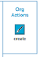
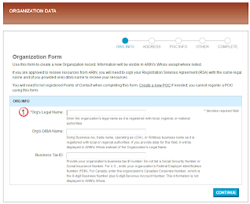
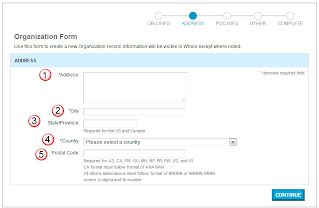
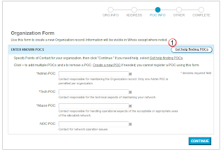
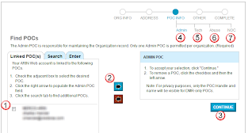
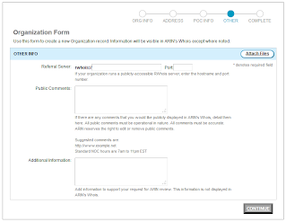

# ARIN-How to create an ORGID

## Overview: 
An ORGID is the same thing as a POC, but instead of an ID for a person, it's an ID for a company.  

## Create a New OrgID: 
First log into your web account on the ARIN webpage, and then select the Organization Data button in the left hand column

In the right side of the page, select the Create button under "Org Actions".  

## Fill out the online Form: 

### Name: 
On the first page, you only need to create the legal name for your org.  

### Address: 
Enter the address for the new org.  

### POC Info: 
Select the Get help finding POC button, to add the POC's

Then under the Linked POC, check off on your POC entry (1), then press the right button (2) to move it to the right "selected" column, and then select the continue button (3).  The first time you do this will be for the Admin (4) of the Org, but this needs to be repeated for the Tech (5), Abuse (6), and NOC (7) contacts.  

### Other 
Finally you can enter in any public or noted comments to the Org, and submit the information to ARIN.  

It should take about 2-3 days to complete this, but you should check your email, as the tech confirming this information might want to follow up with you with any questions.  

